# DaemonSets

<div class="abs-br m-6 flex gap-2">
  <carbon-network-overlay class="text-6xl text-blue-400" />
</div>

<div v-click class="mt-8 text-xl opacity-80">
Ensuring one Pod runs on every node
</div>

---
layout: center
---

# What Makes DaemonSets Different

<div v-click="1">

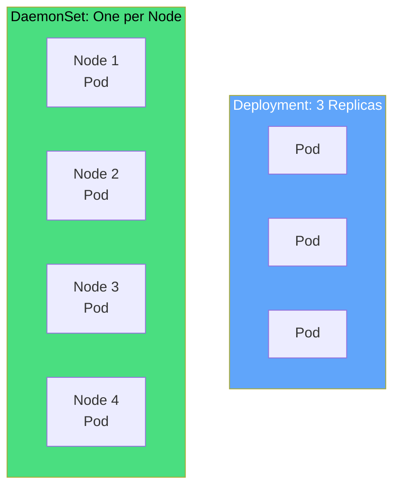

</div>

<div class="grid grid-cols-2 gap-6 mt-8">
<div v-click="2" class="text-center">
<carbon-deployment-pattern class="text-5xl text-blue-400 mb-2" />
<strong>Deployment</strong><br/>
<span class="text-sm opacity-80">You specify replica count<br/>Distributed across nodes</span>
</div>
<div v-click="3" class="text-center">
<carbon-network-overlay class="text-5xl text-green-400 mb-2" />
<strong>DaemonSet</strong><br/>
<span class="text-sm opacity-80">One Pod per node automatically<br/>Scales with cluster</span>
</div>
</div>

<div v-click="4" class="mt-8 text-center text-lg">
<carbon-idea class="inline-block text-3xl text-blue-400" /> No replicas field - automatic scaling
</div>

---
layout: center
---

# The "Daemon" Analogy

<div v-click="1">

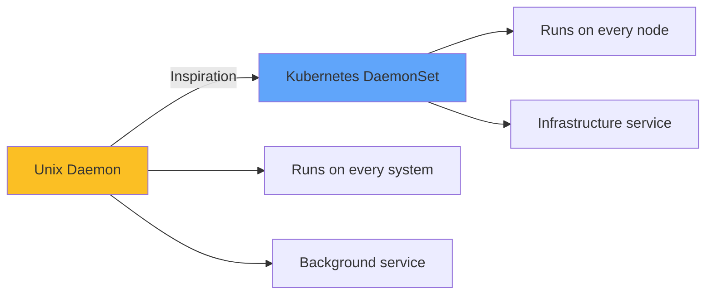

</div>

<div v-click="2" class="mt-8 text-center">
<carbon-container-software class="inline-block text-5xl text-purple-400" />
<div class="text-xl mt-4"><strong>Background processes running continuously on every node</strong></div>
</div>

<div class="grid grid-cols-3 gap-6 mt-8 text-sm">
<div v-click="3" class="text-center">
<carbon-add class="text-3xl text-green-400 mb-2" />
New node joins<br/>Pod created
</div>
<div v-click="4" class="text-center">
<carbon-subtract class="text-3xl text-red-400 mb-2" />
Node removed<br/>Pod deleted
</div>
<div v-click="5" class="text-center">
<carbon-checkmark class="text-3xl text-blue-400 mb-2" />
Exactly one Pod<br/>per node
</div>
</div>

---
layout: center
---

# Common Use Cases

<div v-click="1">

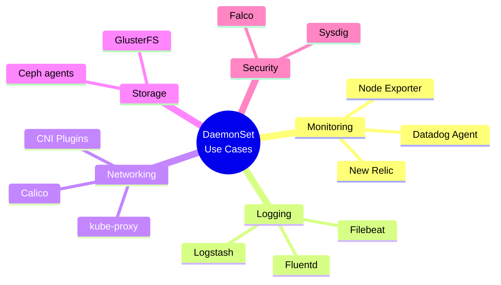

</div>

<div v-click="2" class="mt-8 text-center text-lg">
<carbon-rule class="inline-block text-3xl text-yellow-400" /> Pattern: Node-level resources require DaemonSets
</div>

---
layout: center
---

# Use Case Details

<div class="grid grid-cols-2 gap-6 mt-4">
<div v-click="1">
<carbon-dashboard class="text-5xl text-blue-400 mb-2" />
<strong>Monitoring</strong><br/>
<span class="text-sm opacity-80">Collect metrics from every node<br/>Prometheus Node Exporter</span>
</div>
<div v-click="2">
<carbon-document class="text-5xl text-green-400 mb-2" />
<strong>Log Collection</strong><br/>
<span class="text-sm opacity-80">Access node-level logs<br/>Fluentd, Filebeat</span>
</div>
<div v-click="3">
<carbon-network-3 class="text-5xl text-purple-400 mb-2" />
<strong>Network Infrastructure</strong><br/>
<span class="text-sm opacity-80">Configure pod networking<br/>Calico, Weave, Flannel</span>
</div>
<div v-click="4">
<carbon-security class="text-5xl text-red-400 mb-2" />
<strong>Security Monitoring</strong><br/>
<span class="text-sm opacity-80">Runtime security per node<br/>Falco, Sysdig</span>
</div>
</div>

---
layout: center
---

# DaemonSets vs Deployments

<div v-click="1">

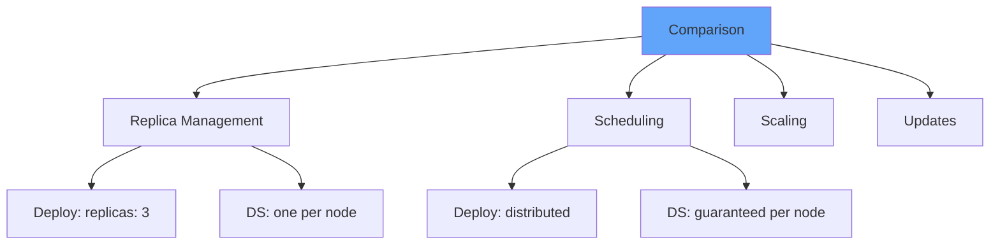

</div>

<div class="grid grid-cols-2 gap-4 mt-6 text-sm">
<div v-click="2">
<carbon-tag class="inline-block text-2xl text-blue-400" /> <strong>Replicas:</strong> Deploy has count, DS automatic
</div>
<div v-click="3">
<carbon-network-overlay class="inline-block text-2xl text-green-400" /> <strong>Scheduling:</strong> Deploy distributed, DS per-node
</div>
<div v-click="4">
<carbon-arrow-up-right class="inline-block text-2xl text-purple-400" /> <strong>Scaling:</strong> Deploy change count, DS add nodes
</div>
<div v-click="5">
<carbon-renew class="inline-block text-2xl text-yellow-400" /> <strong>Updates:</strong> Different RollingUpdate behavior
</div>
</div>

---
layout: center
---

# When to Use Which

<div v-click="1">

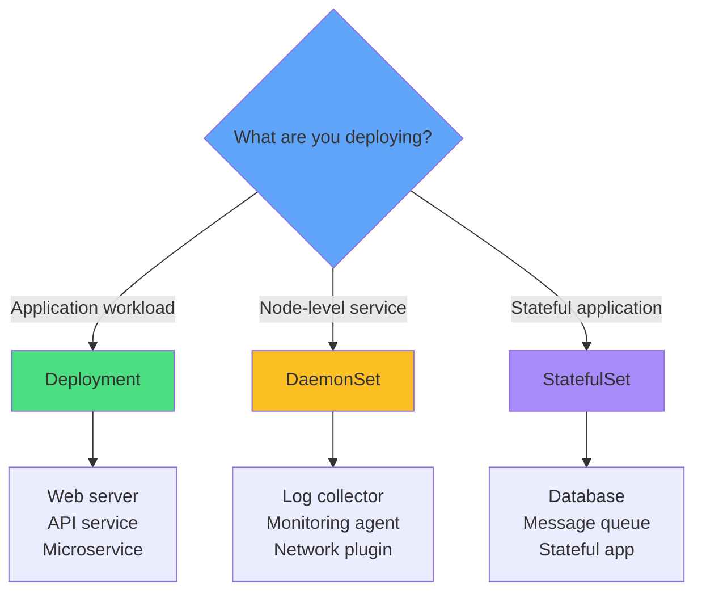

</div>

---
layout: center
---

# Node Selection with nodeSelector

<div v-click="1" class="mb-4">

**Run on All Nodes (Default):**
```yaml
apiVersion: apps/v1
kind: DaemonSet
metadata:
  name: monitoring-agent
spec:
  selector:
    matchLabels:
      app: monitoring
  template:
    # Pod spec
```

</div>

<div v-click="2" class="mb-4">

**Run on Specific Nodes:**
```yaml
spec:
  template:
    spec:
      nodeSelector:
        disktype: ssd
```

</div>

<div v-click="3" class="text-center text-sm opacity-80">
<carbon-filter class="inline-block text-2xl text-blue-400" /> Only nodes with <code>disktype=ssd</code> label
</div>

---
layout: center
---

# Node Selection Patterns

<div v-click="1">

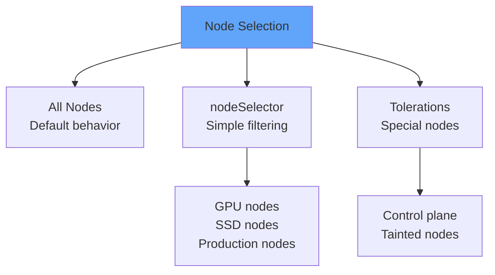

</div>

<div v-click="2" class="mt-8 text-center text-lg">
<carbon-tag class="inline-block text-3xl text-green-400" /> Label a node → DaemonSet creates Pod automatically
</div>

<div v-click="3" class="mt-4 text-center text-lg">
<carbon-close class="inline-block text-3xl text-red-400" /> Remove label → DaemonSet removes Pod
</div>

---
layout: center
---

# Tolerations for Special Nodes

<div v-click="1" class="mb-4">

```yaml
spec:
  template:
    spec:
      tolerations:
      - key: node-role.kubernetes.io/master
        effect: NoSchedule
```

</div>

<div v-click="2">

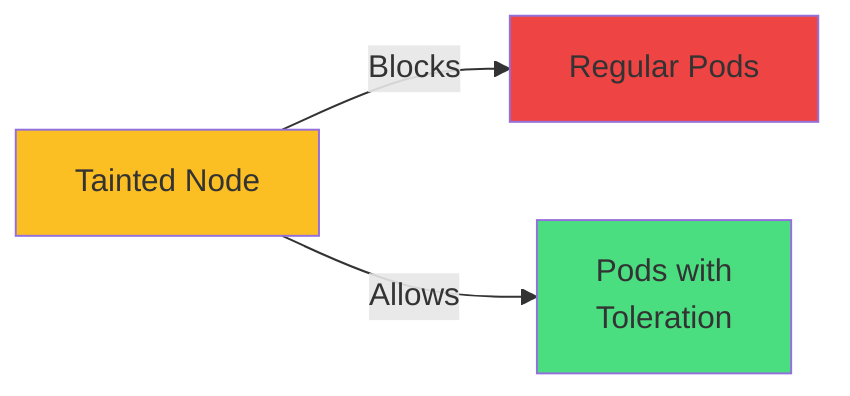

</div>

<div v-click="3" class="mt-6 text-center">
<carbon-security class="inline-block text-3xl text-blue-400" />
<strong class="ml-2">Run monitoring/networking even on control plane nodes</strong>
</div>

---
layout: center
---

# HostPath Volumes

<div v-click="1" class="mb-4">

```yaml
volumes:
- name: varlog
  hostPath:
    path: /var/log
    type: Directory
```

</div>

<div v-click="2">

```mermaid
graph TB
    H[Host Node Filesystem] --> V[HostPath Volume]
    V --> P[Pod Container]
    H --> E1[/var/log<br/>Logs]
    H --> E2[/proc<br/>System metrics]
    H --> E3[/var/run/docker.sock<br/>Container runtime]
    style H fill:#60a5fa
    style V fill:#fbbf24
    style P fill:#4ade80
```

</div>

<div class="grid grid-cols-3 gap-4 mt-6 text-sm">
<div v-click="3" class="text-center">
<carbon-document class="text-3xl text-green-400 mb-2" />
<strong>Logs</strong><br/>
/var/log
</div>
<div v-click="4" class="text-center">
<carbon-dashboard class="text-3xl text-blue-400 mb-2" />
<strong>Metrics</strong><br/>
/proc, /sys
</div>
<div v-click="5" class="text-center">
<carbon-container-software class="text-3xl text-purple-400 mb-2" />
<strong>Runtime</strong><br/>
docker.sock
</div>
</div>

---
layout: center
---

# HostPath Security

<div v-click="1">

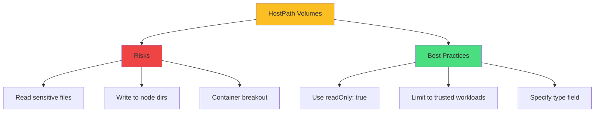

</div>

<div class="grid grid-cols-2 gap-6 mt-6 text-sm">
<div v-click="2">
<carbon-warning class="text-4xl text-red-400 mb-2" />
<strong>Security Risks</strong><br/>
<span class="opacity-80">Access to host filesystem<br/>Potential container escape</span>
</div>
<div v-click="3">
<carbon-locked class="text-4xl text-green-400 mb-2" />
<strong>Best Practices</strong><br/>
<span class="opacity-80">Use readOnly, specify type<br/>Restrict with Pod Security</span>
</div>
</div>

---
layout: center
---

# HostPath Types

<div class="grid grid-cols-2 gap-6 mt-4">
<div v-click="1">
<carbon-folder class="text-4xl text-blue-400 mb-2" />
<strong>Directory</strong>
```yaml
type: Directory
```
<span class="text-sm opacity-80">Must exist as directory</span>
</div>
<div v-click="2">
<carbon-folder-add class="text-4xl text-green-400 mb-2" />
<strong>DirectoryOrCreate</strong>
```yaml
type: DirectoryOrCreate
```
<span class="text-sm opacity-80">Create if doesn't exist</span>
</div>
<div v-click="3">
<carbon-document class="text-4xl text-purple-400 mb-2" />
<strong>File</strong>
```yaml
type: File
```
<span class="text-sm opacity-80">Must exist as file</span>
</div>
<div v-click="4">
<carbon-network-3 class="text-4xl text-yellow-400 mb-2" />
<strong>Socket</strong>
```yaml
type: Socket
```
<span class="text-sm opacity-80">Unix socket (docker.sock)</span>
</div>
</div>

---
layout: center
---

# Update Strategies

<div v-click="1">

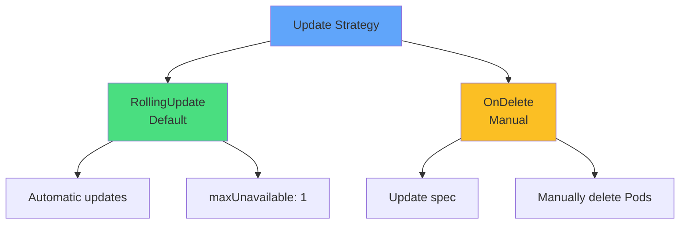

</div>

<div class="grid grid-cols-2 gap-6 mt-8">
<div v-click="2" class="text-center">
<carbon-renew class="text-5xl text-green-400 mb-2" />
<strong>RollingUpdate</strong><br/>
<span class="text-sm opacity-80">Automatic Pod replacement<br/>One node at a time</span>
</div>
<div v-click="3" class="text-center">
<carbon-user class="text-5xl text-yellow-400 mb-2" />
<strong>OnDelete</strong><br/>
<span class="text-sm opacity-80">Manual control<br/>Delete to trigger update</span>
</div>
</div>

---
layout: center
---

# RollingUpdate Strategy

<div v-click="1" class="mb-4">

```yaml
spec:
  updateStrategy:
    type: RollingUpdate
    rollingUpdate:
      maxUnavailable: 1
```

</div>

<div v-click="2">

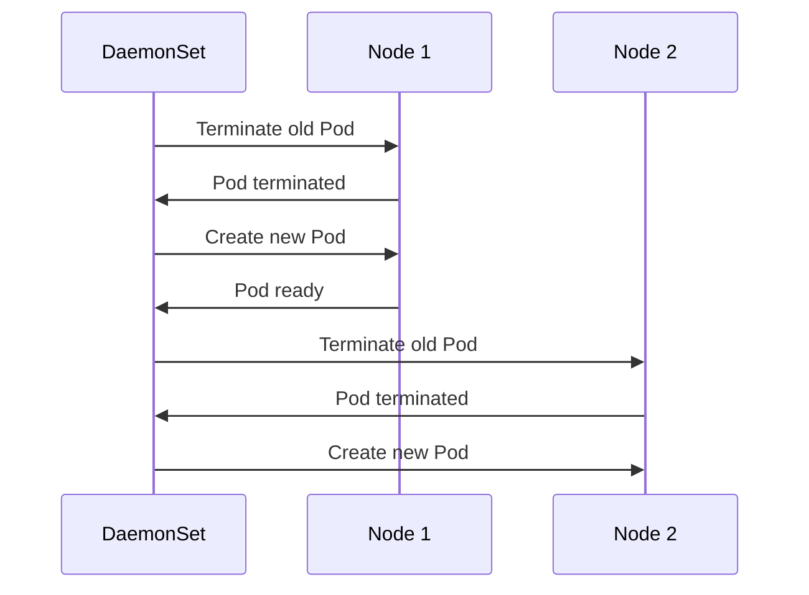

</div>

<div v-click="3" class="mt-6 text-center text-red-400">
<carbon-warning class="inline-block text-2xl" /> Terminates old Pod BEFORE creating new (unlike Deployments)
</div>

---
layout: center
---

# OnDelete Strategy

<div v-click="1" class="mb-4">

```yaml
spec:
  updateStrategy:
    type: OnDelete
```

</div>

<div v-click="2">

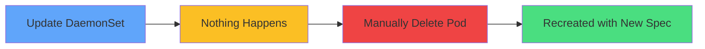

</div>

<div class="grid grid-cols-2 gap-6 mt-8 text-sm">
<div v-click="3">
<carbon-rule class="inline-block text-2xl text-blue-400" /> <strong>Use case:</strong> Critical infrastructure
</div>
<div v-click="4">
<carbon-timer class="inline-block text-2xl text-green-400" /> <strong>Use case:</strong> Maintenance windows
</div>
<div v-click="5">
<carbon-test-tool class="inline-block text-2xl text-purple-400" /> <strong>Use case:</strong> Test one node first
</div>
<div v-click="6">
<carbon-network-overlay class="inline-block text-2xl text-yellow-400" /> <strong>Use case:</strong> Coordinate with external systems
</div>
</div>

---
layout: center
---

# Init Containers in DaemonSets

<div v-click="1" class="mb-4">

```yaml
initContainers:
- name: setup
  image: busybox
  command: ['sh', '-c', 'sysctl -w net.ipv4.ip_forward=1']
  securityContext:
    privileged: true
```

</div>

<div v-click="2">

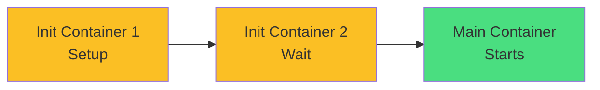

</div>

<div class="grid grid-cols-3 gap-4 mt-6 text-sm">
<div v-click="3" class="text-center">
<carbon-settings class="text-3xl text-blue-400 mb-2" />
<strong>Configure</strong><br/>
Kernel parameters
</div>
<div v-click="4" class="text-center">
<carbon-time class="text-3xl text-green-400 mb-2" />
<strong>Wait</strong><br/>
Dependencies ready
</div>
<div v-click="5" class="text-center">
<carbon-download class="text-3xl text-purple-400 mb-2" />
<strong>Fetch</strong><br/>
Download config
</div>
</div>

---
layout: center
---

# CKAD Exam Relevance

<div v-click="1" class="text-center mb-6">
<carbon-certificate class="inline-block text-6xl text-blue-400" />
</div>

<div class="grid grid-cols-2 gap-4 text-sm">
<div v-click="2">
<carbon-checkmark class="inline-block text-2xl text-green-400" /> Understand one-per-node concept
</div>
<div v-click="3">
<carbon-close class="inline-block text-2xl text-green-400" /> No replicas field
</div>
<div v-click="4">
<carbon-renew class="inline-block text-2xl text-green-400" /> Update strategies (RollingUpdate/OnDelete)
</div>
<div v-click="5">
<carbon-filter class="inline-block text-2xl text-green-400" /> Use nodeSelector for targeting
</div>
<div v-click="6">
<carbon-data-volume class="inline-block text-2xl text-green-400" /> Configure HostPath volumes
</div>
<div v-click="7">
<carbon-settings class="inline-block text-2xl text-green-400" /> Implement init containers
</div>
<div v-click="8">
<carbon-terminal class="inline-block text-2xl text-yellow-400" /> kubectl get/describe ds
</div>
<div v-click="9">
<carbon-timer class="inline-block text-2xl text-red-400" /> Create in 3-4 minutes
</div>
</div>

<div v-click="10" class="mt-6 text-center text-sm opacity-80">
Supplementary topic: 1-2 exam questions likely
</div>

---
layout: center
---

# Common Exam Scenarios

<div class="grid grid-cols-2 gap-6 mt-4">
<div v-click="1">
<carbon-document class="text-4xl text-blue-400 mb-2" />
<strong>Log Collector</strong><br/>
<span class="text-sm opacity-80">Deploy Fluentd to all nodes<br/>HostPath: /var/log</span>
</div>
<div v-click="2">
<carbon-dashboard class="text-4xl text-green-400 mb-2" />
<strong>Monitoring Agent</strong><br/>
<span class="text-sm opacity-80">Node Exporter DaemonSet<br/>HostPath: /proc, /sys</span>
</div>
<div v-click="3">
<carbon-debug class="text-4xl text-purple-400 mb-2" />
<strong>Troubleshooting</strong><br/>
<span class="text-sm opacity-80">Why not scheduling on nodes?<br/>Check nodeSelector/taints</span>
</div>
<div v-click="4">
<carbon-edit class="text-4xl text-yellow-400 mb-2" />
<strong>Manual Updates</strong><br/>
<span class="text-sm opacity-80">Use OnDelete strategy<br/>Control update timing</span>
</div>
</div>

---
layout: center
---

# Quick Commands

<div class="grid grid-cols-2 gap-6 mt-4">
<div v-click="1">
<carbon-view class="text-3xl text-blue-400 mb-2" />
<strong>List DaemonSets</strong>
```bash
kubectl get daemonset
kubectl get ds
```
</div>
<div v-click="2">
<carbon-document class="text-3xl text-green-400 mb-2" />
<strong>Describe DaemonSet</strong>
```bash
kubectl describe ds <name>
```
</div>
<div v-click="3">
<carbon-renew class="text-3xl text-purple-400 mb-2" />
<strong>Rollout status</strong>
```bash
kubectl rollout status ds/<name>
```
</div>
<div v-click="4">
<carbon-undo class="text-3xl text-yellow-400 mb-2" />
<strong>Rollback</strong>
```bash
kubectl rollout undo ds/<name>
```
</div>
</div>

---
layout: center
---

# Summary

<div v-click="1">

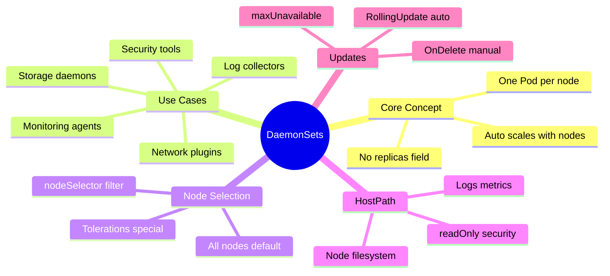

</div>

---
layout: center
---

# Key Takeaways

<div class="grid grid-cols-2 gap-6 mt-6">
<div v-click="1">
<carbon-network-overlay class="text-4xl text-blue-400 mb-2" />
<strong>One Pod per node</strong><br/>
<span class="text-sm opacity-80">Automatic, no replicas field</span>
</div>
<div v-click="2">
<carbon-dashboard class="text-4xl text-green-400 mb-2" />
<strong>Node-level services</strong><br/>
<span class="text-sm opacity-80">Monitoring, logging, networking</span>
</div>
<div v-click="3">
<carbon-data-volume class="text-4xl text-purple-400 mb-2" />
<strong>HostPath volumes</strong><br/>
<span class="text-sm opacity-80">Access node resources</span>
</div>
<div v-click="4">
<carbon-renew class="text-4xl text-yellow-400 mb-2" />
<strong>Different updates</strong><br/>
<span class="text-sm opacity-80">Terminates old Pod first</span>
</div>
</div>

<div v-click="5" class="mt-8 text-center text-lg">
Simpler than StatefulSets, less common than Deployments <carbon-arrow-right class="inline-block text-2xl" />
</div>
