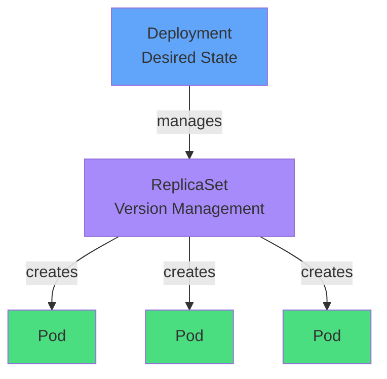

# Three-Layer Architecture

```mermaid
graph TB
    D[<carbon-deploy/> Deployment<br/>Desired State]
    RS[<carbon-layers/> ReplicaSet<br/>Version Management]
    P1[<carbon-container-software/> Pod]
    P2[<carbon-container-software/> Pod]
    P3[<carbon-container-software/> Pod]

    D -->|manages| RS
    RS -->|creates| P1
    RS -->|creates| P2
    RS -->|creates| P3

    style D fill:#60a5fa
    style RS fill:#a78bfa
    style P1 fill:#4ade80
    style P2 fill:#4ade80
    style P3 fill:#4ade80
```

Understanding this is key to troubleshooting

