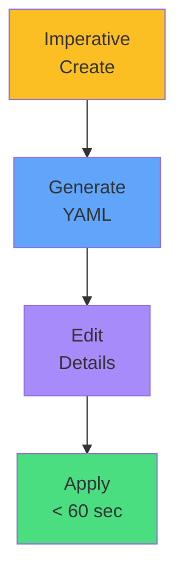

# Rapid Creation

<carbon-flash class="text-5xl text-yellow-400 mb-4" />

## Imperative Commands

```bash
kubectl create deployment \
  nginx \
  --image=nginx \
  --replicas=3
```

<carbon-terminal class="text-5xl text-green-400 mb-4 mt-6" />

## Generate & Edit

```bash
kubectl create deployment ... \
  --dry-run=client \
  -o yaml > deploy.yaml
```

::right::

<div class="mt-16">



<div class="mt-8 text-center text-lg opacity-80">
<carbon-timer class="text-3xl text-red-400 inline-block" />
<br/>
Dramatically faster than writing from scratch
</div>

</div>
