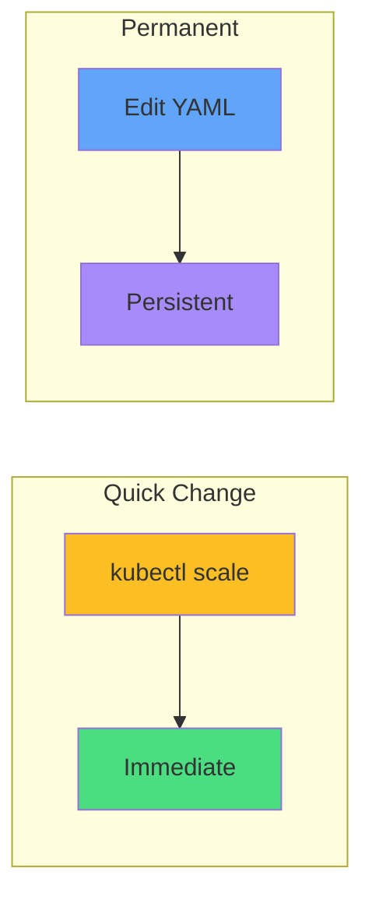

# Scaling Operations

```mermaid
graph LR
    subgraph Quick Change
        Q[<carbon-terminal/> kubectl scale] --> I[<carbon-flash/> Immediate]
    end
    subgraph Permanent
        Y[<carbon-document/> Edit YAML] --> P[<carbon-save/> Persistent]
    end
    style Q fill:#fbbf24
    style I fill:#4ade80
    style Y fill:#60a5fa
    style P fill:#a78bfa
```

## Scaling
<carbon-grow class="text-4xl text-green-400" />

Immediate effect

## Image Update
<carbon-renew class="text-4xl text-blue-400" />

Rolling update

