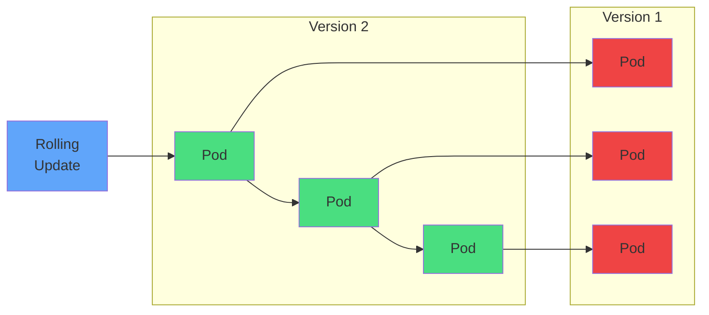

# Rolling Updates

<carbon-data-connected class="text-3xl text-blue-400" />

maxSurge

<carbon-data-unstructured class="text-3xl text-yellow-400" />

maxUnavailable

<carbon-renew class="text-3xl text-green-400" />

Zero downtime

