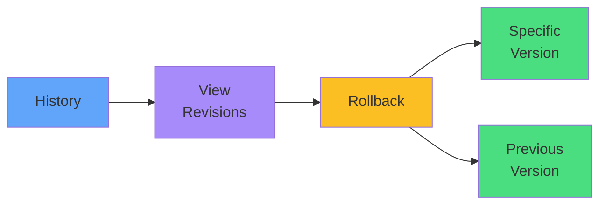

# Rollback Procedures



<div class="mt-8 text-center">

```bash
kubectl rollout undo deployment/app
```

<div class="text-lg opacity-80 mt-4">
<carbon-time class="text-3xl text-blue-400 inline-block" />
<br/>
Safety net for failed updates
</div>

</div>
