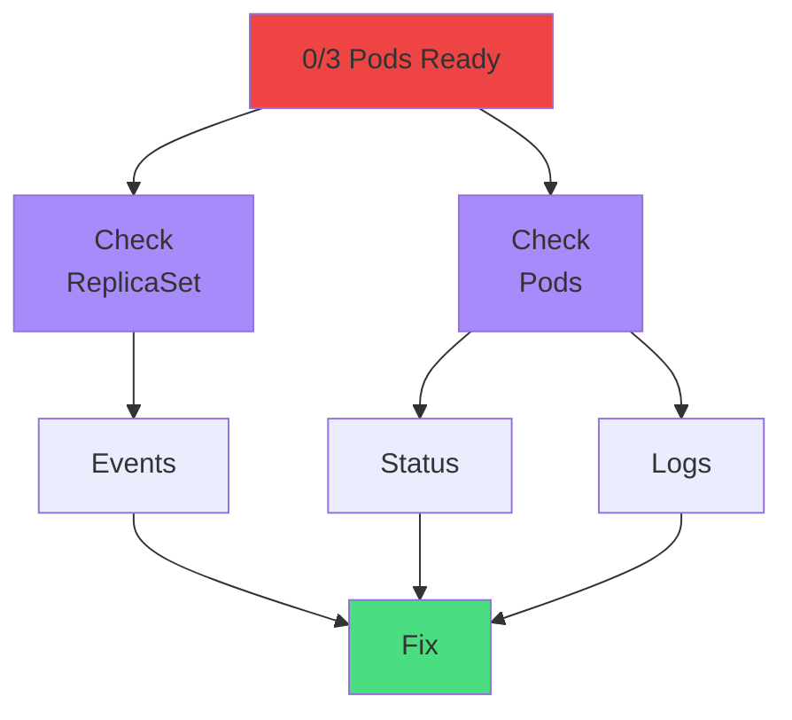

# Troubleshooting Flow

```mermaid
graph TB
    D[<carbon-warning/> 0/3 Pods Ready]
    D --> RS[<carbon-layers/> Check<br/>ReplicaSet]
    D --> P[<carbon-container-software/> Check<br/>Pods]
    RS --> E[<carbon-error/> Events]
    P --> S[<carbon-task-settings/> Status]
    P --> L[<carbon-document/> Logs]
    E --> FIX[<carbon-tools/> Fix]
    S --> FIX
    L --> FIX
    style D fill:#ef4444
    style RS fill:#a78bfa
    style P fill:#a78bfa
    style FIX fill:#4ade80
```

Systematic approach saves time

