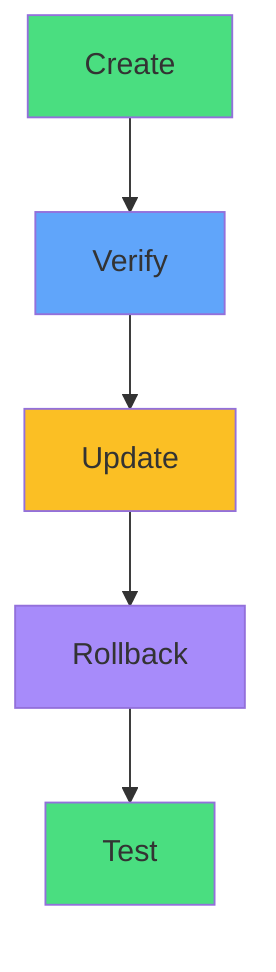

# Time-Saving Techniques

<carbon-flash class="text-5xl text-yellow-400 mb-4" />

## Quick Commands

- `--dry-run=client -o yaml >`
- `kubectl set image`
- `kubectl diff`
- `kubectl rollout restart`

<carbon-timer class="text-5xl text-red-400 mb-4 mt-6" />

## Target: 4-5 Minutes
Including verification

::right::

Practice until it's muscle memory

