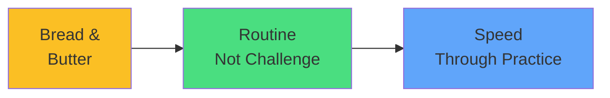

# Exam Mindset

<carbon-keyboard class="text-yellow-400 text-4xl inline-block" />

### If you're spending > 5 minutes
### Something's wrong with your approach

Imperative commands are your superpower

