# Kubernetes Deployments

<div class="abs-br m-6 flex gap-2">
  <carbon-deployment-pattern class="text-6xl text-blue-400" />
</div>

<div v-click class="mt-8 text-xl opacity-80">
The workload controller you'll use most frequently
</div>

---
layout: center
---

# Why Not Just Use Pods?

<div v-click="1">

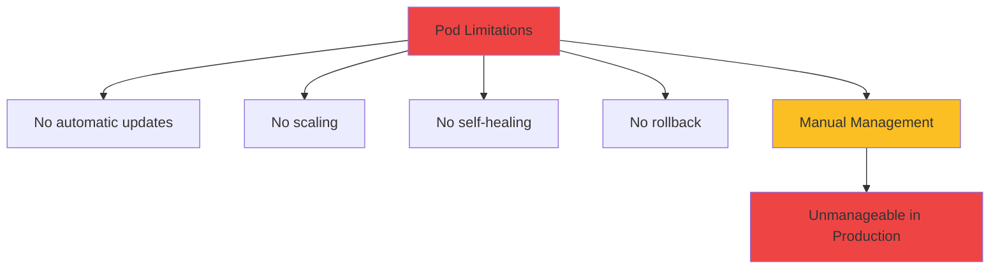

</div>

<div class="grid grid-cols-2 gap-6 mt-8 text-sm">
<div v-click="2" class="text-center">
<carbon-renew class="text-4xl text-red-400 mb-2" />
<strong>Updates</strong><br/>
Manual Pod replacement
</div>
<div v-click="3" class="text-center">
<carbon-arrow-up-right class="text-4xl text-red-400 mb-2" />
<strong>Scaling</strong><br/>
Create/delete manually
</div>
<div v-click="4" class="text-center">
<carbon-restart class="text-4xl text-red-400 mb-2" />
<strong>Recovery</strong><br/>
No automatic restart
</div>
<div v-click="5" class="text-center">
<carbon-undo class="text-4xl text-red-400 mb-2" />
<strong>Rollback</strong><br/>
No version tracking
</div>
</div>

---
layout: center
---

# What is a Deployment?

<div v-click="1">

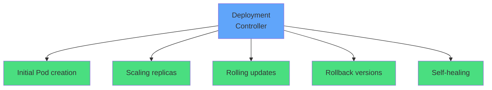

</div>

<div v-click="2" class="mt-8 text-center mb-4">
<carbon-deployment-pattern class="inline-block text-5xl text-blue-400" />
<div class="text-xl mt-2"><strong>Controller that manages Pods declaratively</strong></div>
</div>

<div v-click="3" class="text-center text-lg">
<carbon-idea class="inline-block text-3xl text-green-400" /> Declare desired state, Kubernetes makes it happen
</div>

---
layout: center
---

# The Role of ReplicaSets

<div v-click="1">

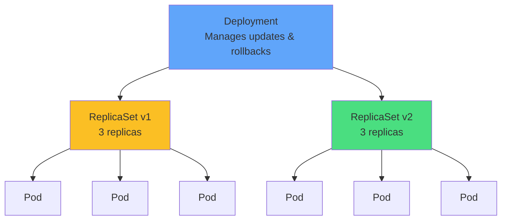

</div>

<div v-click="2" class="mt-6 text-center">
<strong>Deployment</strong> → manages ReplicaSets
</div>
<div v-click="3" class="text-center">
<strong>ReplicaSet</strong> → ensures desired number of Pods
</div>
<div v-click="4" class="text-center">
<strong>Pods</strong> → run your containers
</div>

<div v-click="5" class="mt-6 text-center text-sm opacity-80">
You rarely work with ReplicaSets directly
</div>

---
layout: center
---

# Deployment Anatomy

<div v-click="1" class="mb-4">

```yaml
apiVersion: apps/v1
kind: Deployment
metadata:
  name: myapp
spec:
  replicas: 3
  selector:
    matchLabels:
      app: myapp
  template:
    metadata:
      labels:
        app: myapp
    spec:
      containers:
      - name: app
        image: myapp:v1
```

</div>

<div class="grid grid-cols-3 gap-4 text-sm">
<div v-click="2">
<carbon-filter class="inline-block text-2xl text-blue-400" /> <strong>selector:</strong> Which Pods to manage
</div>
<div v-click="3">
<carbon-tag class="inline-block text-2xl text-green-400" /> <strong>replicas:</strong> Desired Pod count
</div>
<div v-click="4">
<carbon-document class="inline-block text-2xl text-purple-400" /> <strong>template:</strong> Pod specification
</div>
</div>

---
layout: center
---

# Scaling Applications

<div v-click="1">

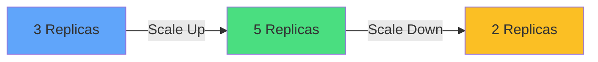

</div>

<div v-click="2" class="mt-8">

**Imperative (quick):**
```bash
kubectl scale deployment myapp --replicas=5
```

</div>

<div v-click="3" class="mt-4">

**Declarative (production):**
```yaml
spec:
  replicas: 5
```
```bash
kubectl apply -f deployment.yaml
```

</div>

<div v-click="4" class="mt-6 text-center text-green-400">
<carbon-checkmark class="inline-block text-2xl" /> Declarative = source control matches cluster state
</div>

---
layout: center
---

# Scaling Behavior

<div v-click="1">

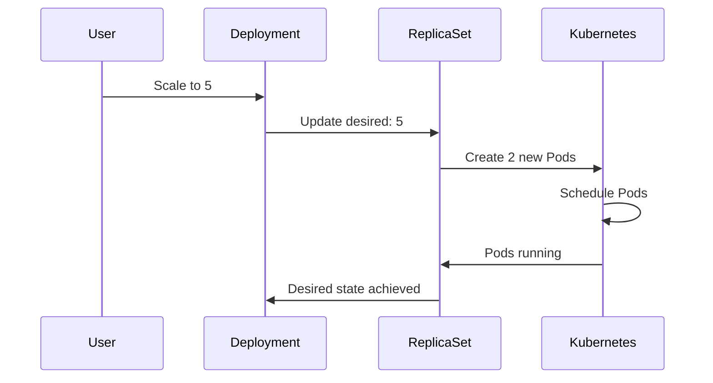

</div>

<div class="grid grid-cols-2 gap-6 mt-6 text-sm">
<div v-click="2" class="text-center">
<carbon-arrow-up-right class="text-4xl text-green-400 mb-2" />
<strong>Scale Up</strong><br/>
Create new Pods<br/>Schedule across nodes
</div>
<div v-click="3" class="text-center">
<carbon-arrow-down-right class="text-4xl text-yellow-400 mb-2" />
<strong>Scale Down</strong><br/>
Terminate excess Pods<br/>Graceful shutdown
</div>
</div>

---
layout: center
---

# Rolling Updates

<div v-click="1">

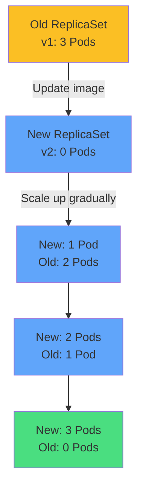

</div>

<div v-click="2" class="mt-6 text-center text-lg">
<carbon-checkmark class="inline-block text-3xl text-green-400" /> Zero-downtime deployments
</div>

<div v-click="3" class="mt-4 text-center text-sm opacity-80">
Some Pods always available during updates
</div>

---
layout: center
---

# Rolling Update Configuration

<div v-click="1" class="mb-4">

```yaml
spec:
  strategy:
    type: RollingUpdate
    rollingUpdate:
      maxSurge: 25%
      maxUnavailable: 25%
```

</div>

<div v-click="2">

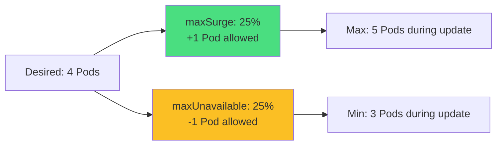

</div>

<div class="grid grid-cols-2 gap-6 mt-6 text-sm">
<div v-click="3">
<carbon-arrow-up-right class="inline-block text-2xl text-green-400" /> <strong>maxSurge:</strong> Extra Pods above desired
</div>
<div v-click="4">
<carbon-arrow-down-right class="inline-block text-2xl text-yellow-400" /> <strong>maxUnavailable:</strong> Pods below desired
</div>
</div>

<div v-click="5" class="mt-4 text-center text-blue-400">
<carbon-idea class="inline-block text-2xl" /> Set maxUnavailable: 0 for guaranteed zero downtime
</div>

---
layout: center
---

# Recreate Strategy

<div v-click="1">

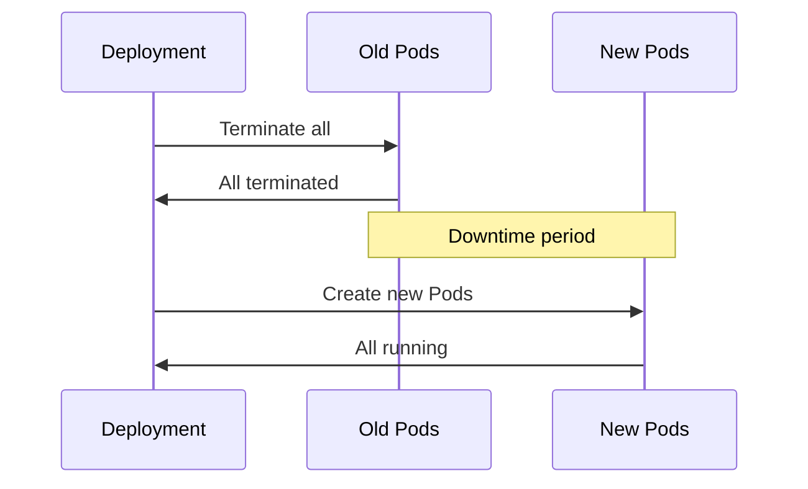

</div>

<div v-click="2" class="mb-4">

```yaml
spec:
  strategy:
    type: Recreate
```

</div>

<div class="grid grid-cols-2 gap-6 mt-6">
<div v-click="3" class="text-center">
<carbon-warning class="text-4xl text-red-400 mb-2" />
<strong>Downtime</strong><br/>
<span class="text-sm opacity-80">All old Pods stop first</span>
</div>
<div v-click="4" class="text-center">
<carbon-rule class="text-4xl text-blue-400 mb-2" />
<strong>When to Use</strong><br/>
<span class="text-sm opacity-80">Can't run multiple versions<br/>Database migrations</span>
</div>
</div>

---
layout: center
---

# Rollback Capabilities

<div v-click="1">

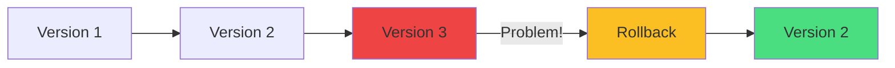

</div>

<div v-click="2" class="mt-8">

**View history:**
```bash
kubectl rollout history deployment/myapp
```

</div>

<div v-click="3" class="mt-4">

**Rollback:**
```bash
kubectl rollout undo deployment/myapp
kubectl rollout undo deployment/myapp --to-revision=2
```

</div>

<div v-click="4" class="mt-6 text-center text-green-400">
<carbon-checkmark class="inline-block text-3xl" /> One command to undo failed deployments
</div>

---
layout: center
---

# How Rollback Works

<div v-click="1">

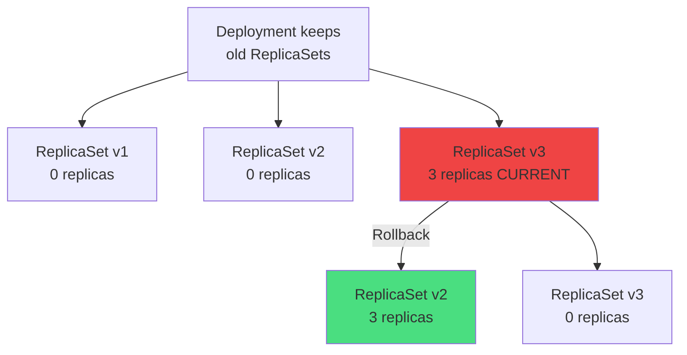

</div>

<div v-click="2" class="mt-6 text-center text-sm opacity-80">
Rollback = scale up old ReplicaSet, scale down current one
</div>

<div v-click="3" class="mt-4 text-center">
Default: Keep last 10 revisions (configurable with <code>revisionHistoryLimit</code>)
</div>

---
layout: center
---

# Deployment Lifecycle

<div v-click="1">

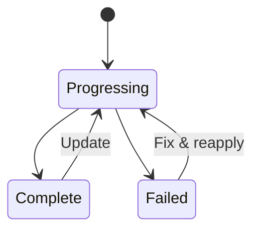

</div>

<div class="grid grid-cols-3 gap-6 mt-8 text-sm">
<div v-click="2" class="text-center">
<carbon-in-progress class="text-4xl text-blue-400 mb-2" />
<strong>Progressing</strong><br/>
Actively rolling out
</div>
<div v-click="3" class="text-center">
<carbon-checkmark class="text-4xl text-green-400 mb-2" />
<strong>Complete</strong><br/>
All replicas updated
</div>
<div v-click="4" class="text-center">
<carbon-close class="text-4xl text-red-400 mb-2" />
<strong>Failed</strong><br/>
Image pull error, etc.
</div>
</div>

<div v-click="5" class="mt-6 text-center">

**Monitor rollout:**
```bash
kubectl rollout status deployment/myapp
```

</div>

---
layout: center
---

# Labels and Selectors

<div v-click="1">

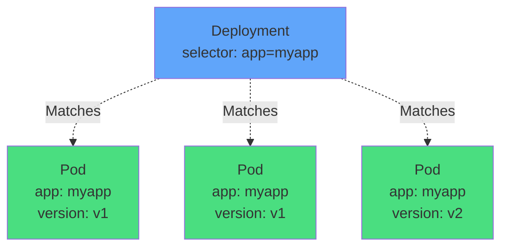

</div>

<div v-click="2" class="mt-8 text-center mb-4">
<carbon-filter class="inline-block text-4xl text-blue-400" />
<div class="text-lg mt-2"><strong>Selector must match labels in Pod template</strong></div>
</div>

<div v-click="3" class="text-center text-sm opacity-80">
Services use same label selectors to find Pods
</div>

---
layout: center
---

# Best Practice Labels

<div v-click="1" class="mb-6">

```yaml
metadata:
  labels:
    app: myapp
    version: v1
    tier: frontend
    environment: production
```

</div>

<div class="grid grid-cols-2 gap-6 text-sm">
<div v-click="2">
<carbon-application class="inline-block text-3xl text-blue-400" /> <strong>app:</strong> application-name
</div>
<div v-click="3">
<carbon-version class="inline-block text-3xl text-green-400" /> <strong>version:</strong> v1, v2
</div>
<div v-click="4">
<carbon-category-and class="inline-block text-3xl text-purple-400" /> <strong>tier:</strong> frontend, backend
</div>
<div v-click="5">
<carbon-tag class="inline-block text-3xl text-yellow-400" /> <strong>environment:</strong> prod, staging
</div>
</div>

<div v-click="6" class="mt-8 text-center">
<carbon-idea class="inline-block text-3xl text-blue-400" /> Consistent labels enable advanced deployment patterns
</div>

---
layout: center
---

# Deployment Best Practices

<div class="grid grid-cols-2 gap-6 mt-4">
<div v-click="1">
<carbon-deployment-pattern class="text-4xl text-blue-400 mb-2" />
<strong>Always use Deployments</strong><br/>
<span class="text-sm opacity-80">Not bare Pods in production</span>
</div>
<div v-click="2">
<carbon-dashboard class="text-4xl text-green-400 mb-2" />
<strong>Resource limits</strong><br/>
<span class="text-sm opacity-80">Requests & limits for scheduling</span>
</div>
<div v-click="3">
<carbon-health-cross class="text-4xl text-purple-400 mb-2" />
<strong>Readiness probes</strong><br/>
<span class="text-sm opacity-80">Critical for zero downtime</span>
</div>
<div v-click="4">
<carbon-tag class="text-4xl text-yellow-400 mb-2" />
<strong>Pin image versions</strong><br/>
<span class="text-sm opacity-80">Never :latest in production</span>
</div>
<div v-click="5">
<carbon-rule class="text-4xl text-orange-400 mb-2" />
<strong>Set replica count</strong><br/>
<span class="text-sm opacity-80">At least 2 for HA</span>
</div>
<div v-click="6">
<carbon-renew class="text-4xl text-red-400 mb-2" />
<strong>maxUnavailable: 0</strong><br/>
<span class="text-sm opacity-80">Guaranteed zero downtime</span>
</div>
</div>

---
layout: center
---

# CKAD Exam Requirements

<div v-click="1" class="text-center mb-6">
<carbon-certificate class="inline-block text-6xl text-blue-400" />
</div>

<div class="grid grid-cols-2 gap-4 text-sm">
<div v-click="2">
<carbon-edit class="inline-block text-2xl text-green-400" /> Create Deployments (imperative & declarative)
</div>
<div v-click="3">
<carbon-arrow-up-right class="inline-block text-2xl text-green-400" /> Scale Deployments
</div>
<div v-click="4">
<carbon-renew class="inline-block text-2xl text-green-400" /> Perform rolling updates
</div>
<div v-click="5">
<carbon-settings class="inline-block text-2xl text-green-400" /> Configure maxSurge/maxUnavailable
</div>
<div v-click="6">
<carbon-undo class="inline-block text-2xl text-green-400" /> Roll back deployments
</div>
<div v-click="7">
<carbon-view class="inline-block text-2xl text-green-400" /> View rollout history
</div>
<div v-click="8">
<carbon-debug class="inline-block text-2xl text-green-400" /> Troubleshoot deployment issues
</div>
<div v-click="9">
<carbon-timer class="inline-block text-2xl text-red-400" /> Work fast and accurately
</div>
</div>

<div v-click="10" class="mt-6 text-center text-yellow-400">
<carbon-idea class="inline-block text-2xl" /> Use kubectl create to generate YAML, then edit
</div>

---
layout: center
---

# Quick Commands

<div class="grid grid-cols-2 gap-6 mt-4">
<div v-click="1">
<carbon-edit class="text-3xl text-blue-400 mb-2" />
<strong>Create</strong>
```bash
kubectl create deployment myapp --image=nginx
kubectl create deployment myapp --image=nginx --replicas=3
```
</div>
<div v-click="2">
<carbon-arrow-up-right class="text-3xl text-green-400 mb-2" />
<strong>Scale</strong>
```bash
kubectl scale deployment myapp --replicas=5
```
</div>
<div v-click="3">
<carbon-renew class="text-3xl text-purple-400 mb-2" />
<strong>Update image</strong>
```bash
kubectl set image deployment/myapp app=nginx:1.20
```
</div>
<div v-click="4">
<carbon-undo class="text-3xl text-yellow-400 mb-2" />
<strong>Rollback</strong>
```bash
kubectl rollout undo deployment/myapp
kubectl rollout history deployment/myapp
```
</div>
</div>

<div v-click="5" class="mt-6 text-center text-sm opacity-80">
Shorthand: <code>deploy</code> for Deployment, <code>rs</code> for ReplicaSet
</div>

---
layout: center
---

# Zero-Downtime Deployment Pattern

<div v-click="1" class="mb-4">

```yaml
spec:
  replicas: 3
  strategy:
    type: RollingUpdate
    rollingUpdate:
      maxSurge: 1
      maxUnavailable: 0
  template:
    spec:
      containers:
      - name: app
        image: myapp:v2
        readinessProbe:
          httpGet:
            path: /health
            port: 8080
        resources:
          requests:
            cpu: 100m
            memory: 128Mi
          limits:
            cpu: 200m
            memory: 256Mi
```

</div>

<div v-click="2" class="text-center text-sm">
<carbon-checkmark class="inline-block text-2xl text-green-400" /> maxUnavailable: 0 + readiness probe = zero downtime
</div>

---
layout: center
---

# Summary

<div v-click="1">

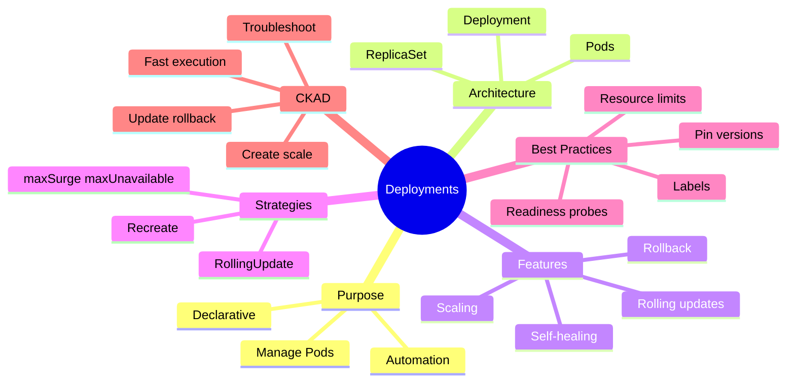

</div>

---
layout: center
---

# Key Takeaways

<div class="grid grid-cols-2 gap-6 mt-6">
<div v-click="1">
<carbon-deployment-pattern class="text-4xl text-blue-400 mb-2" />
<strong>Controllers manage Pods</strong><br/>
<span class="text-sm opacity-80">Deployments → ReplicaSets → Pods</span>
</div>
<div v-click="2">
<carbon-renew class="text-4xl text-green-400 mb-2" />
<strong>Rolling updates</strong><br/>
<span class="text-sm opacity-80">Zero-downtime deployments</span>
</div>
<div v-click="3">
<carbon-undo class="text-4xl text-purple-400 mb-2" />
<strong>Easy rollbacks</strong><br/>
<span class="text-sm opacity-80">Version history & one-command undo</span>
</div>
<div v-click="4">
<carbon-tag class="text-4xl text-yellow-400 mb-2" />
<strong>Labels & selectors</strong><br/>
<span class="text-sm opacity-80">Flexible Pod management</span>
</div>
</div>

<div v-click="5" class="mt-8 text-center text-lg">
Most important CKAD topic - master it thoroughly <carbon-arrow-right class="inline-block text-2xl" />
</div>

---
layout: center
---

# Next Steps

<div v-click="1" class="text-center mb-8">
<carbon-education class="inline-block text-6xl text-blue-400" />
</div>

<div v-click="2">

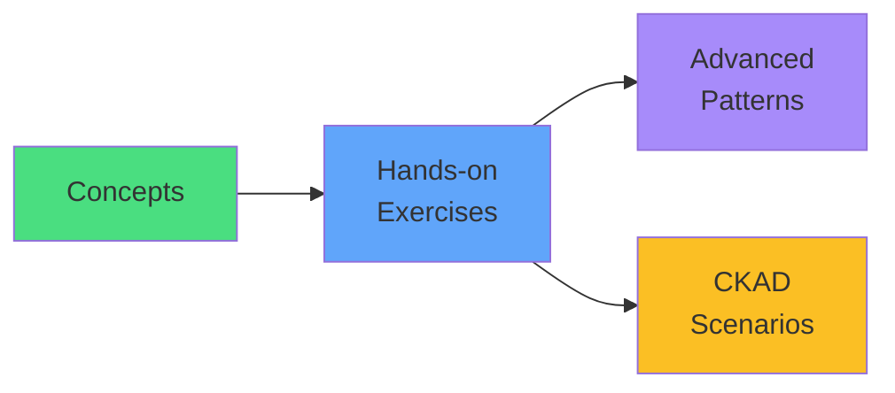

</div>

<div v-click="3" class="mt-8 text-center text-xl">
Let's practice with real deployments! <carbon-arrow-right class="inline-block text-2xl" />
</div>
