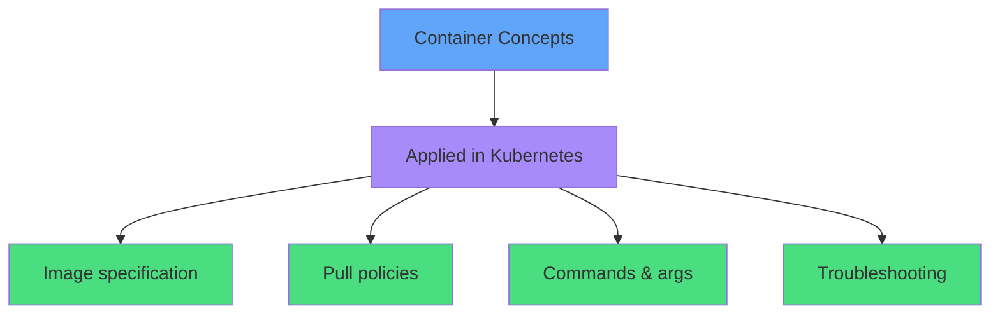

# Container Knowledge for CKAD

```mermaid
graph TB
    DOCKER[<carbon-container-software/> Container Concepts] --> K8S[<carbon-kubernetes/> Applied in Kubernetes]

    K8S --> IMAGE[<carbon-document/> Image specification]
    K8S --> PULL[<carbon-download/> Pull policies]
    K8S --> CMD[<carbon-terminal/> Commands & args]
    K8S --> TROUBLE[<carbon-search/> Troubleshooting]

    style DOCKER fill:#60a5fa
    style K8S fill:#a78bfa
    style IMAGE fill:#4ade80
    style PULL fill:#4ade80
    style CMD fill:#4ade80
    style TROUBLE fill:#4ade80
```

CKAD tests Kubernetes, not Docker commands 
But container knowledge helps troubleshooting

