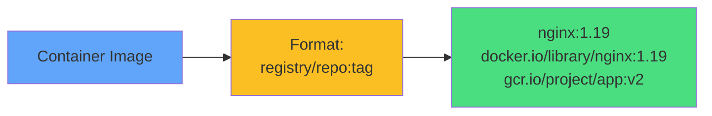

# Image Specification

```mermaid
graph LR
    IMAGE[<carbon-container-software/> Container Image] --> FORMAT[<carbon-document/> Format:<br/>registry/repo:tag]

    FORMAT --> EXAMPLES[nginx:1.19<br/>docker.io/library/nginx:1.19<br/>gcr.io/project/app:v2]

    style IMAGE fill:#60a5fa
    style FORMAT fill:#fbbf24
    style EXAMPLES fill:#4ade80
```

### Missing tag defaults to `:latest`
### Missing registry defaults to Docker Hub
### Always specify versions in production

