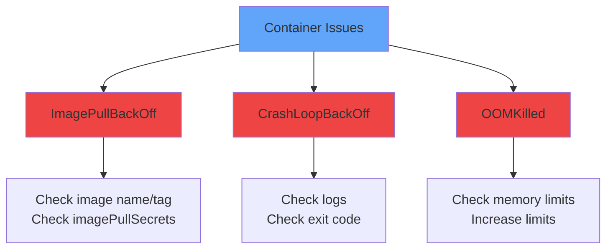

# Troubleshooting Container Issues

```mermaid
graph TB
    ISSUES[<carbon-warning-alt/> Container Issues]

    ISSUES --> PULL[<carbon-close-filled/> ImagePullBackOff]
    ISSUES --> CRASH[<carbon-close-filled/> CrashLoopBackOff]
    ISSUES --> OOM[<carbon-close-filled/> OOMKilled]

    PULL --> FIX1[Check image name/tag<br/>Check imagePullSecrets]
    CRASH --> FIX2[Check logs<br/>Check exit code]
    OOM --> FIX3[Check memory limits<br/>Increase limits]

    style ISSUES fill:#60a5fa
    style PULL fill:#ef4444
    style CRASH fill:#ef4444
    style OOM fill:#ef4444
```

Systematic diagnosis based on error type

