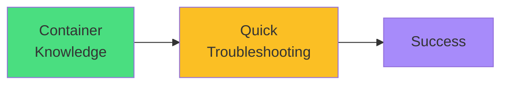

# Exam Mindset

<carbon-lightbulb class="text-yellow-400 text-4xl inline-block" />

### Specify images correctly: registry/repo:tag
### Use imagePullPolicy appropriately
### Check logs for crash diagnosis
### Exit codes provide failure clues
### Container knowledge speeds troubleshooting

