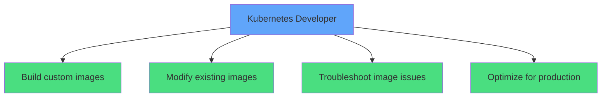
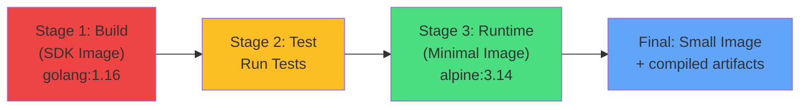
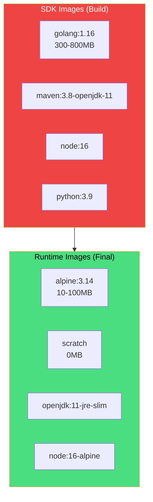
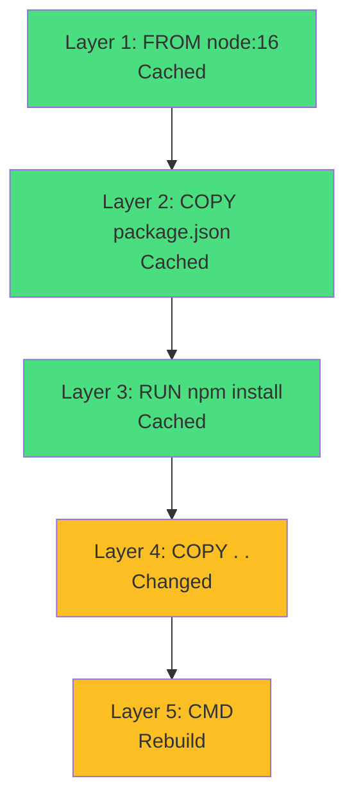
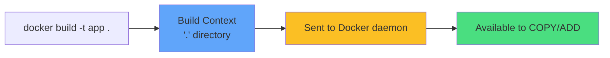
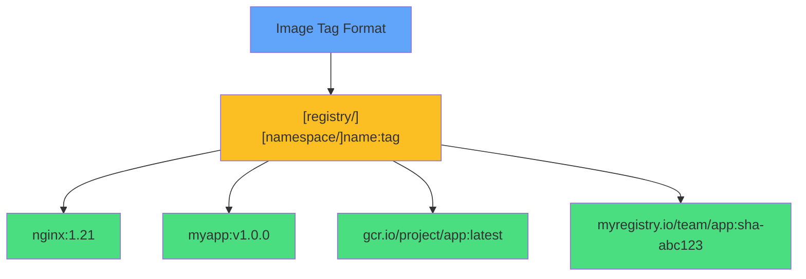
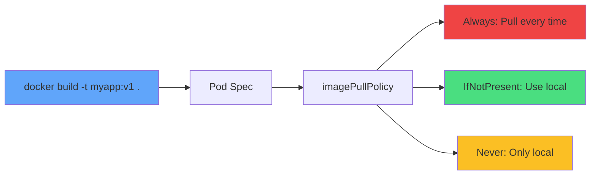
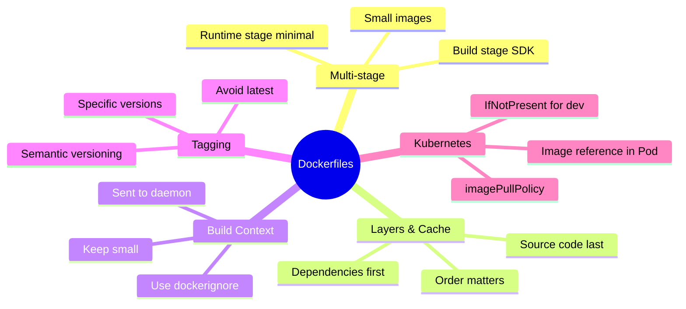
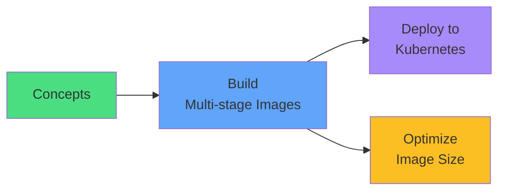

# Container Images and Dockerfiles

<div class="abs-br m-6 flex gap-2">
  <carbon-container-software class="text-6xl text-blue-400" />
</div>

<div v-click class="mt-8 text-xl opacity-80">
Building custom application images for Kubernetes
</div>

---
layout: center
---

# Why Dockerfiles Matter for CKAD

<div v-click="1" class="mb-6">



</div>

<div class="grid grid-cols-2 gap-4 mt-6 text-sm">
<div v-click="2">
<carbon-edit class="inline-block text-2xl text-blue-400" /> Write/modify Dockerfiles
</div>
<div v-click="3">
<carbon-layers class="inline-block text-2xl text-green-400" /> Multi-stage builds
</div>
<div v-click="4">
<carbon-image class="inline-block text-2xl text-purple-400" /> Build and tag images
</div>
<div v-click="5">
<carbon-tag class="inline-block text-2xl text-yellow-400" /> Reference in Pod specs
</div>
</div>

---
layout: center
---

# Dockerfile Basics

<div v-click="1" class="mb-4">

```dockerfile
FROM node:16
WORKDIR /app
COPY package.json .
RUN npm install
COPY . .
ENV NODE_ENV=production
EXPOSE 3000
CMD ["node", "server.js"]
```

</div>

<div class="grid grid-cols-2 gap-4 text-xs">
<div v-click="2">
<carbon-data-base class="inline-block text-2xl text-blue-400" /> <strong>FROM:</strong> Base image
</div>
<div v-click="3">
<carbon-terminal class="inline-block text-2xl text-green-400" /> <strong>RUN:</strong> Execute commands
</div>
<div v-click="4">
<carbon-document class="inline-block text-2xl text-purple-400" /> <strong>COPY/ADD:</strong> Add files
</div>
<div v-click="5">
<carbon-folder class="inline-block text-2xl text-yellow-400" /> <strong>WORKDIR:</strong> Set directory
</div>
<div v-click="6">
<carbon-list class="inline-block text-2xl text-red-400" /> <strong>ENV:</strong> Environment variables
</div>
<div v-click="7">
<carbon-network-3 class="inline-block text-2xl text-orange-400" /> <strong>EXPOSE:</strong> Document port
</div>
<div v-click="8">
<carbon-play class="inline-block text-2xl text-teal-400" /> <strong>CMD:</strong> Default command
</div>
<div v-click="9">
<carbon-terminal class="inline-block text-2xl text-pink-400" /> <strong>ENTRYPOINT:</strong> Main executable
</div>
</div>

<div v-click="10" class="mt-6 text-center text-sm opacity-80">
<carbon-layers class="inline-block text-2xl text-blue-400" /> Each instruction creates a layer
</div>

---
layout: center
---

# Multi-Stage Builds

<div v-click="1">



</div>

<div class="grid grid-cols-2 gap-6 mt-8">
<div v-click="2">
<carbon-tool-box class="text-4xl text-red-400 mb-2" />
<strong>Build Stage</strong><br/>
<span class="text-sm opacity-80">Large SDK with compilers</span>
</div>
<div v-click="3">
<carbon-container-software class="text-4xl text-green-400 mb-2" />
<strong>Runtime Stage</strong><br/>
<span class="text-sm opacity-80">Minimal image with artifacts</span>
</div>
</div>

<div v-click="4" class="mt-6 text-center text-lg">
<carbon-arrow-down class="inline-block text-2xl text-yellow-400" /> Result: 800MB → 50MB
</div>

---
layout: center
---

# Build Stages and Targets

<div v-click="1" class="mb-4">

```dockerfile
FROM golang:1.16 AS builder
WORKDIR /app
COPY . .
RUN go build -o myapp

FROM alpine:3.14 AS runtime
COPY --from=builder /app/myapp /usr/local/bin/
CMD ["myapp"]
```

</div>

<div class="grid grid-cols-2 gap-6 mt-8">
<div v-click="2">
<carbon-tag class="text-4xl text-blue-400 mb-2" />
<strong>Name stages with AS</strong><br/>
<span class="text-sm opacity-80">Reference in later stages</span>
</div>
<div v-click="3">
<carbon-target class="text-4xl text-green-400 mb-2" />
<strong>Build specific stage</strong><br/>
<span class="text-sm opacity-80">docker build --target builder</span>
</div>
</div>

<div v-click="4" class="mt-6 text-center">
<carbon-lightning class="inline-block text-3xl text-yellow-400" /> BuildKit: Skip unused stages
</div>

---
layout: center
---

# SDK Images vs Runtime Images

<div v-click="1">



</div>

<div v-click="2" class="mt-8 text-center text-xl">
<carbon-arrow-down class="inline-block text-3xl text-blue-400" /> SDK: Build tools · Runtime: Only what's needed
</div>

---
layout: center
---

# Image Layers and Caching

<div v-click="1">



</div>

<div class="grid grid-cols-2 gap-6 mt-8">
<div v-click="2">
<carbon-checkmark class="text-4xl text-green-400 mb-2" />
<strong>Good Pattern</strong><br/>
<span class="text-sm opacity-80">Copy dependencies first<br/>Source code last</span>
</div>
<div v-click="3">
<carbon-close class="text-4xl text-red-400 mb-2" />
<strong>Bad Pattern</strong><br/>
<span class="text-sm opacity-80">Copy all files first<br/>Invalidates cache</span>
</div>
</div>

<div v-click="4" class="mt-6 text-center text-yellow-400">
<carbon-warning class="inline-block text-2xl" /> Order matters for cache efficiency!
</div>

---
layout: center
---

# Build Context

<div v-click="1">



</div>

<div v-click="2" class="mt-8 mb-4 text-center text-lg">
<carbon-document class="inline-block text-3xl text-blue-400" /> .dockerignore
</div>

<div v-click="3" class="text-sm">

```
node_modules/
.git/
*.log
.env
.DS_Store
```

</div>

<div v-click="4" class="mt-6 text-center text-yellow-400">
<carbon-warning class="inline-block text-2xl" /> Large contexts slow builds!
</div>

---
layout: center
---

# Image Tagging for Kubernetes

<div v-click="1" class="mb-6">



</div>

<div class="grid grid-cols-2 gap-6">
<div v-click="2">
<carbon-checkmark class="text-4xl text-green-400 mb-2" />
<strong>Best Practices</strong><br/>
<span class="text-sm opacity-80">Specific versions<br/>Semantic versioning<br/>Commit SHAs</span>
</div>
<div v-click="3">
<carbon-close class="text-4xl text-red-400 mb-2" />
<strong>Avoid</strong><br/>
<span class="text-sm opacity-80">Using :latest<br/>No version tags<br/>Overwriting tags</span>
</div>
</div>

---
layout: center
---

# Using Custom Images in Kubernetes

<div v-click="1" class="mb-4">

```yaml
spec:
  containers:
  - name: app
    image: myapp:v1
    imagePullPolicy: IfNotPresent
```

</div>

<div v-click="2">



</div>

<div class="grid grid-cols-3 gap-4 mt-6 text-xs">
<div v-click="3" class="text-center">
<carbon-download class="text-3xl text-red-400 mb-1" />
<strong>Always</strong><br/>
Default for :latest
</div>
<div v-click="4" class="text-center">
<carbon-checkmark class="text-3xl text-green-400 mb-1" />
<strong>IfNotPresent</strong><br/>
Local development
</div>
<div v-click="5" class="text-center">
<carbon-close class="text-3xl text-yellow-400 mb-1" />
<strong>Never</strong><br/>
Local only
</div>
</div>

---
layout: center
---

# Common Issues and Optimization

<div class="grid grid-cols-2 gap-6 mt-4">
<div v-click="1">
<carbon-warning class="text-4xl text-red-400 mb-2" />
<strong>Common Issues</strong><br/>
<span class="text-sm opacity-80">• Large image sizes<br/>• Slow builds<br/>• ImagePullBackOff<br/>• Large build context</span>
</div>
<div v-click="2">
<carbon-lightning class="text-4xl text-green-400 mb-2" />
<strong>Optimization Tips</strong><br/>
<span class="text-sm opacity-80">• Multi-stage builds<br/>• Alpine/slim variants<br/>• Combine RUN commands<br/>• Use .dockerignore</span>
</div>
</div>

<div v-click="3" class="mt-8 mb-4 text-center">
<carbon-clean class="inline-block text-3xl text-blue-400" /> Combine cleanup in same layer:
</div>

<div v-click="4" class="text-xs">

```dockerfile
RUN apt-get update && \
    apt-get install -y pkg && \
    rm -rf /var/lib/apt/lists/*
```

</div>

---
layout: center
---

# Summary

<div v-click="1">



</div>

---
layout: center
---

# CKAD Exam Focus

<div v-click="1" class="text-center mb-6">
<carbon-certificate class="inline-block text-6xl text-blue-400" />
</div>

<div class="grid grid-cols-2 gap-4 text-sm">
<div v-click="2">
<carbon-edit class="inline-block text-2xl text-green-400" /> Write basic Dockerfiles
</div>
<div v-click="3">
<carbon-layers class="inline-block text-2xl text-green-400" /> Multi-stage build pattern
</div>
<div v-click="4">
<carbon-terminal class="inline-block text-2xl text-green-400" /> Build and tag images
</div>
<div v-click="5">
<carbon-tag class="inline-block text-2xl text-green-400" /> Reference correctly in specs
</div>
<div v-click="6">
<carbon-debug class="inline-block text-2xl text-green-400" /> Troubleshoot image pull issues
</div>
<div v-click="7">
<carbon-settings class="inline-block text-2xl text-green-400" /> Understand imagePullPolicy
</div>
</div>

<div v-click="8" class="mt-8 text-center text-lg">
<carbon-terminal class="inline-block text-3xl text-purple-400" /> Practice multi-stage builds!
</div>

---
layout: center
---

# Next Steps

<div v-click="1" class="text-center mb-8">
<carbon-education class="inline-block text-6xl text-blue-400" />
</div>

<div v-click="2">



</div>

<div v-click="3" class="mt-8 text-center text-xl">
Let's build some images! <carbon-arrow-right class="inline-block text-2xl" />
</div>
