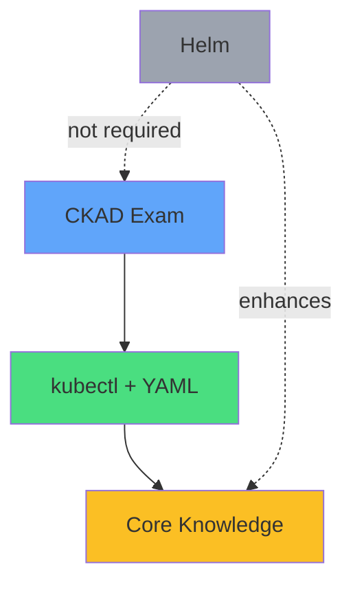

# Beyond Exam Scope

```mermaid
graph TB
    CKAD[<carbon-certificate/> CKAD Exam] --> KUBECTL[<carbon-terminal/> kubectl + YAML]

    HELM[<carbon-package/> Helm] -.->|not required| CKAD

    KUBECTL --> FUNDAMENTALS[<carbon-education/> Core Knowledge]
    HELM -.->|enhances| FUNDAMENTALS

    style CKAD fill:#60a5fa
    style KUBECTL fill:#4ade80
    style HELM fill:#9ca3af
    style FUNDAMENTALS fill:#fbbf24
```

Helm is valuable but NOT tested on CKAD 
Focus on kubectl and YAML

