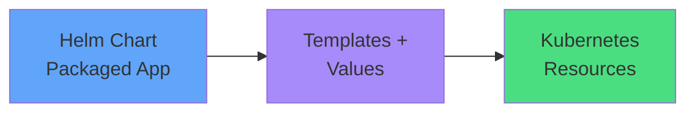

# What Helm Does

### Helm packages Kubernetes resources

**Without Helm (CKAD)**
- Write YAML manually
- Apply with kubectl
- Manage each resource

**With Helm (Production)**
- Install Chart
- Customize values
- Manage as release

