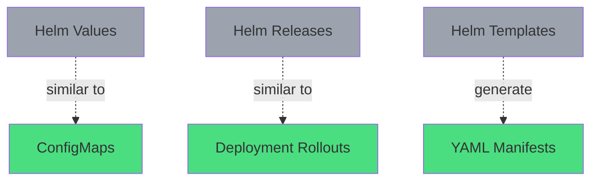

# Helm Concepts vs CKAD

```mermaid
graph TB
    HELM_VALUES[<carbon-package/> Helm Values] -.->|similar to| CONFIGMAP[<carbon-settings/> ConfigMaps]
    HELM_RELEASE[<carbon-package/> Helm Releases] -.->|similar to| ROLLOUT[<carbon-renew/> Deployment Rollouts]
    HELM_TEMPLATE[<carbon-package/> Helm Templates] -.->|generate| YAML[<carbon-document/> YAML Manifests]

    style HELM_VALUES fill:#9ca3af
    style HELM_RELEASE fill:#9ca3af
    style HELM_TEMPLATE fill:#9ca3af
    style CONFIGMAP fill:#4ade80
    style ROLLOUT fill:#4ade80
    style YAML fill:#4ade80
```

Helm automates patterns you do manually in CKAD

