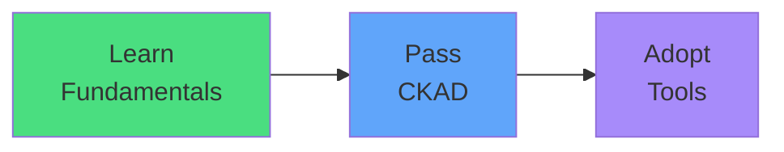

# Exam Mindset

<carbon-lightbulb class="text-yellow-400 text-4xl inline-block" />

### Focus on kubectl and YAML for CKAD
### Helm creates standard Kubernetes resources
### Your CKAD knowledge applies to Helm-deployed apps
### Don't spend exam prep time on Helm

