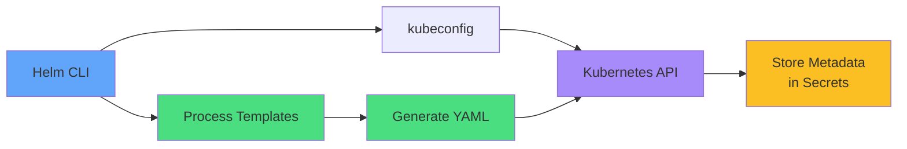
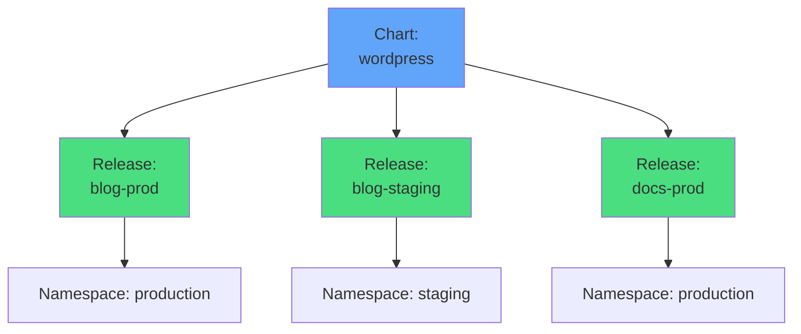
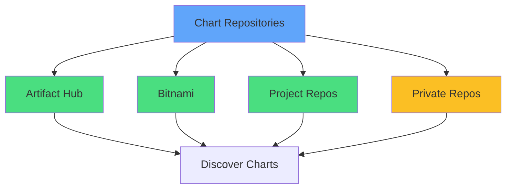
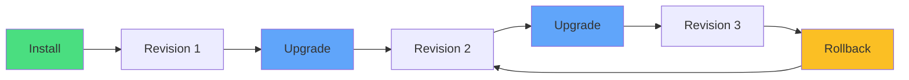
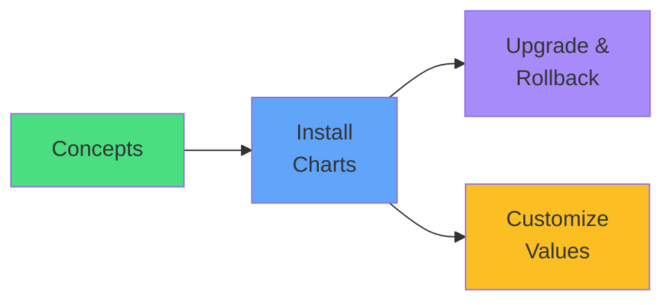

# Helm

<div class="abs-br m-6 flex gap-2">
  <carbon-container-software class="text-6xl text-blue-400" />
</div>

<div v-click class="mt-8 text-xl opacity-80">
The package manager for Kubernetes
</div>

---
layout: center
---

# The Challenge Without Helm

<div v-click="1">


</div>

<div class="grid grid-cols-2 gap-6 mt-8 text-sm">
<div v-click="2">
<carbon-document class="text-3xl text-red-400 mb-2" />
Duplicate YAML for each environment
</div>
<div v-click="3">
<carbon-edit class="text-3xl text-yellow-400 mb-2" />
Manual config updates
</div>
<div v-click="4">
<carbon-version class="text-3xl text-purple-400 mb-2" />
No easy rollbacks
</div>
<div v-click="5">
<carbon-share class="text-3xl text-blue-400 mb-2" />
Difficult to share apps
</div>
</div>

---
layout: center
---

# What is Helm?

<div v-click="1" class="mb-6">


</div>

<div class="grid grid-cols-2 gap-6">
<div v-click="2">
<carbon-settings class="text-4xl text-blue-400 mb-2" />
<strong>Like apt, yum, brew</strong><br/>
<span class="text-sm opacity-80">But for Kubernetes</span>
</div>
<div v-click="3">
<carbon-terminal class="text-4xl text-green-400 mb-2" />
<strong>CLI tool</strong><br/>
<span class="text-sm opacity-80">No server required (v3+)</span>
</div>
</div>

<div v-click="4" class="mt-6 text-center text-yellow-400">
<carbon-checkmark class="inline-block text-2xl" /> Standard Kubernetes resources
</div>

---
layout: center
---

# Helm Architecture

<div v-click="1">



</div>

<div class="grid grid-cols-3 gap-4 mt-8 text-sm">
<div v-click="2" class="text-center">
<carbon-template class="text-3xl text-green-400 mb-1" />
<strong>Process</strong><br/>
Templates + Values
</div>
<div v-click="3" class="text-center">
<carbon-document class="text-3xl text-blue-400 mb-1" />
<strong>Generate</strong><br/>
Standard YAML
</div>
<div v-click="4" class="text-center">
<carbon-kubernetes class="text-3xl text-purple-400 mb-1" />
<strong>Deploy</strong><br/>
To cluster
</div>
</div>

---
layout: center
---

# Core Concepts: Charts

<div v-click="1">


</div>

<div v-click="2" class="mt-8 text-center text-lg">
<carbon-package class="inline-block text-4xl text-blue-400" /> <strong>Chart</strong> = Package of everything needed
</div>

<div class="grid grid-cols-3 gap-4 mt-6 text-sm">
<div v-click="3" class="text-center">
<carbon-folder class="text-3xl text-green-400 mb-1" />
Local directories
</div>
<div v-click="4" class="text-center">
<carbon-archive class="text-3xl text-yellow-400 mb-1" />
Tar.gz archives
</div>
<div v-click="5" class="text-center">
<carbon-cloud class="text-3xl text-purple-400 mb-1" />
Remote repositories
</div>
</div>

---
layout: center
---

# Core Concepts: Values

<div v-click="1" class="mb-4">

```yaml
# values.yaml
replicaCount: 3
image:
  repository: nginx
  tag: "1.21"
service:
  type: LoadBalancer
  port: 80
```

</div>

<div v-click="2">


</div>

<div class="grid grid-cols-2 gap-6 mt-6 text-sm">
<div v-click="3">
<carbon-settings class="text-3xl text-blue-400 mb-1" />
<strong>Override defaults</strong><br/>
helm install --set replicas=5
</div>
<div v-click="4">
<carbon-document class="text-3xl text-green-400 mb-1" />
<strong>Custom values file</strong><br/>
helm install -f prod-values.yaml
</div>
</div>

---
layout: center
---

# Core Concepts: Templates

<div v-click="1" class="mb-4">

```yaml
apiVersion: apps/v1
kind: Deployment
metadata:
  name: {{ .Release.Name }}
spec:
  replicas: {{ .Values.replicaCount }}
  template:
    spec:
      containers:
      - name: {{ .Chart.Name }}
        image: "{{ .Values.image.repository }}:{{ .Values.image.tag }}"
```

</div>

<div class="grid grid-cols-2 gap-6 mt-6">
<div v-click="2">
<carbon-template class="text-4xl text-blue-400 mb-2" />
<strong>Go Template Syntax</strong><br/>
<span class="text-sm opacity-80">{{ .Values.field }}</span>
</div>
<div v-click="3">
<carbon-flow class="text-4xl text-green-400 mb-2" />
<strong>Built-in Objects</strong><br/>
<span class="text-sm opacity-80">.Release .Chart .Values</span>
</div>
</div>

<div v-click="4" class="mt-6 text-center text-yellow-400">
<carbon-warning class="inline-block text-2xl" /> Read templates, don't write complex ones for CKAD
</div>

---
layout: center
---

# Core Concepts: Releases

<div v-click="1">



</div>

<div v-click="2" class="mt-8 text-center text-xl">
<carbon-deployment-pattern class="inline-block text-4xl text-blue-400" />
</div>

<div class="grid grid-cols-2 gap-6 mt-6">
<div v-click="3" class="text-center">
<strong>Chart</strong><br/>
<span class="text-sm opacity-80">Package template</span>
</div>
<div v-click="4" class="text-center">
<strong>Release</strong><br/>
<span class="text-sm opacity-80">Running instance</span>
</div>
</div>

---
layout: center
---

# Chart Repositories

<div v-click="1">



</div>

<div class="grid grid-cols-2 gap-4 mt-6 text-sm">
<div v-click="2">
<carbon-terminal class="inline-block text-2xl text-blue-400" /> helm repo add
</div>
<div v-click="3">
<carbon-renew class="inline-block text-2xl text-green-400" /> helm repo update
</div>
<div v-click="4">
<carbon-search class="inline-block text-2xl text-purple-400" /> helm search repo
</div>
<div v-click="5">
<carbon-view class="inline-block text-2xl text-yellow-400" /> helm show values
</div>
</div>

<div v-click="6" class="mt-8 text-center">
<carbon-cloud class="inline-block text-3xl text-blue-400" /> artifacthub.io
</div>

---
layout: center
---

# Helm Lifecycle Operations

<div v-click="1">


</div>

<div class="grid grid-cols-2 gap-4 mt-6 text-sm">
<div v-click="2">
<carbon-add class="inline-block text-2xl text-green-400" /> <strong>install:</strong> Deploy new release
</div>
<div v-click="3">
<carbon-upgrade class="inline-block text-2xl text-blue-400" /> <strong>upgrade:</strong> Update existing release
</div>
<div v-click="4">
<carbon-reset class="inline-block text-2xl text-yellow-400" /> <strong>rollback:</strong> Revert to previous revision
</div>
<div v-click="5">
<carbon-list class="inline-block text-2xl text-purple-400" /> <strong>list:</strong> Show all releases
</div>
<div v-click="6">
<carbon-information class="inline-block text-2xl text-teal-400" /> <strong>status:</strong> Display release status
</div>
<div v-click="7">
<carbon-close class="inline-block text-2xl text-red-400" /> <strong>uninstall:</strong> Remove release
</div>
</div>

---
layout: center
---

# Install and Upgrade

<div v-click="1" class="mb-4">

```bash
# Install new release
helm install myapp bitnami/nginx --set replicas=3

# Upgrade with new values
helm upgrade myapp bitnami/nginx --set replicas=5

# Install or upgrade (idempotent)
helm upgrade --install myapp bitnami/nginx
```

</div>

<div v-click="2">



</div>

<div v-click="3" class="mt-6 text-center text-sm">
<carbon-version class="inline-block text-2xl text-purple-400" /> Each upgrade creates a new revision
</div>

---
layout: center
---

# Rollback and History

<div v-click="1" class="mb-4">

```bash
# View release history
helm history myapp

# Rollback to previous revision
helm rollback myapp

# Rollback to specific revision
helm rollback myapp 2
```

</div>

<div v-click="2">


</div>

<div v-click="3" class="mt-6 text-center">
<carbon-reset class="inline-block text-3xl text-green-400" /> Safe rollback with complete history
</div>

---
layout: center
---

# When to Use Helm

<div class="grid grid-cols-2 gap-6 mt-4">
<div v-click="1">
<carbon-checkmark class="text-5xl text-green-400 mb-2" />
<strong>Best Use Cases</strong><br/>
<span class="text-sm opacity-80">• Third-party apps<br/>• Complex applications<br/>• Multiple environments<br/>• Team sharing<br/>• Frequent upgrades</span>
</div>
<div v-click="2">
<carbon-help class="text-5xl text-yellow-400 mb-2" />
<strong>Consider Alternatives</strong><br/>
<span class="text-sm opacity-80">• Simple apps<br/>• Template-free preference<br/>• GitOps workflows<br/>• Team unfamiliar with Go templates</span>
</div>
</div>

<div v-click="3" class="mt-8 text-center text-lg">
<carbon-flow class="inline-block text-3xl text-blue-400" /> Many teams use Helm + Kustomize
</div>

---
layout: center
---

# Summary

<div v-click="1">


</div>

---
layout: center
---

# Helm and CKAD

<div v-click="1" class="text-center mb-6">
<carbon-certificate class="inline-block text-6xl text-blue-400" />
</div>

<div class="grid grid-cols-2 gap-4 text-sm">
<div v-click="2">
<carbon-terminal class="inline-block text-2xl text-green-400" /> Install Helm CLI
</div>
<div v-click="3">
<carbon-add class="inline-block text-2xl text-green-400" /> Install charts with custom values
</div>
<div v-click="4">
<carbon-settings class="inline-block text-2xl text-green-400" /> Use --set to override values
</div>
<div v-click="5">
<carbon-upgrade class="inline-block text-2xl text-green-400" /> Upgrade releases
</div>
<div v-click="6">
<carbon-reset class="inline-block text-2xl text-green-400" /> Rollback releases
</div>
<div v-click="7">
<carbon-list class="inline-block text-2xl text-green-400" /> List and view status
</div>
<div v-click="8">
<carbon-view class="inline-block text-2xl text-green-400" /> Inspect generated YAML
</div>
<div v-click="9">
<carbon-timer class="inline-block text-2xl text-red-400" /> Practice for speed
</div>
</div>

<div v-click="10" class="mt-8 text-center text-yellow-400">
<carbon-warning class="inline-block text-2xl" /> Supplementary topic, but still important!
</div>

---
layout: center
---

# Next Steps

<div v-click="1" class="text-center mb-8">
<carbon-education class="inline-block text-6xl text-blue-400" />
</div>

<div v-click="2">



</div>

<div v-click="3" class="mt-8 text-center text-xl">
Let's deploy with Helm! <carbon-arrow-right class="inline-block text-2xl" />
</div>
