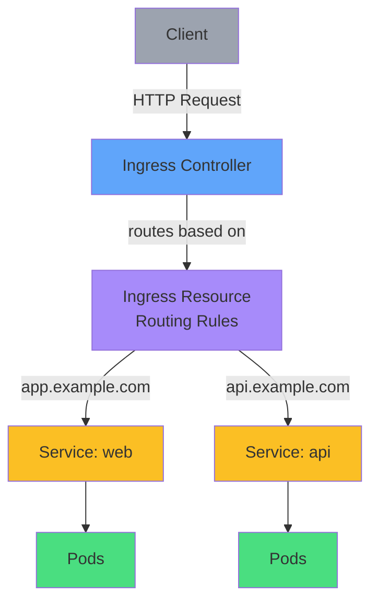

# Ingress Architecture

```mermaid
graph TB
    CLIENT[<carbon-user/> Client] -->|HTTP Request| IC[<carbon-router/> Ingress Controller]

    IC -->|routes based on| ING[<carbon-rule/> Ingress Resource<br/>Routing Rules]

    ING -->|app.example.com| SVC1[<carbon-network-3/> Service: web]
    ING -->|api.example.com| SVC2[<carbon-network-3/> Service: api]

    SVC1 --> POD1[<carbon-container-software/> Pods]
    SVC2 --> POD2[<carbon-container-software/> Pods]

    style CLIENT fill:#9ca3af
    style IC fill:#60a5fa
    style ING fill:#a78bfa
    style SVC1 fill:#fbbf24
    style SVC2 fill:#fbbf24
    style POD1 fill:#4ade80
    style POD2 fill:#4ade80
```

Layer 7 HTTP/HTTPS routing

