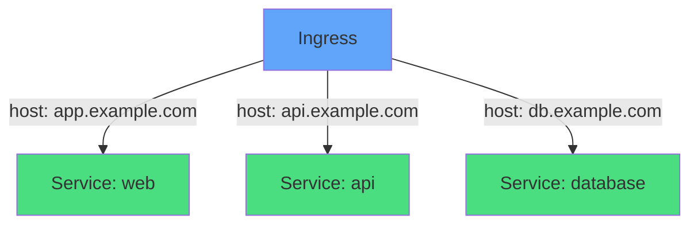

# Host-Based Routing

```mermaid
graph TB
    ING[<carbon-router/> Ingress]

    ING -->|host: app.example.com| SVC1[<carbon-network-3/> Service: web]
    ING -->|host: api.example.com| SVC2[<carbon-network-3/> Service: api]
    ING -->|host: db.example.com| SVC3[<carbon-network-3/> Service: database]

    style ING fill:#60a5fa
    style SVC1 fill:#4ade80
    style SVC2 fill:#4ade80
    style SVC3 fill:#4ade80
```

### Route by hostname

Different hosts → Different services 
No host specified → Match any hostname

