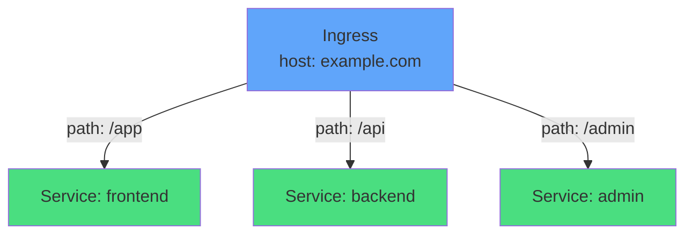

# Path-Based Routing

```mermaid
graph TB
    ING[<carbon-router/> Ingress<br/>host: example.com]

    ING -->|path: /app| SVC1[<carbon-network-3/> Service: frontend]
    ING -->|path: /api| SVC2[<carbon-network-3/> Service: backend]
    ING -->|path: /admin| SVC3[<carbon-network-3/> Service: admin]

    style ING fill:#60a5fa
    style SVC1 fill:#4ade80
    style SVC2 fill:#4ade80
    style SVC3 fill:#4ade80
```

### Route by path within same host

**Prefix**
Matches /path/*

**Exact**
Matches /path only

**ImplementationSpecific**
Controller-dependent

