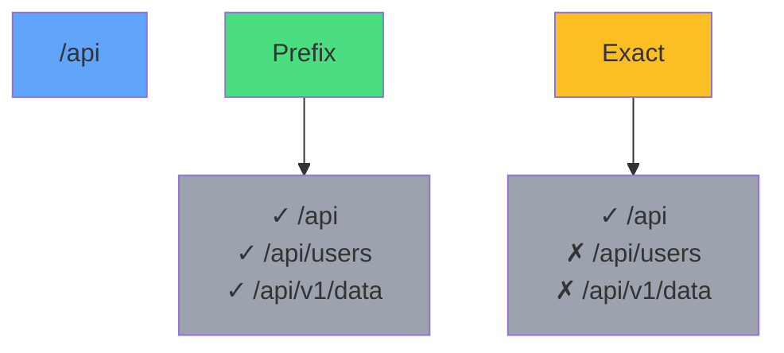

# PathType Options

```mermaid
graph TB
    PATH[<carbon-folder/> /api]

    PREFIX[<carbon-arrow-right/> Prefix] --> MATCH1[✓ /api<br/>✓ /api/users<br/>✓ /api/v1/data]

    EXACT[<carbon-arrow-right/> Exact] --> MATCH2[✓ /api<br/>✗ /api/users<br/>✗ /api/v1/data]

    style PATH fill:#60a5fa
    style PREFIX fill:#4ade80
    style EXACT fill:#fbbf24
    style MATCH1 fill:#9ca3af
    style MATCH2 fill:#9ca3af
```

### Prefix is most common for APIs
### Exact for specific endpoints only

