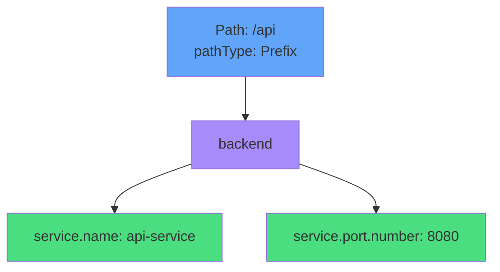

# Backend Service Configuration



<div class="mt-8 text-center">

### Critical Syntax (networking.k8s.io/v1)

```yaml
backend:
  service:
    name: api-service
    port:
      number: 8080
```

<div class="mt-4 opacity-80 text-sm">
Can also use port.name instead of port.number
</div>

</div>
