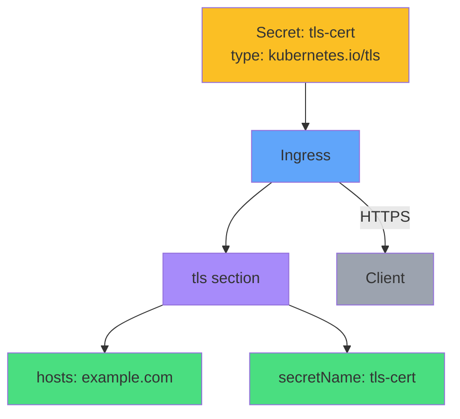

# TLS Configuration

```mermaid
graph TB
    SECRET[<carbon-locked/> Secret: tls-cert<br/>type: kubernetes.io/tls] --> ING[<carbon-router/> Ingress]

    ING --> TLS[<carbon-security/> tls section]
    TLS --> HOSTS[hosts: example.com]
    TLS --> SECRETNAME[secretName: tls-cert]

    ING -->|HTTPS| CLIENT[<carbon-user/> Client]

    style SECRET fill:#fbbf24
    style ING fill:#60a5fa
    style TLS fill:#a78bfa
    style HOSTS fill:#4ade80
    style SECRETNAME fill:#4ade80
    style CLIENT fill:#9ca3af
```

### 1. Create TLS Secret: `kubectl create secret tls tls-cert --cert=cert.pem --key=key.pem`
### 2. Reference in Ingress tls section

