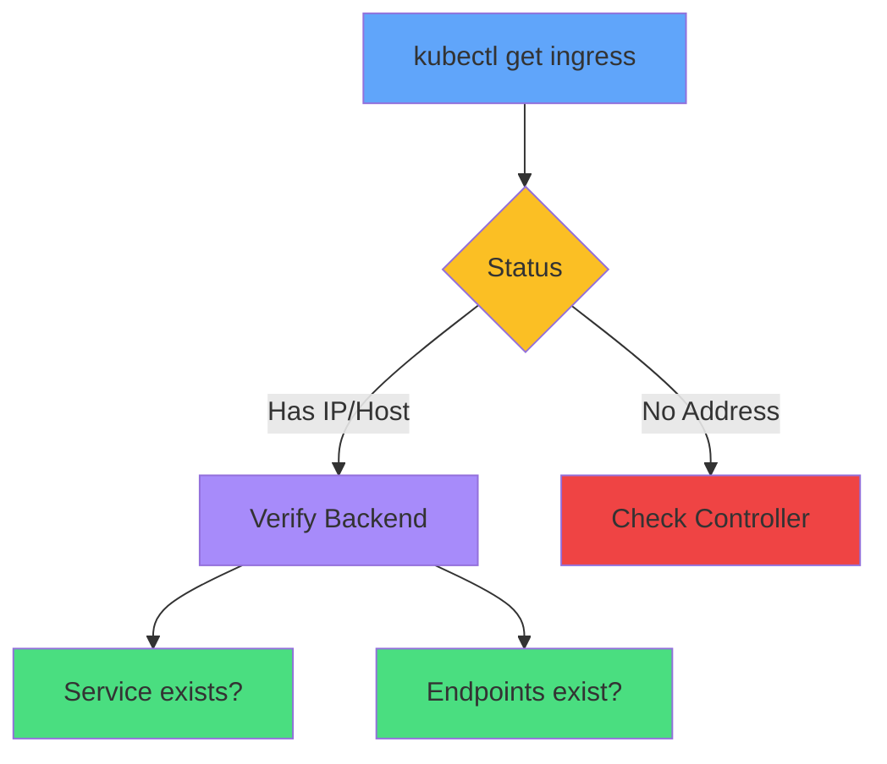

# Troubleshooting Ingress

```mermaid
graph TB
    CHECK[<carbon-search/> kubectl get ingress] --> STATUS{<carbon-decision-tree/> Status}

    STATUS -->|Has IP/Host| VERIFY[<carbon-checkmark-outline/> Verify Backend]
    STATUS -->|No Address| CONTROLLER[<carbon-warning-alt/> Check Controller]

    VERIFY --> SVC[<carbon-network-3/> Service exists?]
    VERIFY --> EP[<carbon-network-3/> Endpoints exist?]

    style CHECK fill:#60a5fa
    style STATUS fill:#fbbf24
    style VERIFY fill:#a78bfa
    style CONTROLLER fill:#ef4444
    style SVC fill:#4ade80
    style EP fill:#4ade80
```

### Common Issues
- Backend Service doesn't exist
- Service has no endpoints (Pods not running)
- Ingress controller not installed
- Wrong pathType for routing

