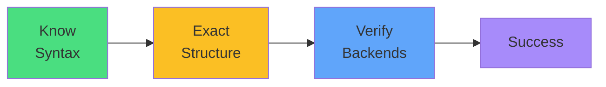

# Exam Mindset

<carbon-lightbulb class="text-yellow-400 text-4xl inline-block" />

### pathType is REQUIRED
### Backend uses service.name and service.port.number
### Verify Services exist before creating Ingress

