# Kubernetes Ingress

<div class="abs-br m-6 flex gap-2">
  <carbon-network-3 class="text-6xl text-blue-400" />
</div>

<div v-click class="mt-8 text-xl opacity-80">
HTTP/HTTPS routing to services in your cluster
</div>

---
layout: center
---

# The Problem Without Ingress

<div v-click="1">

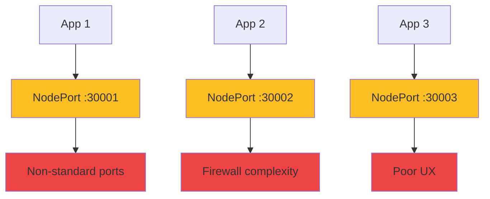

</div>

<div v-click="2" class="mt-8">

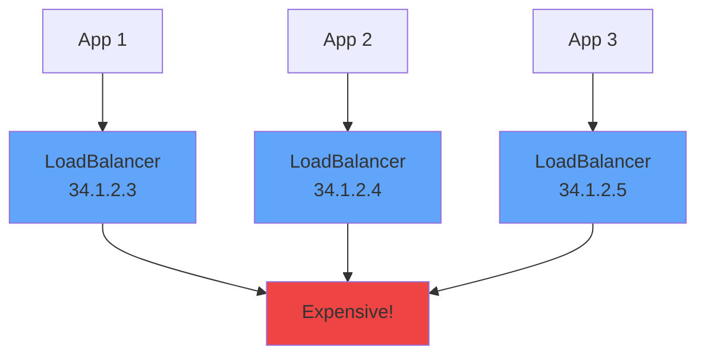

</div>

<div v-click="3" class="mt-6 text-center text-yellow-400">
<carbon-warning class="inline-block text-2xl" /> 10 apps = 10 load balancers!
</div>

---
layout: center
---

# What is Ingress?

<div v-click="1">

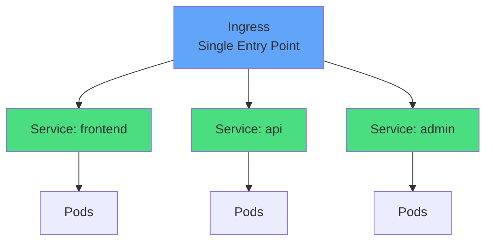

</div>

<div class="grid grid-cols-2 gap-6 mt-8">
<div v-click="2">
<carbon-gateway class="text-5xl text-blue-400 mb-2" />
<strong>Smart Reverse Proxy</strong><br/>
<span class="text-sm opacity-80">Routes HTTP/HTTPS traffic</span>
</div>
<div v-click="3">
<carbon-money class="text-5xl text-green-400 mb-2" />
<strong>Cost Effective</strong><br/>
<span class="text-sm opacity-80">One LoadBalancer for all apps</span>
</div>
</div>

---
layout: center
---

# Ingress Architecture

<div v-click="1">

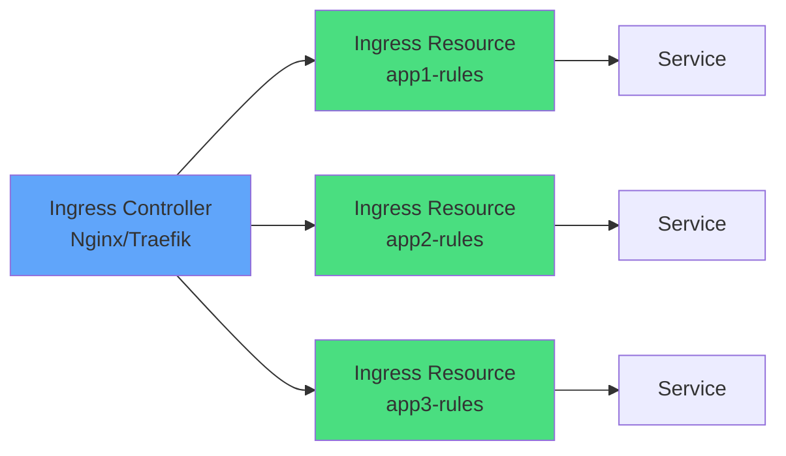

</div>

<div class="grid grid-cols-2 gap-6 mt-8">
<div v-click="2">
<carbon-container-software class="text-4xl text-blue-400 mb-2" />
<strong>Ingress Controller</strong><br/>
<span class="text-sm opacity-80">Actual reverse proxy (Deployment)</span>
</div>
<div v-click="3">
<carbon-rule class="text-4xl text-green-400 mb-2" />
<strong>Ingress Resources</strong><br/>
<span class="text-sm opacity-80">Routing rules (YAML manifests)</span>
</div>
</div>

<div v-click="4" class="mt-6 text-center text-yellow-400">
<carbon-checkmark class="inline-block text-2xl" /> Controller watches API, updates config dynamically
</div>

---
layout: center
---

# Ingress Controller Options

<div v-click="1">

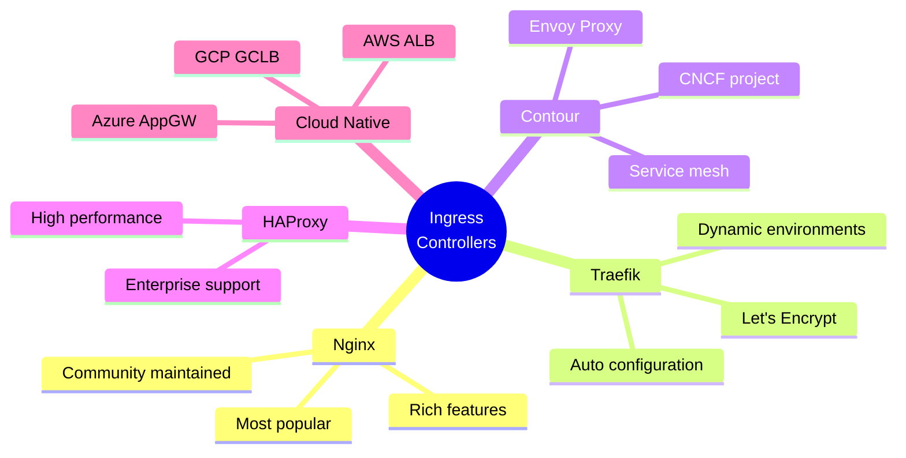

</div>

<div v-click="2" class="mt-8 text-center text-lg">
<carbon-kubernetes class="inline-block text-3xl text-blue-400" /> For CKAD: Focus on <strong>Nginx</strong>
</div>

---
layout: center
---

# Host-Based Routing

<div v-click="1">

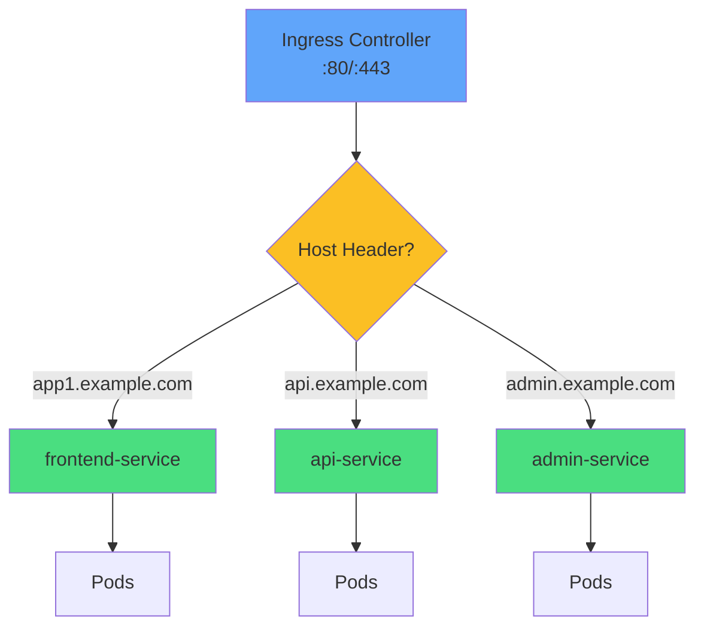

</div>

<div v-click="2" class="mt-8 text-center text-xl">
<carbon-tag class="inline-block text-3xl text-purple-400" /> Different hostname → Different service
</div>

<div class="grid grid-cols-2 gap-6 mt-6 text-sm">
<div v-click="3">
<carbon-checkmark class="text-3xl text-green-400 mb-1" />
Clean separation, bookmarkable
</div>
<div v-click="4">
<carbon-certificate class="text-3xl text-blue-400 mb-1" />
Different TLS certs per host
</div>
</div>

---
layout: center
---

# Path-Based Routing

<div v-click="1">

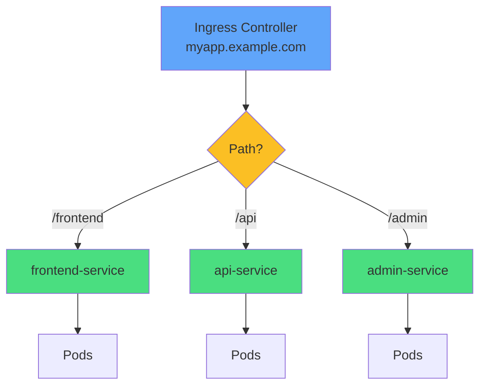

</div>

<div v-click="2" class="mt-8 text-center text-xl">
<carbon-network-3 class="inline-block text-3xl text-blue-400" /> Same hostname, different path → Different service
</div>

<div class="grid grid-cols-2 gap-6 mt-6 text-sm">
<div v-click="3">
<carbon-rule class="text-3xl text-purple-400 mb-1" />
<strong>Prefix:</strong> /api matches /api/users
</div>
<div v-click="4">
<carbon-checkmark class="text-3xl text-green-400 mb-1" />
<strong>Exact:</strong> /health matches only /health
</div>
</div>

---
layout: center
---

# Ingress Resource Structure

<div v-click="1" class="mb-4">

```yaml
apiVersion: networking.k8s.io/v1
kind: Ingress
metadata:
  name: myapp-ingress
spec:
  ingressClassName: nginx
  rules:
  - host: app.example.com
    http:
      paths:
      - path: /api
        pathType: Prefix
        backend:
          service:
            name: api-service
            port:
              number: 8080
```

</div>

<div class="grid grid-cols-2 gap-4 text-xs">
<div v-click="2">
<carbon-tag class="inline-block text-2xl text-blue-400" /> <strong>ingressClassName:</strong> Which controller
</div>
<div v-click="3">
<carbon-network-3 class="inline-block text-2xl text-green-400" /> <strong>host:</strong> Hostname (optional)
</div>
<div v-click="4">
<carbon-rule class="inline-block text-2xl text-purple-400" /> <strong>path:</strong> URL path
</div>
<div v-click="5">
<carbon-flow class="inline-block text-2xl text-yellow-400" /> <strong>pathType:</strong> Prefix or Exact
</div>
<div v-click="6">
<carbon-container-software class="inline-block text-2xl text-red-400" /> <strong>backend:</strong> Target service
</div>
<div v-click="7">
<carbon-network-1 class="inline-block text-2xl text-teal-400" /> <strong>port:</strong> Service port
</div>
</div>

---
layout: center
---

# How Ingress Controllers Work

<div v-click="1">

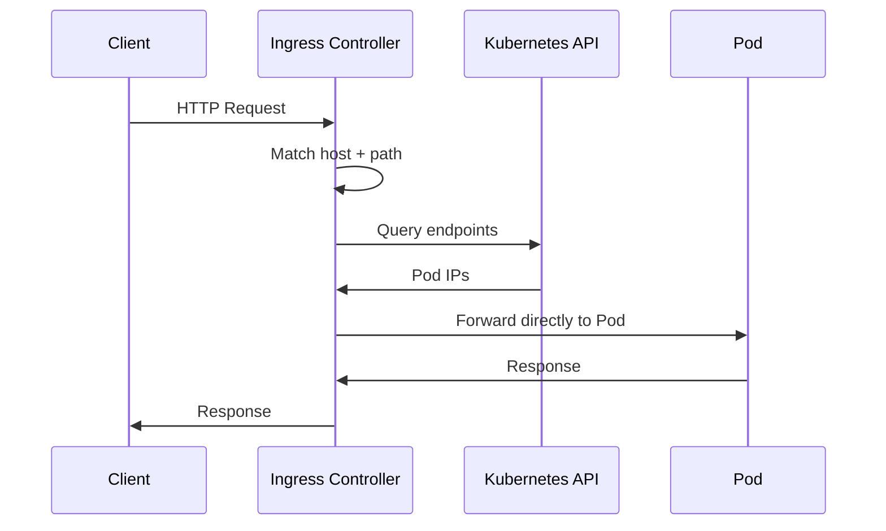

</div>

<div v-click="2" class="mt-8 text-center">
<carbon-lightning class="inline-block text-3xl text-blue-400" /> <strong>Direct-to-Pod routing</strong>
</div>

<div v-click="3" class="mt-4 text-center text-sm opacity-80">
Bypasses service for efficiency
</div>

<div v-click="4" class="mt-6 text-center text-yellow-400">
<carbon-warning class="inline-block text-2xl" /> Controller needs RBAC to read endpoints
</div>

---
layout: center
---

# Controller-Specific Features

<div v-click="1" class="mb-4">

```yaml
apiVersion: networking.k8s.io/v1
kind: Ingress
metadata:
  name: myapp-ingress
  annotations:
    nginx.ingress.kubernetes.io/rewrite-target: /
    nginx.ingress.kubernetes.io/ssl-redirect: "true"
    nginx.ingress.kubernetes.io/rate-limit: "10"
```

</div>

<div class="grid grid-cols-2 gap-4 text-sm">
<div v-click="2">
<carbon-cache class="text-3xl text-blue-400 mb-1" />
<strong>Caching</strong><br/>
Response caching
</div>
<div v-click="3">
<carbon-edit class="text-3xl text-green-400 mb-1" />
<strong>Rewrite</strong><br/>
Path modification
</div>
<div v-click="4">
<carbon-locked class="text-3xl text-purple-400 mb-1" />
<strong>SSL Redirect</strong><br/>
HTTP → HTTPS
</div>
<div v-click="5">
<carbon-dashboard class="text-3xl text-yellow-400 mb-1" />
<strong>Rate Limiting</strong><br/>
Prevent abuse
</div>
</div>

<div v-click="6" class="mt-8 text-center text-yellow-400">
<carbon-warning class="inline-block text-2xl" /> Annotations are controller-specific!
</div>

---
layout: center
---

# TLS/HTTPS Configuration

<div v-click="1" class="mb-4">

```yaml
apiVersion: networking.k8s.io/v1
kind: Ingress
metadata:
  name: myapp-ingress
spec:
  tls:
  - hosts:
    - app.example.com
    secretName: app-tls-secret
  rules:
  - host: app.example.com
    http:
      paths:
      - path: /
        pathType: Prefix
        backend:
          service:
            name: app-service
            port:
              number: 80
```

</div>

<div v-click="2">

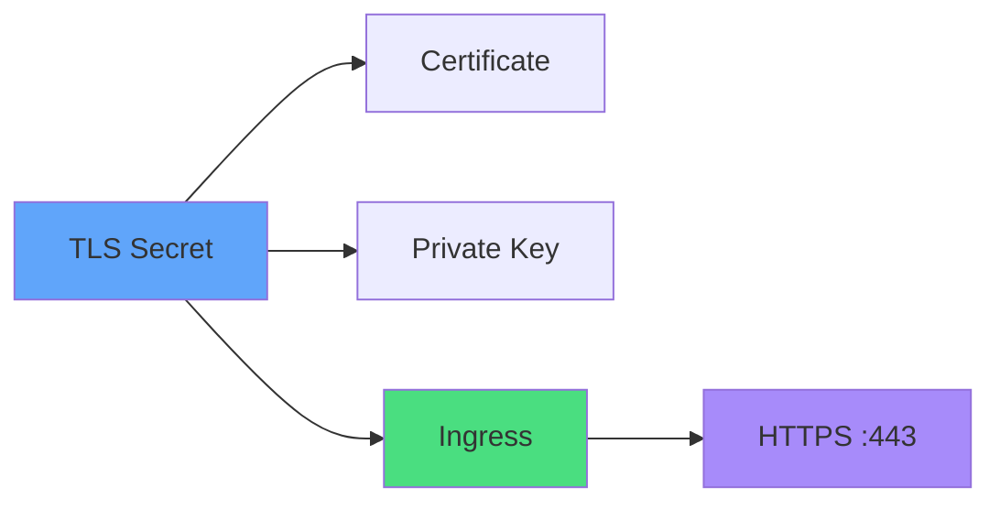

</div>

---
layout: center
---

# Default Backend

<div v-click="1">

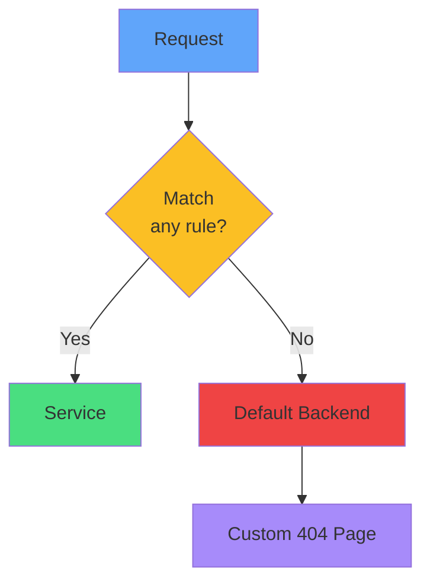

</div>

<div v-click="2" class="mt-8">

```yaml
spec:
  defaultBackend:
    service:
      name: default-http-backend
      port:
        number: 80
```

</div>

<div v-click="3" class="mt-6 text-center">
<carbon-view class="inline-block text-3xl text-purple-400" /> Custom 404 or landing page
</div>

---
layout: center
---

# Multiple Rules Example

<div v-click="1" class="text-xs">

```yaml
apiVersion: networking.k8s.io/v1
kind: Ingress
metadata:
  name: multi-ingress
spec:
  ingressClassName: nginx
  rules:
  - host: app1.example.com
    http:
      paths:
      - path: /
        pathType: Prefix
        backend:
          service:
            name: app1-service
            port:
              number: 80
  - host: app2.example.com
    http:
      paths:
      - path: /api
        pathType: Prefix
        backend:
          service:
            name: app2-api
            port:
              number: 8080
      - path: /web
        pathType: Prefix
        backend:
          service:
            name: app2-web
            port:
              number: 80
```

</div>

<div v-click="2" class="mt-4 text-center text-sm">
<carbon-flow class="inline-block text-2xl text-blue-400" /> Combine host + path routing
</div>

---
layout: center
---

# Common Patterns

<div class="grid grid-cols-2 gap-6 mt-4">
<div v-click="1">
<carbon-application class="text-4xl text-blue-400 mb-2" />
<strong>Single App</strong><br/>
<span class="text-sm opacity-80">One host, one service<br/>app.example.com → app-service</span>
</div>
<div v-click="2">
<carbon-apps class="text-4xl text-green-400 mb-2" />
<strong>Multi-App</strong><br/>
<span class="text-sm opacity-80">Multiple hosts<br/>app1.com, app2.com, app3.com</span>
</div>
<div v-click="3">
<carbon-flow class="text-4xl text-purple-400 mb-2" />
<strong>Microservices</strong><br/>
<span class="text-sm opacity-80">Path-based routing<br/>/api, /web, /admin</span>
</div>
<div v-click="4">
<carbon-version class="text-4xl text-yellow-400 mb-2" />
<strong>A/B Testing</strong><br/>
<span class="text-sm opacity-80">Traffic splitting<br/>v1 vs v2 with annotations</span>
</div>
</div>

---
layout: center
---

# Troubleshooting

<div v-click="1">

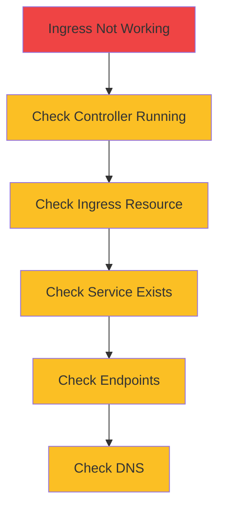

</div>

<div class="grid grid-cols-2 gap-4 mt-6 text-sm">
<div v-click="2">
<carbon-terminal class="inline-block text-2xl text-blue-400" /> kubectl describe ingress
</div>
<div v-click="3">
<carbon-view class="inline-block text-2xl text-green-400" /> kubectl get endpoints
</div>
<div v-click="4">
<carbon-debug class="inline-block text-2xl text-purple-400" /> Check controller logs
</div>
<div v-click="5">
<carbon-rule class="inline-block text-2xl text-yellow-400" /> Verify pathType matches
</div>
</div>

---
layout: center
---

# Summary

<div v-click="1">

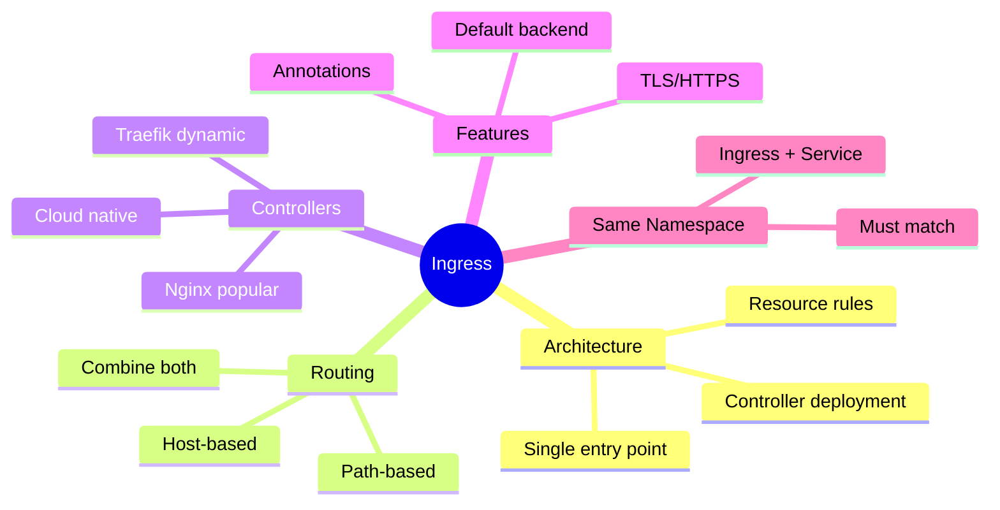

</div>

---
layout: center
---

# CKAD Exam Focus

<div v-click="1" class="text-center mb-6">
<carbon-certificate class="inline-block text-6xl text-blue-400" />
</div>

<div class="grid grid-cols-2 gap-4 text-sm">
<div v-click="2">
<carbon-edit class="inline-block text-2xl text-green-400" /> Create Ingress resources
</div>
<div v-click="3">
<carbon-network-3 class="inline-block text-2xl text-green-400" /> Host-based routing
</div>
<div v-click="4">
<carbon-rule class="inline-block text-2xl text-green-400" /> Path-based routing
</div>
<div v-click="5">
<carbon-locked class="inline-block text-2xl text-green-400" /> Configure TLS
</div>
<div v-click="6">
<carbon-settings class="inline-block text-2xl text-green-400" /> Use annotations
</div>
<div v-click="7">
<carbon-debug class="inline-block text-2xl text-green-400" /> Troubleshoot routing
</div>
<div v-click="8">
<carbon-warning class="inline-block text-2xl text-yellow-400" /> Same namespace required
</div>
<div v-click="9">
<carbon-timer class="inline-block text-2xl text-red-400" /> Practice YAML quickly
</div>
</div>

---
layout: center
---

# Next Steps

<div v-click="1" class="text-center mb-8">
<carbon-education class="inline-block text-6xl text-blue-400" />
</div>

<div v-click="2">

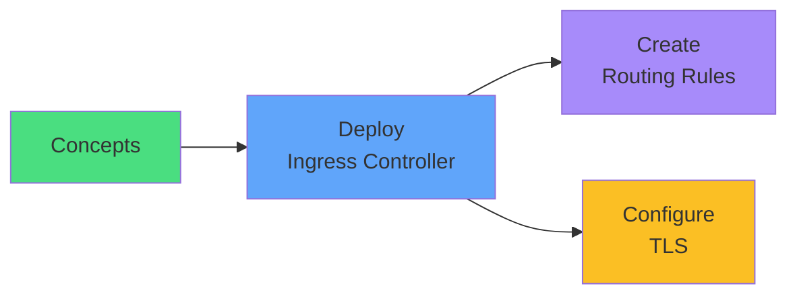

</div>

<div v-click="3" class="mt-8 text-center text-xl">
Let's route some traffic! <carbon-arrow-right class="inline-block text-2xl" />
</div>
