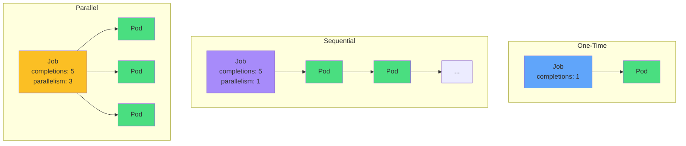

# Job Execution Patterns

```mermaid
graph TB
    subgraph One-Time
        J1[<carbon-task/> Job<br/>completions: 1] --> P1[<carbon-container-software/> Pod]
    end
    subgraph Sequential
        J2[<carbon-task/> Job<br/>completions: 5<br/>parallelism: 1] --> P2[<carbon-container-software/> Pod] --> P3[<carbon-container-software/> Pod] --> P4[...]
    end
    subgraph Parallel
        J3[<carbon-task/> Job<br/>completions: 5<br/>parallelism: 3] --> P5[<carbon-container-software/> Pod]
        J3 --> P6[<carbon-container-software/> Pod]
        J3 --> P7[<carbon-container-software/> Pod]
    end
    style J1 fill:#60a5fa
    style J2 fill:#a78bfa
    style J3 fill:#fbbf24
    style P1 fill:#4ade80
    style P2 fill:#4ade80
    style P3 fill:#4ade80
    style P5 fill:#4ade80
    style P6 fill:#4ade80
    style P7 fill:#4ade80
```

Understand the completion patterns

