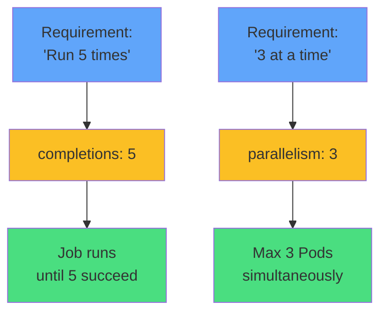

# Completions & Parallelism

```mermaid
graph TB
    REQ[<carbon-task-complete/> Requirement:<br/>'Run 5 times'] --> COMP[<carbon-arrow-right/> completions: 5]
    REQ2[<carbon-parallel-for-task/> Requirement:<br/>'3 at a time'] --> PAR[<carbon-arrow-right/> parallelism: 3]

    COMP --> RESULT[<carbon-checkmark-filled/> Job runs<br/>until 5 succeed]
    PAR --> RESULT2[<carbon-user-multiple/> Max 3 Pods<br/>simultaneously]

    style REQ fill:#60a5fa
    style REQ2 fill:#60a5fa
    style COMP fill:#fbbf24
    style PAR fill:#fbbf24
    style RESULT fill:#4ade80
    style RESULT2 fill:#4ade80
```

Translate requirements to configuration

