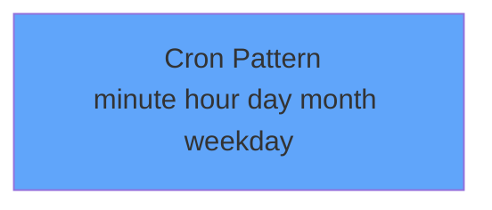

# CronJob Schedule Syntax

### Common Patterns
- Every 5 minutes: `*/5 * * * *`
- Every hour: `0 * * * *`
- Daily at 2am: `0 2 * * *`
- Daily at midnight: `0 0 * * *`

### Requirements to Schedules
- "Every 6 hours" → `0 */6 * * *`
- "Every 15 minutes" → `*/15 * * * *`
- "Weekly on Monday" → `0 0 * * 1`
- "Monthly on 1st" → `0 0 1 * *`

<carbon-time class="text-4xl text-blue-400" />

