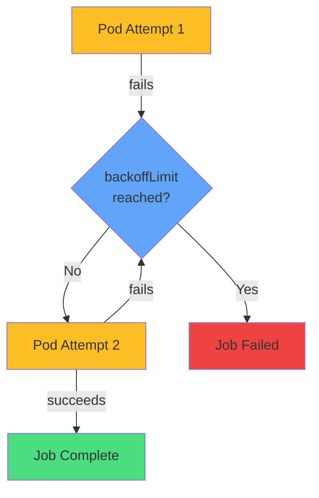

# Failure Handling

```mermaid
graph TB
    POD1[<carbon-container-software/> Pod Attempt 1] -->|fails| CHECK{<carbon-decision-tree/> backoffLimit<br/>reached?}
    CHECK -->|No| POD2[<carbon-container-software/> Pod Attempt 2]
    CHECK -->|Yes| FAIL[<carbon-close-filled/> Job Failed]
    POD2 -->|fails| CHECK
    POD2 -->|succeeds| SUCCESS[<carbon-checkmark-filled/> Job Complete]

    style POD1 fill:#fbbf24
    style POD2 fill:#fbbf24
    style CHECK fill:#60a5fa
    style FAIL fill:#ef4444
    style SUCCESS fill:#4ade80
```

### `backoffLimit: 3`
Retry up to 3 times before marking Job as failed

Default is 6 | Set to 0 for no retries

