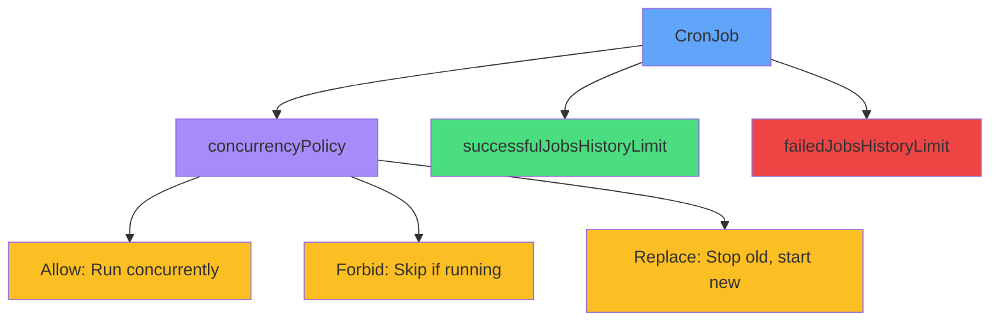

# CronJob Configuration

```mermaid
graph TB
    CJ[<carbon-calendar/> CronJob] --> CP[<carbon-settings/> concurrencyPolicy]
    CJ --> SH[<carbon-checkmark-outline/> successfulJobsHistoryLimit]
    CJ --> FH[<carbon-warning-alt/> failedJobsHistoryLimit]

    CP --> ALLOW[Allow: Run concurrently]
    CP --> FORBID[Forbid: Skip if running]
    CP --> REPLACE[Replace: Stop old, start new]

    style CJ fill:#60a5fa
    style CP fill:#a78bfa
    style SH fill:#4ade80
    style FH fill:#ef4444
    style ALLOW fill:#fbbf24
    style FORBID fill:#fbbf24
    style REPLACE fill:#fbbf24
```

Control overlapping executions and cleanup

