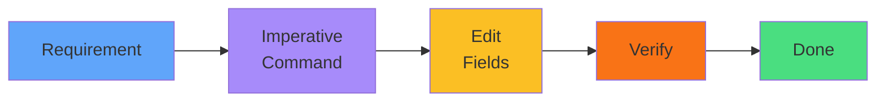

# Exam Techniques

## Job Creation
<carbon-task class="text-4xl text-blue-400" />

`kubectl create job` 
Add completions/parallelism 
Under 60 seconds

## CronJob Creation
<carbon-calendar class="text-4xl text-purple-400" />

`kubectl create cronjob` 
Verify schedule syntax 
Configure concurrency

