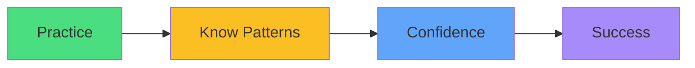

# Exam Mindset

<carbon-lightbulb class="text-yellow-400 text-4xl inline-block" />

### "Create a job that completes 3 times" → `completions: 3`
### "Runs every 6 hours" → `schedule: "0 */6 * * *"`
### Practice until these patterns are automatic

