# Jobs and CronJobs

<div class="abs-br m-6 flex gap-2">
  <carbon-task class="text-6xl text-blue-400" />
</div>

<div v-click class="mt-8 text-xl opacity-80">
Running one-off and scheduled workloads in Kubernetes
</div>

---
layout: center
---

# The Problem Jobs Solve

<div v-click="1">

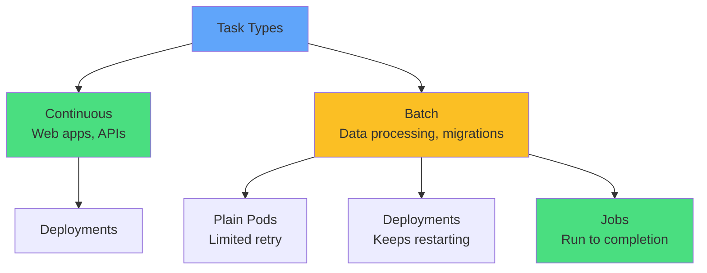

</div>

<div class="grid grid-cols-3 gap-4 mt-8 text-sm">
<div v-click="2" class="text-center">
<carbon-data-base class="text-3xl text-blue-400 mb-1" />
Database migrations
</div>
<div v-click="3" class="text-center">
<carbon-analytics class="text-3xl text-green-400 mb-1" />
Batch processing
</div>
<div v-click="4" class="text-center">
<carbon-clean class="text-3xl text-purple-400 mb-1" />
Cleanup tasks
</div>
</div>

---
layout: center
---

# Job Architecture

<div v-click="1">

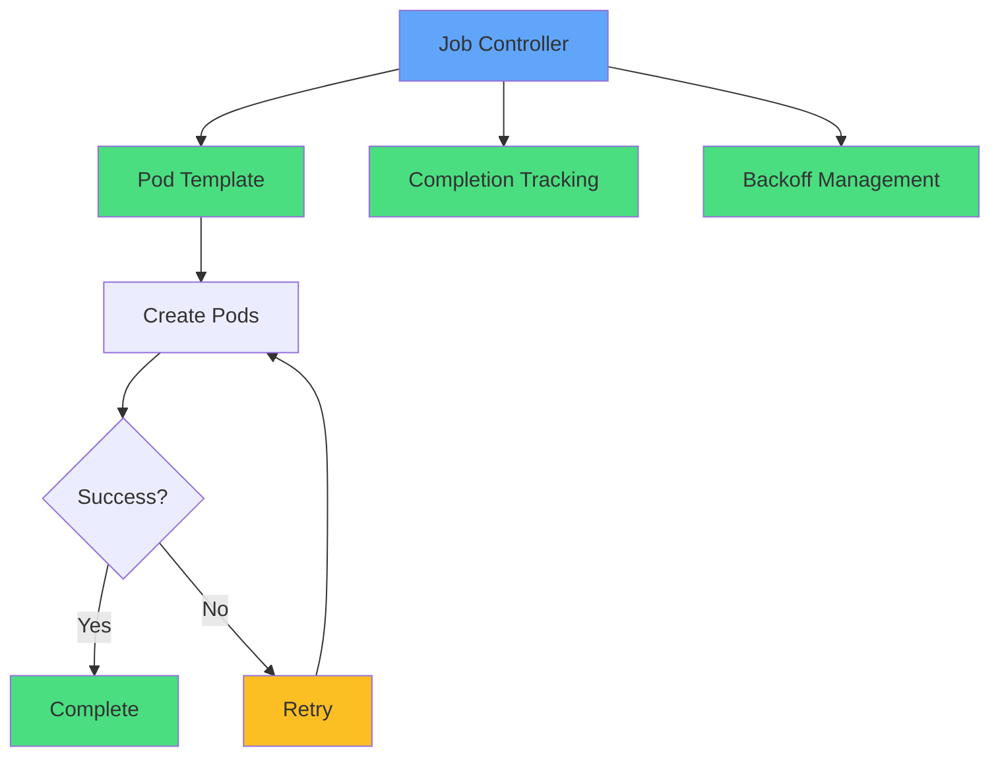

</div>

<div v-click="2" class="mt-8 text-center text-xl">
<carbon-task-complete class="inline-block text-4xl text-green-400" /> Ensures work completes, with retries
</div>

<div v-click="3" class="mt-6 text-center text-yellow-400">
<carbon-warning class="inline-block text-2xl" /> Jobs are immutable - cannot update Pod template
</div>

---
layout: center
---

# Job Restart Policies

<div v-click="1">

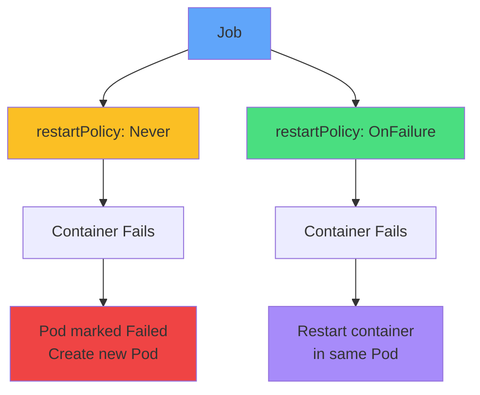

</div>

<div class="grid grid-cols-2 gap-6 mt-8">
<div v-click="2">
<carbon-close class="text-4xl text-yellow-400 mb-2" />
<strong>Never</strong><br/>
<span class="text-sm opacity-80">New Pod on failure<br/>Best for node issues</span>
</div>
<div v-click="3">
<carbon-restart class="text-4xl text-green-400 mb-2" />
<strong>OnFailure</strong><br/>
<span class="text-sm opacity-80">Restart in same Pod<br/>Save Pod creation overhead</span>
</div>
</div>

<div v-click="4" class="mt-6 text-center text-red-400">
<carbon-warning class="inline-block text-2xl" /> Always specify restart policy - no default!
</div>

---
layout: center
---

# Completion Modes

<div v-click="1">

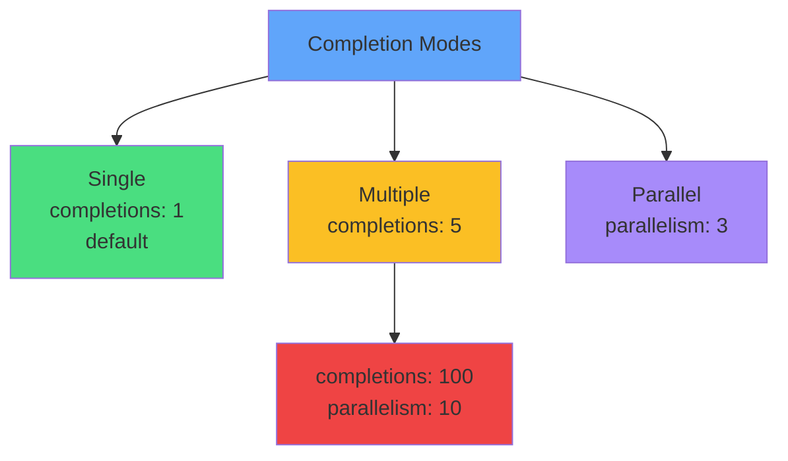

</div>

<div class="grid grid-cols-3 gap-4 mt-8 text-sm">
<div v-click="2" class="text-center">
<carbon-task class="text-3xl text-green-400 mb-1" />
<strong>Single</strong><br/>
One Pod to completion
</div>
<div v-click="3" class="text-center">
<carbon-list class="text-3xl text-yellow-400 mb-1" />
<strong>Multiple</strong><br/>
N Pods sequentially
</div>
<div v-click="4" class="text-center">
<carbon-flow class="text-3xl text-purple-400 mb-1" />
<strong>Parallel</strong><br/>
N Pods concurrently
</div>
</div>

<div v-click="5" class="mt-6 text-center">
<carbon-analytics class="inline-block text-2xl text-blue-400" /> completions: 100, parallelism: 10 = 10x faster
</div>

---
layout: center
---

# Backoff Limits and Failure Handling

<div v-click="1">

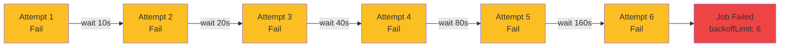

</div>

<div v-click="2" class="mt-6 text-center text-xl">
<carbon-time class="inline-block text-3xl text-yellow-400" /> Exponential backoff: 10s → 20s → 40s → up to 6 minutes
</div>

<div v-click="3" class="mt-4 text-center text-sm">
<strong>backoffLimit:</strong> 6 (default) - Max retry attempts
</div>

---
layout: center
---

# Job YAML Structure

<div v-click="1" class="mb-4">

```yaml
apiVersion: batch/v1
kind: Job
metadata:
  name: data-migration
spec:
  completions: 1
  parallelism: 1
  backoffLimit: 3
  template:
    spec:
      restartPolicy: Never
      containers:
      - name: migrate
        image: myapp:v1
        command: ["python", "migrate.py"]
```

</div>

<div class="grid grid-cols-2 gap-4 text-xs">
<div v-click="2">
<carbon-task class="inline-block text-2xl text-blue-400" /> <strong>completions:</strong> Total successes needed
</div>
<div v-click="3">
<carbon-flow class="inline-block text-2xl text-green-400" /> <strong>parallelism:</strong> Concurrent Pods
</div>
<div v-click="4">
<carbon-reset class="inline-block text-2xl text-yellow-400" /> <strong>backoffLimit:</strong> Max retries
</div>
<div v-click="5">
<carbon-restart class="inline-block text-2xl text-purple-400" /> <strong>restartPolicy:</strong> Never or OnFailure
</div>
</div>

---
layout: center
---

# CronJobs Overview

<div v-click="1">

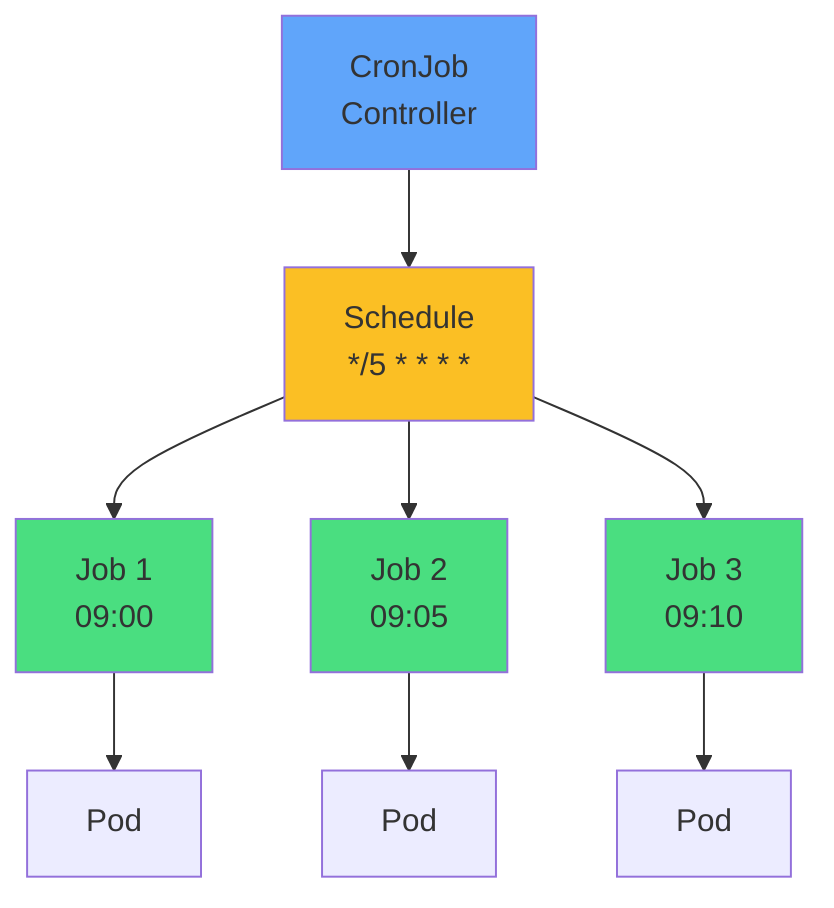

</div>

<div v-click="2" class="mt-8 text-center text-xl">
<carbon-time class="inline-block text-4xl text-blue-400" /> CronJob → Job → Pod
</div>

<div class="grid grid-cols-3 gap-4 mt-6 text-sm">
<div v-click="3" class="text-center">
<carbon-backup class="text-3xl text-green-400 mb-1" />
Daily backups
</div>
<div v-click="4" class="text-center">
<carbon-clean class="text-3xl text-yellow-400 mb-1" />
Periodic cleanup
</div>
<div v-click="5" class="text-center">
<carbon-report class="text-3xl text-purple-400 mb-1" />
Regular reports
</div>
</div>

---
layout: center
---

# Cron Expression Syntax

<div v-click="1" class="mb-6">

```
┌─────── minute (0-59)
│ ┌─────── hour (0-23)
│ │ ┌─────── day of month (1-31)
│ │ │ ┌─────── month (1-12)
│ │ │ │ ┌─────── day of week (0-6, Sunday=0)
│ │ │ │ │
* * * * *
```

</div>

<div v-click="2" class="grid grid-cols-2 gap-4 text-sm">

<div>
<carbon-time class="inline-block text-xl text-blue-400" /> <code>*/5 * * * *</code><br/>
<span class="opacity-80">Every 5 minutes</span>
</div>

<div>
<carbon-time class="inline-block text-xl text-green-400" /> <code>0 * * * *</code><br/>
<span class="opacity-80">Every hour</span>
</div>

<div>
<carbon-time class="inline-block text-xl text-purple-400" /> <code>0 2 * * *</code><br/>
<span class="opacity-80">Daily at 2 AM</span>
</div>

<div>
<carbon-time class="inline-block text-xl text-yellow-400" /> <code>0 9 * * 1</code><br/>
<span class="opacity-80">Monday at 9 AM</span>
</div>

<div>
<carbon-time class="inline-block text-xl text-red-400" /> <code>0 0 1 * *</code><br/>
<span class="opacity-80">1st of month</span>
</div>

<div>
<carbon-time class="inline-block text-xl text-teal-400" /> <code>*/15 9-17 * * *</code><br/>
<span class="opacity-80">Every 15 min, 9AM-5PM</span>
</div>

</div>

<div v-click="3" class="mt-6 text-center text-yellow-400">
<carbon-warning class="inline-block text-2xl" /> Timezone = kube-controller-manager (usually UTC)
</div>

---
layout: center
---

# CronJob Concurrency Policies

<div v-click="1">

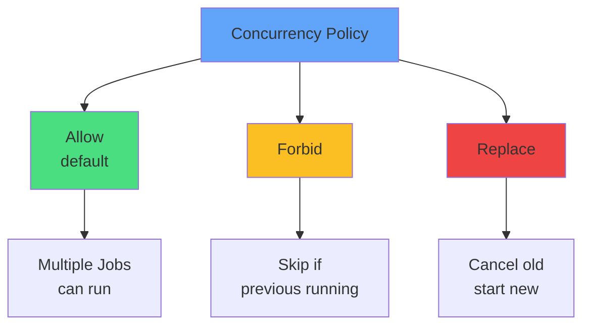

</div>

<div class="grid grid-cols-3 gap-4 mt-8 text-sm">
<div v-click="2" class="text-center">
<carbon-flow class="text-3xl text-green-400 mb-1" />
<strong>Allow</strong><br/>
Independent tasks
</div>
<div v-click="3" class="text-center">
<carbon-locked class="text-3xl text-yellow-400 mb-1" />
<strong>Forbid</strong><br/>
Long-running jobs
</div>
<div v-click="4" class="text-center">
<carbon-renew class="text-3xl text-red-400 mb-1" />
<strong>Replace</strong><br/>
Latest is important
</div>
</div>

<div v-click="5" class="mt-6 text-center">
<carbon-backup class="inline-block text-2xl text-blue-400" /> Backups: Forbid · Cache refresh: Replace
</div>

---
layout: center
---

# CronJob YAML Structure

<div v-click="1" class="text-xs">

```yaml
apiVersion: batch/v1
kind: CronJob
metadata:
  name: daily-backup
spec:
  schedule: "0 2 * * *"
  concurrencyPolicy: Forbid
  successfulJobsHistoryLimit: 3
  failedJobsHistoryLimit: 1
  jobTemplate:
    spec:
      template:
        spec:
          restartPolicy: OnFailure
          containers:
          - name: backup
            image: backup-tool:v1
            command: ["./backup.sh"]
```

</div>

<div class="grid grid-cols-2 gap-4 mt-4 text-xs">
<div v-click="2">
<carbon-time class="inline-block text-xl text-blue-400" /> <strong>schedule:</strong> Cron expression
</div>
<div v-click="3">
<carbon-rule class="inline-block text-xl text-green-400" /> <strong>concurrencyPolicy:</strong> Allow/Forbid/Replace
</div>
<div v-click="4">
<carbon-checkmark class="inline-block text-xl text-purple-400" /> <strong>successfulJobsHistoryLimit:</strong> Keep last N
</div>
<div v-click="5">
<carbon-close class="inline-block text-xl text-red-400" /> <strong>failedJobsHistoryLimit:</strong> Keep failures
</div>
</div>

---
layout: center
---

# Job Immutability

<div v-click="1">

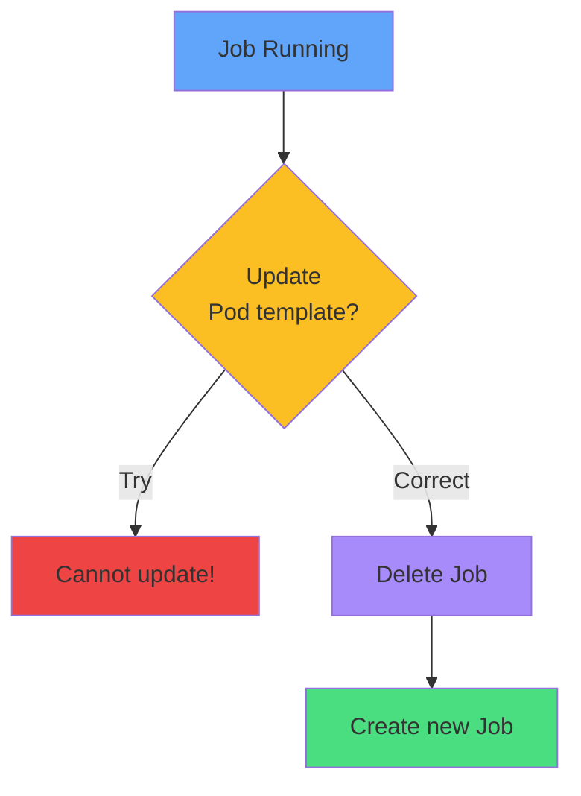

</div>

<div v-click="2" class="mt-8 text-center text-xl">
<carbon-locked class="inline-block text-4xl text-red-400" /> Cannot update Pod template
</div>

<div class="grid grid-cols-2 gap-6 mt-8">
<div v-click="3">
<carbon-close class="text-4xl text-red-400 mb-2" />
<strong>Cannot Change</strong><br/>
<span class="text-sm opacity-80">Image, command, env vars, resources</span>
</div>
<div v-click="4">
<carbon-checkmark class="text-4xl text-green-400 mb-2" />
<strong>Must Do</strong><br/>
<span class="text-sm opacity-80">Delete and recreate</span>
</div>
</div>

<div v-click="5" class="mt-6 text-center text-yellow-400">
<carbon-warning class="inline-block text-2xl" /> Get it right the first time!
</div>

---
layout: center
---

# Job Cleanup and History

<div v-click="1">

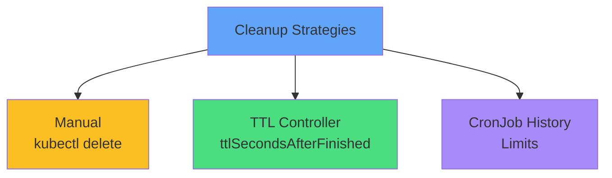

</div>

<div v-click="2" class="mt-6 mb-4">

```yaml
spec:
  ttlSecondsAfterFinished: 100  # Delete after 100s
```

</div>

<div v-click="3" class="mb-4">

```yaml
spec:
  successfulJobsHistoryLimit: 3  # Keep last 3 successful
  failedJobsHistoryLimit: 1      # Keep last 1 failed
```

</div>

<div v-click="4" class="mt-6 text-center text-yellow-400">
<carbon-warning class="inline-block text-2xl" /> Jobs don't auto-cleanup by default!
</div>

---
layout: center
---

# Common Patterns

<div class="grid grid-cols-2 gap-6 mt-4">
<div v-click="1">
<carbon-data-base class="text-4xl text-blue-400 mb-2" />
<strong>Database Migration</strong><br/>
<span class="text-sm opacity-80">Job, completions: 1<br/>restartPolicy: Never</span>
</div>
<div v-click="2">
<carbon-analytics class="text-4xl text-green-400 mb-2" />
<strong>Batch Processing</strong><br/>
<span class="text-sm opacity-80">Job, completions: 100<br/>parallelism: 10</span>
</div>
<div v-click="3">
<carbon-backup class="text-4xl text-purple-400 mb-2" />
<strong>Daily Backup</strong><br/>
<span class="text-sm opacity-80">CronJob, schedule: 0 2 * * *<br/>concurrencyPolicy: Forbid</span>
</div>
<div v-click="4">
<carbon-clean class="text-4xl text-yellow-400 mb-2" />
<strong>Periodic Cleanup</strong><br/>
<span class="text-sm opacity-80">CronJob, schedule: 0 * * * *<br/>concurrencyPolicy: Replace</span>
</div>
</div>

---
layout: center
---

# Troubleshooting

<div v-click="1">

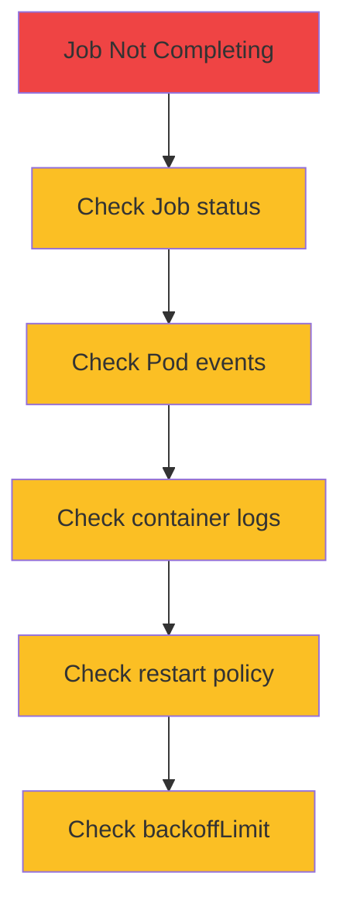

</div>

<div class="grid grid-cols-2 gap-4 mt-6 text-sm">
<div v-click="2">
<carbon-terminal class="inline-block text-2xl text-blue-400" /> kubectl describe job
</div>
<div v-click="3">
<carbon-view class="inline-block text-2xl text-green-400" /> kubectl get pods -l job-name=
</div>
<div v-click="4">
<carbon-document class="inline-block text-2xl text-purple-400" /> kubectl logs job/my-job
</div>
<div v-click="5">
<carbon-debug class="inline-block text-2xl text-yellow-400" /> Check failed Pod events
</div>
</div>

---
layout: center
---

# Summary

<div v-click="1">

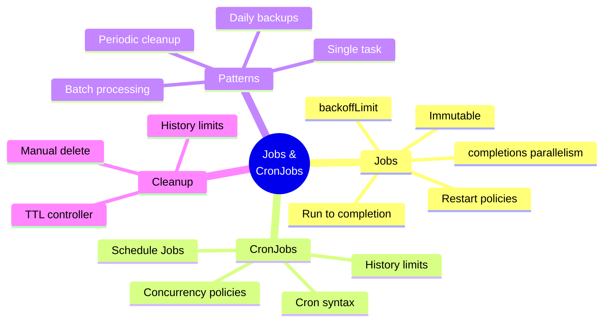

</div>

---
layout: center
---

# CKAD Exam Focus

<div v-click="1" class="text-center mb-6">
<carbon-certificate class="inline-block text-6xl text-blue-400" />
</div>

<div class="grid grid-cols-2 gap-4 text-sm">
<div v-click="2">
<carbon-edit class="inline-block text-2xl text-green-400" /> Create Job YAML
</div>
<div v-click="3">
<carbon-restart class="inline-block text-2xl text-green-400" /> Set restart policy (required!)
</div>
<div v-click="4">
<carbon-flow class="inline-block text-2xl text-green-400" /> Configure completions/parallelism
</div>
<div v-click="5">
<carbon-time class="inline-block text-2xl text-green-400" /> Write cron expressions
</div>
<div v-click="6">
<carbon-rule class="inline-block text-2xl text-green-400" /> Set concurrency policy
</div>
<div v-click="7">
<carbon-debug class="inline-block text-2xl text-green-400" /> Troubleshoot failures
</div>
<div v-click="8">
<carbon-warning class="inline-block text-2xl text-yellow-400" /> Remember: Jobs are immutable
</div>
<div v-click="9">
<carbon-timer class="inline-block text-2xl text-red-400" /> Practice Job creation speed
</div>
</div>

---
layout: center
---

# Next Steps

<div v-click="1" class="text-center mb-8">
<carbon-education class="inline-block text-6xl text-blue-400" />
</div>

<div v-click="2">

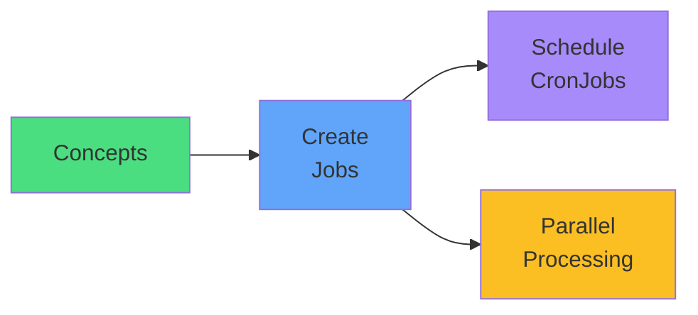

</div>

<div v-click="3" class="mt-8 text-center text-xl">
Let's run some batch workloads! <carbon-arrow-right class="inline-block text-2xl" />
</div>
