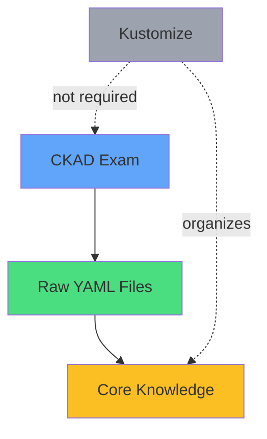

# Beyond Exam Scope

```mermaid
graph TB
    CKAD[<carbon-certificate/> CKAD Exam] --> RAW[<carbon-document/> Raw YAML Files]

    KUSTOMIZE[<carbon-settings-adjust/> Kustomize] -.->|not required| CKAD

    RAW --> FUNDAMENTALS[<carbon-education/> Core Knowledge]
    KUSTOMIZE -.->|organizes| FUNDAMENTALS

    style CKAD fill:#60a5fa
    style RAW fill:#4ade80
    style KUSTOMIZE fill:#9ca3af
    style FUNDAMENTALS fill:#fbbf24
```

Kustomize is useful but NOT tested on CKAD 
Focus on standard YAML manifests

