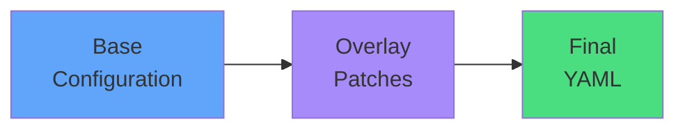

# What Kustomize Does

### Kustomize manages configuration variants

**Without Kustomize (CKAD)**
- Copy YAML files
- Modify manually
- Apply with kubectl

**With Kustomize**
- Define base once
- Apply overlays
- Use kubectl apply -k

