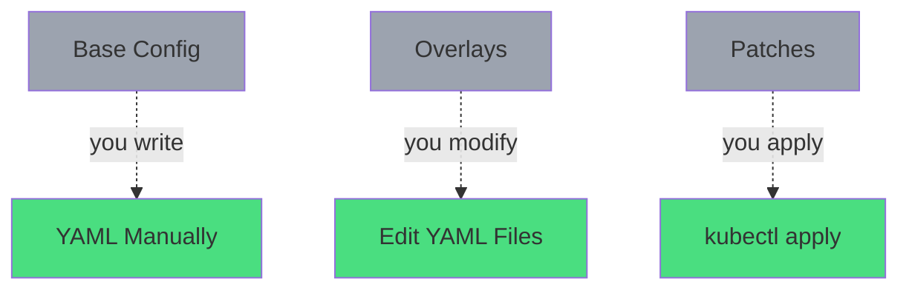

# Kustomize Concepts vs CKAD

```mermaid
graph TB
    BASE[<carbon-settings-adjust/> Base Config] -.->|you write| YAML[<carbon-document/> YAML Manually]
    OVERLAY[<carbon-settings-adjust/> Overlays] -.->|you modify| EDIT[<carbon-edit/> Edit YAML Files]
    PATCHES[<carbon-settings-adjust/> Patches] -.->|you apply| UPDATE[<carbon-renew/> kubectl apply]

    style BASE fill:#9ca3af
    style OVERLAY fill:#9ca3af
    style PATCHES fill:#9ca3af
    style YAML fill:#4ade80
    style EDIT fill:#4ade80
    style UPDATE fill:#4ade80
```

Kustomize automates what you do manually in CKAD

