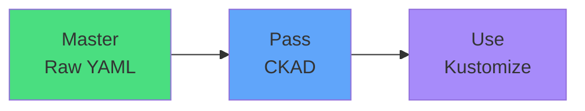

# Exam Mindset

<carbon-lightbulb class="text-yellow-400 text-4xl inline-block" />

### Focus on raw YAML for CKAD
### Kustomize generates standard YAML
### kubectl apply -k is built-in but not exam focus
### Don't spend exam prep time on Kustomize

