# Kustomize

<div class="abs-br m-6 flex gap-2">
  <carbon-settings class="text-6xl text-blue-400" />
</div>

<div v-click class="mt-8 text-xl opacity-80">
Template-free configuration management for Kubernetes
</div>

---
layout: center
---

# Configuration Management Challenge

<div v-click="1">

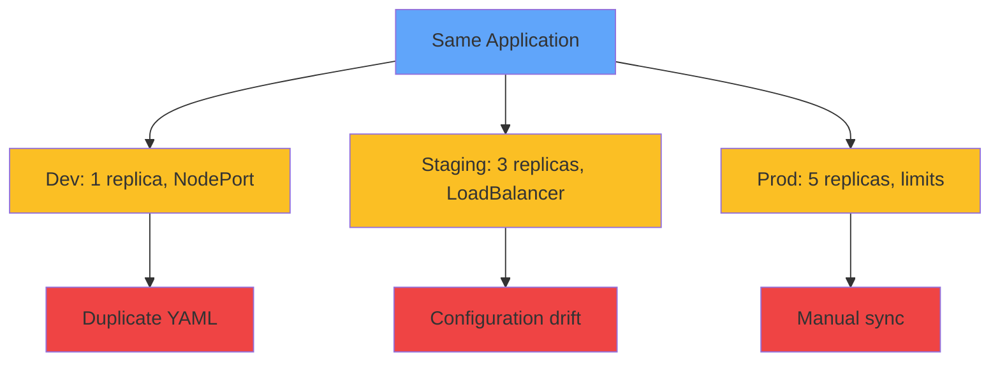

</div>

<div class="grid grid-cols-3 gap-4 mt-8 text-sm">
<div v-click="2" class="text-center">
<carbon-copy class="text-3xl text-red-400 mb-1" />
Duplicate files
</div>
<div v-click="3" class="text-center">
<carbon-warning class="text-3xl text-yellow-400 mb-1" />
Config drift
</div>
<div v-click="4" class="text-center">
<carbon-sync class="text-3xl text-purple-400 mb-1" />
Manual sync
</div>
</div>

---
layout: center
---

# What is Kustomize?

<div v-click="1" class="mb-6">

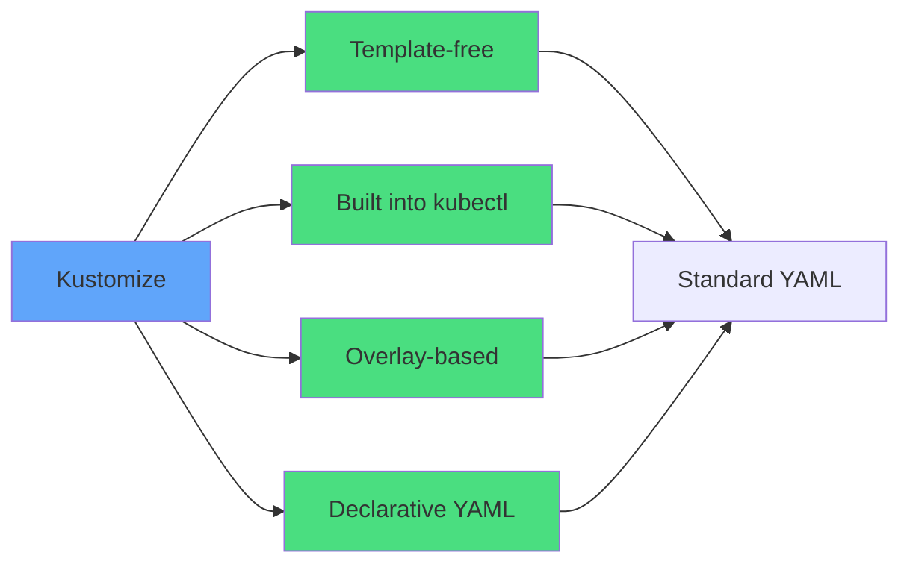

</div>

<div class="grid grid-cols-2 gap-6">
<div v-click="2">
<carbon-terminal class="text-4xl text-blue-400 mb-2" />
<strong>Built into kubectl</strong><br/>
<span class="text-sm opacity-80">No installation needed (v1.14+)</span>
</div>
<div v-click="3">
<carbon-document class="text-4xl text-green-400 mb-2" />
<strong>Pure YAML</strong><br/>
<span class="text-sm opacity-80">No template syntax to learn</span>
</div>
</div>

<div v-click="4" class="mt-8 text-center text-xl">
<carbon-layers class="inline-block text-3xl text-purple-400" /> Base + Overlays = Customization
</div>

---
layout: center
---

# Kustomize vs Helm

<div class="grid grid-cols-2 gap-6 mt-4">
<div v-click="1">
<carbon-settings class="text-5xl text-blue-400 mb-2" />
<strong>Kustomize</strong><br/>
<span class="text-sm opacity-80">• Template-free<br/>• Built into kubectl<br/>• Environment configs<br/>• GitOps friendly<br/>• <strong>CKAD required</strong></span>
</div>
<div v-click="2">
<carbon-container-software class="text-5xl text-green-400 mb-2" />
<strong>Helm</strong><br/>
<span class="text-sm opacity-80">• Package distribution<br/>• Chart versioning<br/>• Complex templates<br/>• Third-party apps<br/>• CKAD supplementary</span>
</div>
</div>

<div v-click="3" class="mt-8 text-center text-lg">
<carbon-checkmark class="inline-block text-3xl text-purple-400" /> Many teams use both!
</div>

<div v-click="4" class="mt-4 text-center text-sm opacity-80">
Helm for third-party, Kustomize for own apps
</div>

---
layout: center
---

# Core Concept: Base

<div v-click="1" class="mb-4">

```
base/
├── kustomization.yaml
├── deployment.yaml
└── service.yaml
```

</div>

<div v-click="2" class="mb-4 text-xs">

```yaml
# base/kustomization.yaml
apiVersion: kustomize.config.k8s.io/v1beta1
kind: Kustomization
resources:
  - deployment.yaml
  - service.yaml
```

</div>

<div v-click="3">

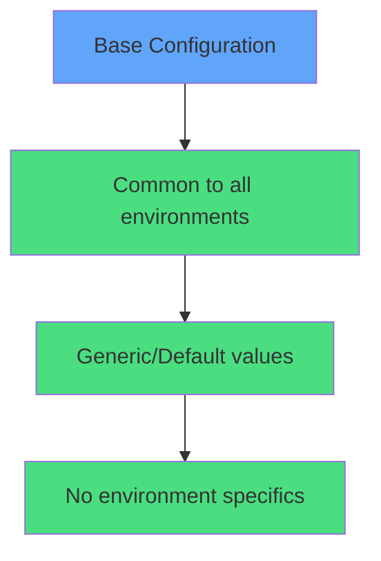

</div>

<div v-click="4" class="mt-6 text-center text-yellow-400">
<carbon-warning class="inline-block text-2xl" /> Base should work in ANY environment
</div>

---
layout: center
---

# Core Concept: Overlays

<div v-click="1" class="mb-4">

```
overlays/
├── dev/
│   └── kustomization.yaml
├── staging/
│   └── kustomization.yaml
└── prod/
    ├── kustomization.yaml
    └── resources-patch.yaml
```

</div>

<div v-click="2" class="text-xs">

```yaml
# overlays/prod/kustomization.yaml
apiVersion: kustomize.config.k8s.io/v1beta1
kind: Kustomization
bases:
  - ../../base
namePrefix: prod-
namespace: production
replicas:
  - name: myapp
    count: 5
```

</div>

<div v-click="3" class="mt-6">

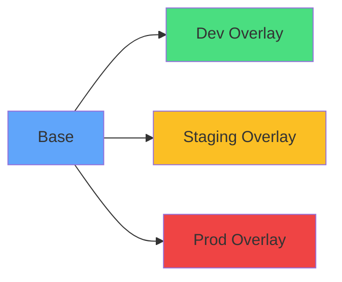

</div>

---
layout: center
---

# Core Concept: Patches

<div v-click="1" class="mb-4 text-xs">

```yaml
# Strategic Merge Patch
apiVersion: apps/v1
kind: Deployment
metadata:
  name: myapp
spec:
  template:
    spec:
      containers:
      - name: myapp
        resources:
          limits:
            memory: "512Mi"
            cpu: "500m"
```

</div>

<div v-click="2">

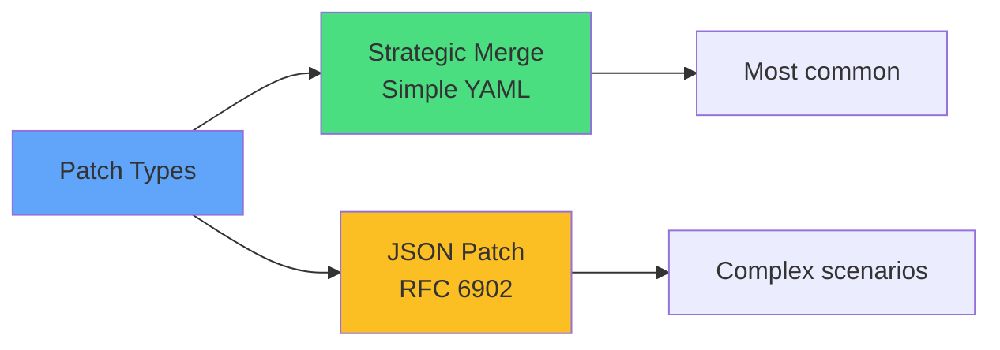

</div>

<div v-click="3" class="mt-6 text-center">
<carbon-edit class="inline-block text-3xl text-green-400" /> Only specify fields to change
</div>

---
layout: center
---

# Kustomization Features: Transformations

<div v-click="1" class="text-xs mb-4">

```yaml
apiVersion: kustomize.config.k8s.io/v1beta1
kind: Kustomization

namePrefix: prod-
nameSuffix: -v2
namespace: production

commonLabels:
  environment: production
  team: backend

images:
  - name: myapp
    newTag: v2.0.1

replicas:
  - name: myapp
    count: 5
```

</div>

<div class="grid grid-cols-3 gap-4 text-xs">
<div v-click="2">
<carbon-text-font class="inline-block text-xl text-blue-400" /> namePrefix/Suffix
</div>
<div v-click="3">
<carbon-folder class="inline-block text-xl text-green-400" /> namespace
</div>
<div v-click="4">
<carbon-tag class="inline-block text-xl text-purple-400" /> commonLabels
</div>
<div v-click="5">
<carbon-image class="inline-block text-xl text-yellow-400" /> images
</div>
<div v-click="6">
<carbon-flow class="inline-block text-xl text-red-400" /> replicas
</div>
</div>

---
layout: center
---

# Generators: ConfigMaps and Secrets

<div v-click="1" class="text-xs mb-4">

```yaml
apiVersion: kustomize.config.k8s.io/v1beta1
kind: Kustomization

configMapGenerator:
  - name: app-config
    literals:
      - LOG_LEVEL=info
      - MAX_CONNECTIONS=100
    files:
      - config.properties

secretGenerator:
  - name: db-credentials
    literals:
      - username=admin
      - password=secret123
```

</div>

<div v-click="2">

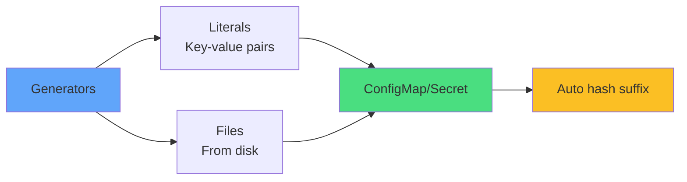

</div>

<div v-click="3" class="mt-6 text-center text-yellow-400">
<carbon-warning class="inline-block text-2xl" /> Auto-generates hash suffix for versioning
</div>

---
layout: center
---

# How Kustomize Works

<div v-click="1">

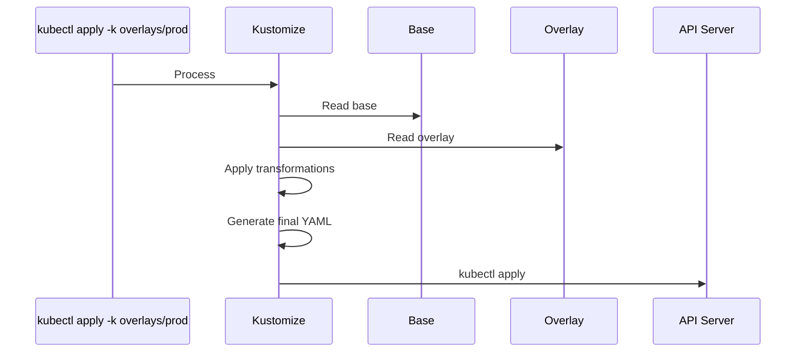

</div>

<div v-click="2" class="mt-6 text-center text-xl">
<carbon-virtual-machine class="inline-block text-3xl text-blue-400" /> All processing in memory
</div>

<div v-click="3" class="mt-4 text-center text-sm opacity-80">
Source files remain unchanged
</div>

---
layout: center
---

# Preview Generated YAML

<div v-click="1" class="mb-4">

```bash
# Preview without applying
kubectl kustomize overlays/prod/

# Apply to cluster
kubectl apply -k overlays/prod/
```

</div>

<div v-click="2">

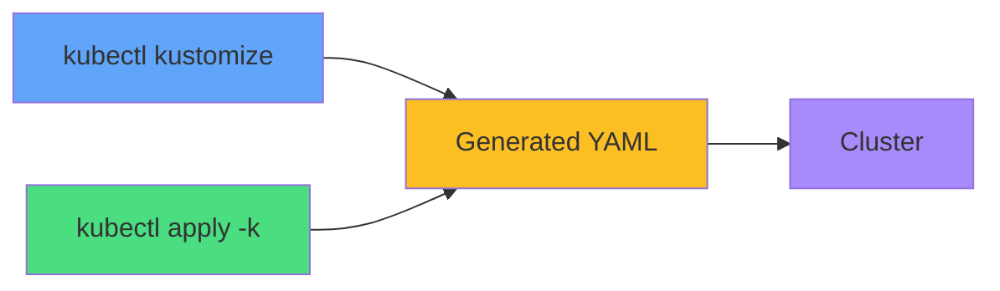

</div>

<div v-click="3" class="mt-8 text-center">
<carbon-view class="inline-block text-3xl text-green-400" /> Always preview before applying!
</div>

---
layout: center
---

# Common Directory Structure

<div v-click="1" class="mb-4">

```
.
├── base/
│   ├── kustomization.yaml
│   ├── deployment.yaml
│   ├── service.yaml
│   └── configmap.yaml
└── overlays/
    ├── dev/
    │   └── kustomization.yaml
    ├── staging/
    │   ├── kustomization.yaml
    │   └── replica-patch.yaml
    └── prod/
        ├── kustomization.yaml
        ├── replica-patch.yaml
        └── resources-patch.yaml
```

</div>

<div v-click="2">

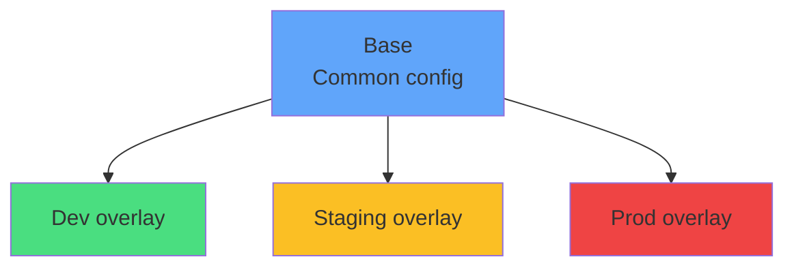

</div>

---
layout: center
---

# Deployment Workflow

<div v-click="1" class="mb-4">

```bash
# Deploy to different environments
kubectl apply -k overlays/dev

kubectl apply -k overlays/staging

kubectl apply -k overlays/prod
```

</div>

<div v-click="2">

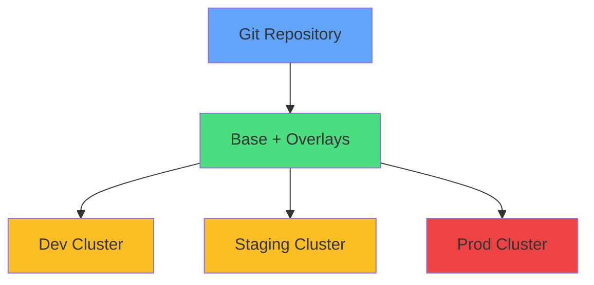

</div>

<div v-click="3" class="mt-6 text-center text-xl">
<carbon-version class="inline-block text-3xl text-purple-400" /> Everything in Git
</div>

<div v-click="4" class="mt-4 text-center text-sm">
<carbon-flow class="inline-block text-2xl text-blue-400" /> Perfect for GitOps (ArgoCD, Flux)
</div>

---
layout: center
---

# Best Practices

<div class="grid grid-cols-2 gap-6 mt-4">
<div v-click="1">
<carbon-checkmark class="text-4xl text-green-400 mb-2" />
<strong>Keep base generic</strong><br/>
<span class="text-sm opacity-80">No environment-specific values</span>
</div>
<div v-click="2">
<carbon-layers class="text-4xl text-blue-400 mb-2" />
<strong>Small overlays</strong><br/>
<span class="text-sm opacity-80">Only define differences</span>
</div>
<div v-click="3">
<carbon-settings class="text-4xl text-purple-400 mb-2" />
<strong>Prefer built-ins</strong><br/>
<span class="text-sm opacity-80">Use replicas, images over patches</span>
</div>
<div v-click="4">
<carbon-view class="text-4xl text-yellow-400 mb-2" />
<strong>Preview locally</strong><br/>
<span class="text-sm opacity-80">kubectl kustomize before apply</span>
</div>
<div v-click="5">
<carbon-folder class="text-4xl text-red-400 mb-2" />
<strong>Namespace isolation</strong><br/>
<span class="text-sm opacity-80">Different namespace per env</span>
</div>
<div v-click="6">
<carbon-tag class="text-4xl text-teal-400 mb-2" />
<strong>Consistent labels</strong><br/>
<span class="text-sm opacity-80">Use commonLabels</span>
</div>
</div>

---
layout: center
---

# Real-World Example

<div v-click="1" class="text-xs mb-4">

```yaml
# overlays/prod/kustomization.yaml
apiVersion: kustomize.config.k8s.io/v1beta1
kind: Kustomization

bases:
  - ../../base

namePrefix: prod-
namespace: production

commonLabels:
  environment: production
  managed-by: kustomize

replicas:
  - name: web-app
    count: 5

images:
  - name: web-app
    newTag: v2.1.0

configMapGenerator:
  - name: app-config
    behavior: merge
    literals:
      - LOG_LEVEL=error
      - CACHE_TTL=3600

patchesStrategicMerge:
  - resources-patch.yaml
```

</div>

---
layout: center
---

# Summary

<div v-click="1">

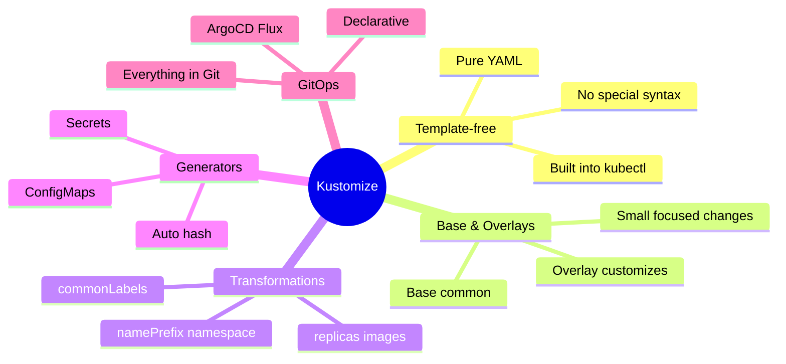

</div>

---
layout: center
---

# Kustomize and CKAD

<div v-click="1" class="text-center mb-6">
<carbon-certificate class="inline-block text-6xl text-blue-400" />
</div>

<div class="grid grid-cols-2 gap-4 text-sm">
<div v-click="2">
<carbon-edit class="inline-block text-2xl text-green-400" /> Create kustomization.yaml
</div>
<div v-click="3">
<carbon-terminal class="inline-block text-2xl text-green-400" /> kubectl apply -k
</div>
<div v-click="4">
<carbon-layers class="inline-block text-2xl text-green-400" /> Base/overlay pattern
</div>
<div v-click="5">
<carbon-settings class="inline-block text-2xl text-green-400" /> Common transformations
</div>
<div v-click="6">
<carbon-document class="inline-block text-2xl text-green-400" /> Strategic merge patches
</div>
<div v-click="7">
<carbon-view class="inline-block text-2xl text-green-400" /> kubectl kustomize preview
</div>
<div v-click="8">
<carbon-warning class="inline-block text-2xl text-yellow-400" /> Required topic!
</div>
<div v-click="9">
<carbon-timer class="inline-block text-2xl text-red-400" /> Practice speed
</div>
</div>

<div v-click="10" class="mt-8 text-center text-xl">
<carbon-checkmark class="inline-block text-3xl text-blue-400" /> More likely than Helm on exam
</div>

---
layout: center
---

# Common Commands

<div v-click="1" class="mb-6">

```bash
# Preview generated YAML
kubectl kustomize overlays/prod/

# Apply to cluster
kubectl apply -k overlays/prod/

# Delete resources
kubectl delete -k overlays/dev/

# Validate kustomization
kubectl kustomize overlays/staging/ --enable-helm
```

</div>

<div v-click="2" class="grid grid-cols-2 gap-6">
<div class="text-center">
<carbon-view class="text-4xl text-blue-400 mb-2" />
<strong>Preview</strong><br/>
<span class="text-sm opacity-80">Check before applying</span>
</div>
<div class="text-center">
<carbon-checkmark class="text-4xl text-green-400 mb-2" />
<strong>Apply</strong><br/>
<span class="text-sm opacity-80">Deploy to cluster</span>
</div>
</div>

---
layout: center
---

# Troubleshooting Tips

<div class="grid grid-cols-2 gap-6 mt-4">
<div v-click="1">
<carbon-debug class="text-4xl text-red-400 mb-2" />
<strong>Path Issues</strong><br/>
<span class="text-sm opacity-80">Check bases path relative to overlay</span>
</div>
<div v-click="2">
<carbon-rule class="text-4xl text-yellow-400 mb-2" />
<strong>Name Mismatches</strong><br/>
<span class="text-sm opacity-80">Patch name must match base resource</span>
</div>
<div v-click="3">
<carbon-view class="text-4xl text-blue-400 mb-2" />
<strong>Preview First</strong><br/>
<span class="text-sm opacity-80">Always kustomize before apply</span>
</div>
<div v-click="4">
<carbon-document class="text-4xl text-green-400 mb-2" />
<strong>Validate YAML</strong><br/>
<span class="text-sm opacity-80">Check kustomization.yaml syntax</span>
</div>
</div>

---
layout: center
---

# Next Steps

<div v-click="1" class="text-center mb-8">
<carbon-education class="inline-block text-6xl text-blue-400" />
</div>

<div v-click="2">

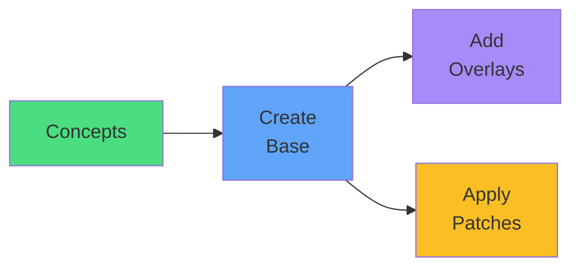

</div>

<div v-click="3" class="mt-8 text-center text-xl">
Let's kustomize! <carbon-arrow-right class="inline-block text-2xl" />
</div>
