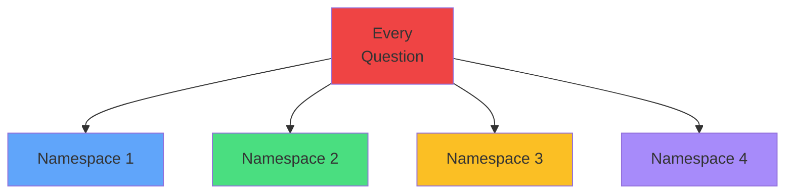

# Throughout the Exam

```mermaid
graph TB
    E[<carbon-exam-mode/> Every<br/>Question]
    E --> N1[<carbon-layers/> Namespace 1]
    E --> N2[<carbon-layers/> Namespace 2]
    E --> N3[<carbon-layers/> Namespace 3]
    E --> N4[<carbon-layers/> Namespace 4]
    style E fill:#ef4444
    style N1 fill:#60a5fa
    style N2 fill:#4ade80
    style N3 fill:#fbbf24
    style N4 fill:#a78bfa
```

<carbon-warning class="text-4xl text-red-400 inline-block mb-4" />
 
Forgetting namespace flags = Silent killer

