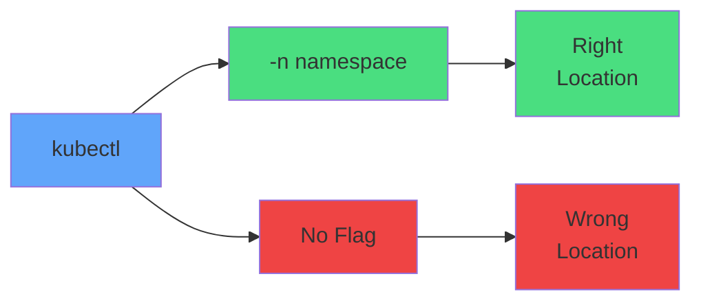

# Namespace Flags



<div class="mt-8 grid grid-cols-2 gap-8">
<div class="text-center">

```bash
kubectl create -n prod
```

<carbon-checkmark class="text-3xl text-green-400 mt-2" />

</div>
<div class="text-center">

```bash
kubectl create
```

<carbon-warning class="text-3xl text-red-400 mt-2" />

</div>
</div>
