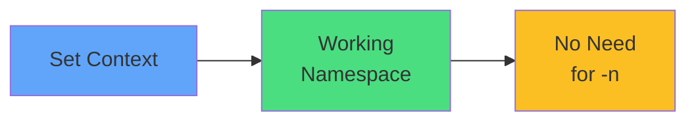

# Context Switching



<div class="mt-8 text-center">

```bash
kubectl config set-context --current \
  --namespace=production
```

<div class="text-lg opacity-80 mt-6">
<carbon-lightbulb class="text-yellow-400 text-3xl inline-block" />
<br/>
Saves typing, but remember which namespace you're in
</div>

</div>
