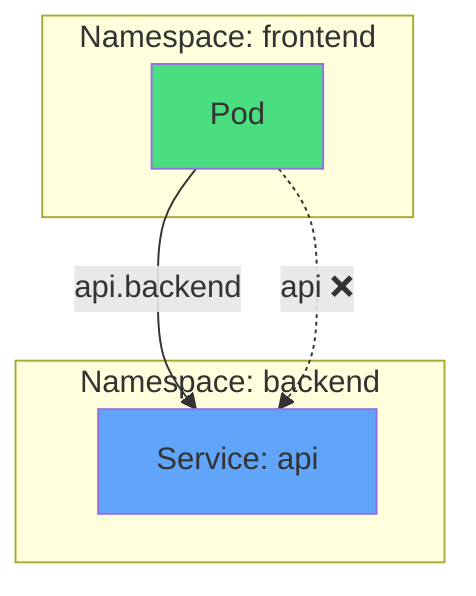

# Cross-Namespace DNS

```mermaid
graph TB
    subgraph "Namespace: frontend"
        P1[<carbon-container-software/> Pod]
    end
    subgraph "Namespace: backend"
        S[<carbon-network-3/> Service: api]
    end
    P1 -->|api.backend| S
    P1 -.->|api ❌| S
    style P1 fill:#4ade80
    style S fill:#60a5fa
```

## Same Namespace
`service-name`

## Cross-Namespace
`service.namespace`

