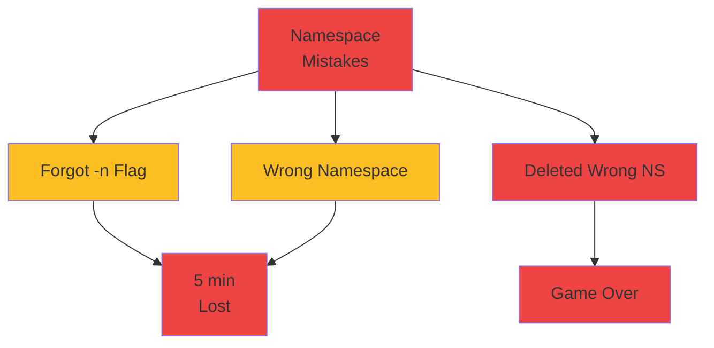

# Common Mistakes

```mermaid
graph TB
    M[<carbon-warning/> Namespace<br/>Mistakes]
    M --> F[<carbon-close/> Forgot -n Flag]
    M --> W[<carbon-error/> Wrong Namespace]
    M --> D[<carbon-trash-can/> Deleted Wrong NS]
    F --> T[<carbon-timer/> 5 min<br/>Lost]
    W --> T
    D --> GAME[<carbon-face-dizzy/> Game Over]
    style M fill:#ef4444
    style F fill:#fbbf24
    style W fill:#fbbf24
    style D fill:#ef4444
    style T fill:#ef4444
    style GAME fill:#ef4444
```

<carbon-warning class="text-3xl text-red-400 inline-block" />
 
Always double-check namespace before operations

