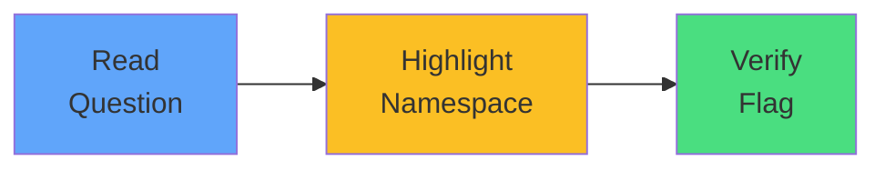

# Exam Mindset

<carbon-warning class="text-red-400 text-4xl inline-block" />

### When question mentions namespace
### Note it mentally or highlight it
### Verify `-n` flag before executing

Make namespace checking reflexive

