# Kubernetes Namespaces

  <carbon-partition-auto class="text-6xl text-blue-400" />

Isolating workloads in virtual clusters

---
layout: center
---

# The Multi-Tenancy Problem

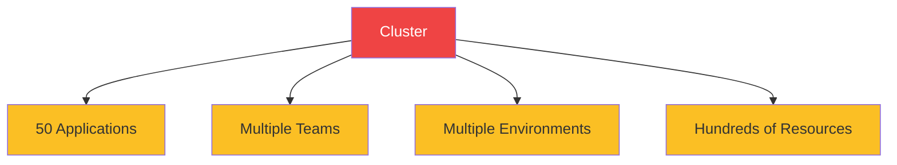

<carbon-close class="inline-block text-3xl text-red-400" /> Name collisions

<carbon-warning class="inline-block text-3xl text-red-400" /> Accidental deletions

<carbon-dashboard class="inline-block text-3xl text-red-400" /> Resource contention

<carbon-unlocked class="inline-block text-3xl text-red-400" /> No access control

<carbon-partition-auto class="inline-block text-3xl text-green-400" /> Namespaces solve these problems

---
layout: center
---

# What Are Namespaces?

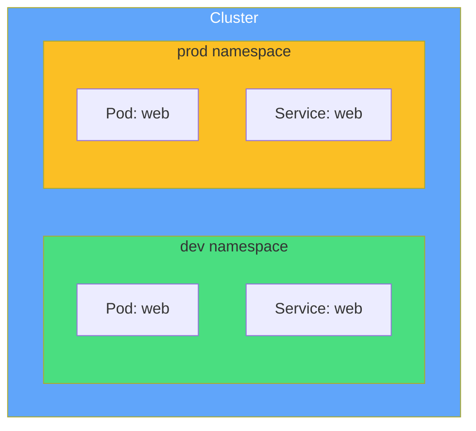

Virtual cluster boundaries within physical cluster

<carbon-container-software class="inline-block text-2xl text-blue-400" /> Contains resources

<carbon-partition-auto class="inline-block text-2xl text-green-400" /> Logical isolation

<carbon-tag class="inline-block text-2xl text-purple-400" /> Unique names per namespace

<carbon-rule class="inline-block text-2xl text-yellow-400" /> Flat structure (no nesting)

---
layout: center
---

# Default Namespaces

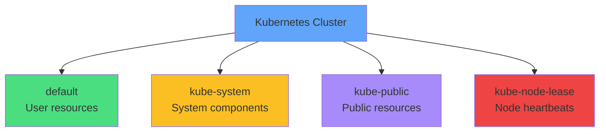

<carbon-document class="inline-block text-2xl text-green-400" /> <strong>default:</strong> Where resources go without -n flag

<carbon-kubernetes class="inline-block text-2xl text-yellow-400" /> <strong>kube-system:</strong> DNS, dashboard, controllers

<carbon-view class="inline-block text-2xl text-purple-400" /> <strong>kube-public:</strong> Publicly readable data

<carbon-activity class="inline-block text-2xl text-red-400" /> <strong>kube-node-lease:</strong> Node health tracking

---
layout: center
---

# Namespace Scoping

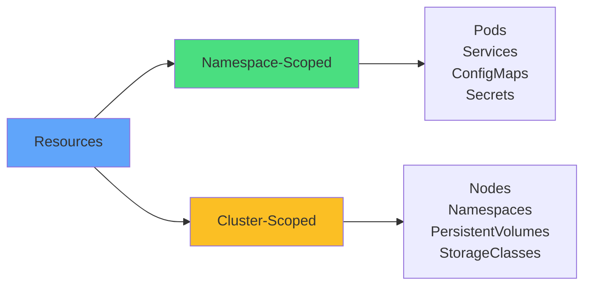

<carbon-tag class="text-4xl text-green-400 mb-2" />
<strong>Namespace-scoped</strong> 
Need -n flag to query

<carbon-network-3 class="text-4xl text-yellow-400 mb-2" />
<strong>Cluster-scoped</strong> 
Global, visible to all

<carbon-terminal class="inline-block text-2xl text-blue-400" /> kubectl api-resources --namespaced=true

---
layout: center
---

# Resource Quotas

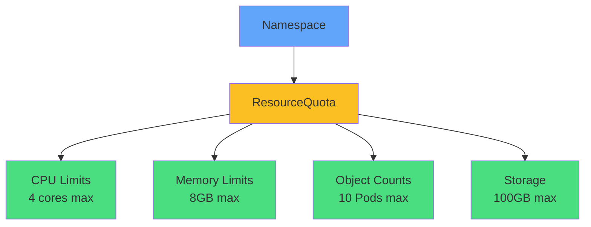

Limit total resources consumed in a namespace

<carbon-dashboard class="inline-block text-2xl text-blue-400" /> Compute: CPU & memory totals

<carbon-rule class="inline-block text-2xl text-green-400" /> Objects: Pod, Service counts

<carbon-warning class="inline-block text-2xl" /> With quotas, Pods MUST specify resources!

---
layout: center
---

# LimitRange

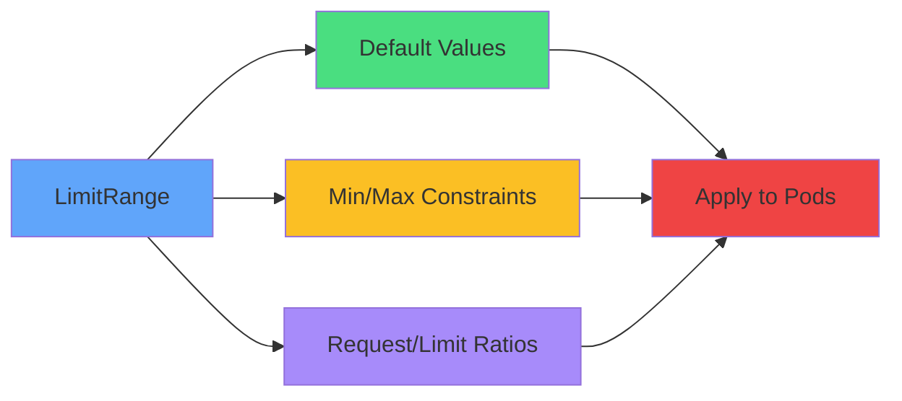

Per-Pod/container defaults and constraints

<carbon-settings class="text-3xl text-green-400 mb-2" />
<strong>Default Values</strong> 
Auto-apply when not specified

<carbon-rule class="text-3xl text-yellow-400 mb-2" />
<strong>Constraints</strong> 
Min/max per container

ResourceQuota = namespace total | LimitRange = per-container

---
layout: center
---

# Cross-Namespace Communication

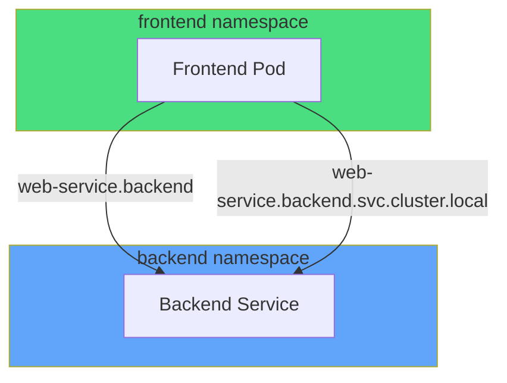

Services accessible via DNS across namespaces

<carbon-text-font class="text-3xl text-green-400 mb-2" />
<strong>Short name</strong> 
web-service 
Same namespace only

<carbon-network-1 class="text-3xl text-blue-400 mb-2" />
<strong>Qualified</strong> 
web-service.production 
Any namespace

<carbon-network-3 class="text-3xl text-purple-400 mb-2" />
<strong>FQDN</strong> 
web.prod.svc.cluster.local 
Fully qualified

<carbon-security class="inline-block text-2xl" /> For network isolation, use NetworkPolicies

---
layout: center
---

# ConfigMaps & Secrets Scoping

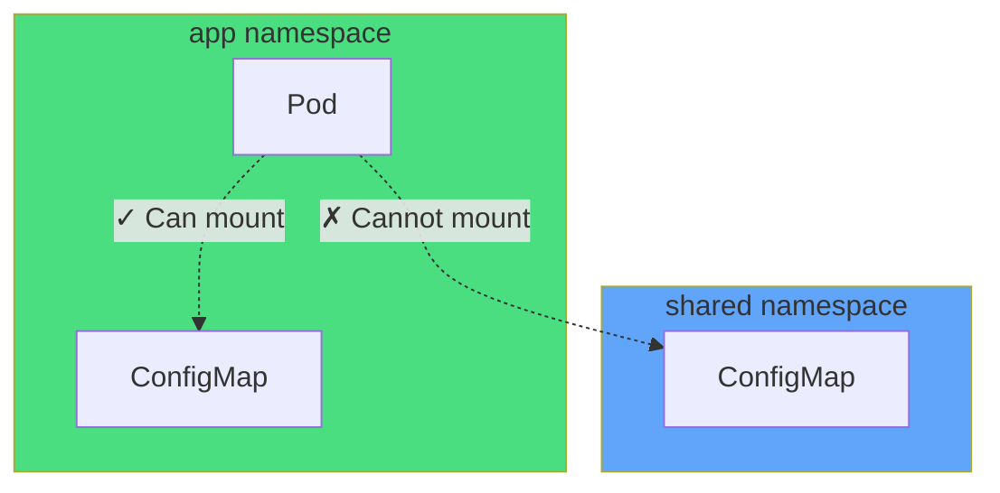

<carbon-warning class="inline-block text-3xl" /> ConfigMaps & Secrets cannot cross namespaces

<carbon-copy class="text-3xl text-yellow-400 mb-2" />
<strong>Duplicate config</strong> 
Create in each namespace

<carbon-network-3 class="text-3xl text-blue-400 mb-2" />
<strong>Use FQDN</strong> 
Reference services across namespaces

---
layout: center
---

# Managing Context

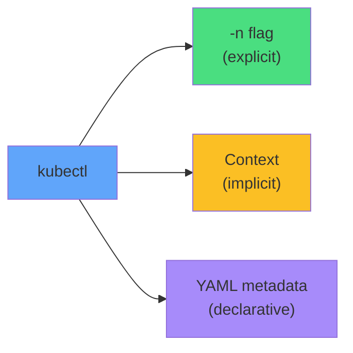

<carbon-terminal class="text-3xl text-green-400 mb-2" />
<strong>Flag method</strong> 
kubectl get pods -n prod 
Clear, explicit

<carbon-settings class="text-3xl text-yellow-400 mb-2" />
<strong>Context method</strong> 
kubectl config set-context 
Less typing

<carbon-document class="text-3xl text-purple-400 mb-2" />
<strong>YAML method</strong> 
metadata: namespace: prod 
Self-documenting

<carbon-idea class="inline-block text-2xl text-blue-400" /> CKAD tip: Use -n flag to avoid mistakes

---
layout: center
---

# Namespace Lifecycle

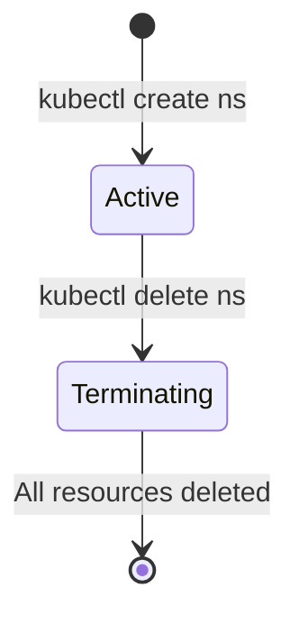

<carbon-warning class="inline-block text-4xl" /> WARNING

Deleting a namespace deletes EVERYTHING inside

<carbon-close class="inline-block text-2xl text-red-400" /> All Pods, Services, Deployments

<carbon-close class="inline-block text-2xl text-red-400" /> All ConfigMaps, Secrets

<carbon-close class="inline-block text-2xl text-red-400" /> All PersistentVolumeClaims

<carbon-warning class="inline-block text-2xl text-red-400" /> Cannot be undone!

Deletion is async - namespace enters "Terminating" state

---
layout: center
---

# Summary

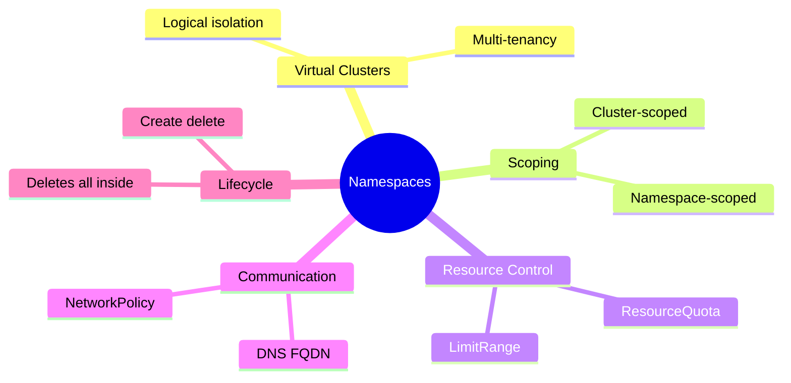

---
layout: center
---

# Key Takeaways

<carbon-partition-auto class="text-4xl text-blue-400 mb-2" />
<strong>Logical isolation</strong> 
Virtual clusters within physical cluster

<carbon-rule class="text-4xl text-green-400 mb-2" />
<strong>Resource control</strong> 
Quotas and limits per namespace

<carbon-network-3 class="text-4xl text-purple-400 mb-2" />
<strong>DNS discovery</strong> 
Access services via FQDN

<carbon-warning class="text-4xl text-red-400 mb-2" />
<strong>Careful deletion</strong> 
Deletes all resources inside

<carbon-education class="inline-block text-3xl text-blue-400" /> Essential CKAD topic - practice context switching!

