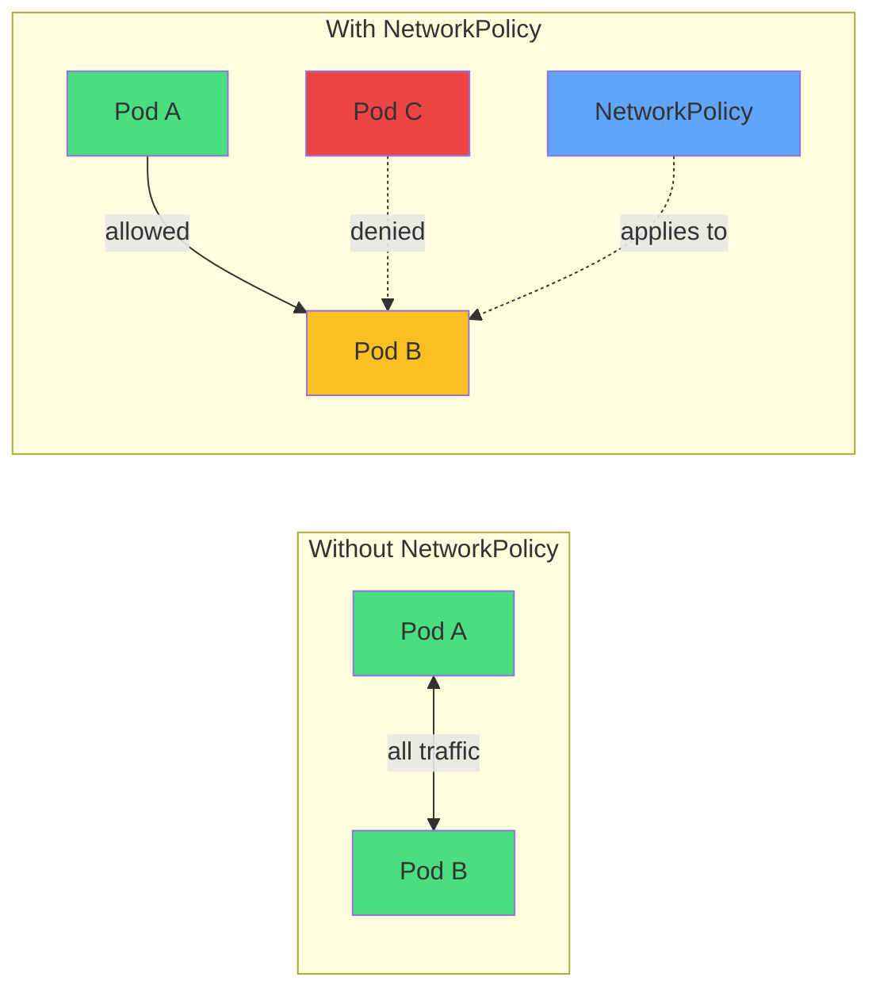

# Default Behavior

```mermaid
graph LR
    subgraph Without NetworkPolicy
        POD1[<carbon-container-software/> Pod A] <-->|all traffic| POD2[<carbon-container-software/> Pod B]
    end

    subgraph With NetworkPolicy
        POD3[<carbon-container-software/> Pod A] -->|allowed| POD4[<carbon-container-software/> Pod B]
        POD5[<carbon-container-software/> Pod C] -.->|denied| POD4
        NP[<carbon-network-overlay/> NetworkPolicy]
        NP -.->|applies to| POD4
    end

    style POD1 fill:#4ade80
    style POD2 fill:#4ade80
    style POD3 fill:#4ade80
    style POD4 fill:#fbbf24
    style POD5 fill:#ef4444
    style NP fill:#60a5fa
```

Creating a policy = deny by default, allow explicitly

